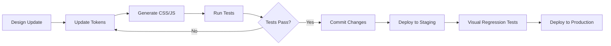

# Design Tokens Implementation
# Implementasi Design Tokens untuk Sembalun

## 🎯 Design Tokens Overview

Design tokens adalah nilai-nilai desain fundamental yang disimpan sebagai data terstruktur untuk memastikan konsistensi visual across platform dan memudahkan maintenance sistem desain.

### Token Categories
```typescript
interface DesignTokenSystem {
  colors: ColorTokens;
  typography: TypographyTokens;
  spacing: SpacingTokens;
  sizing: SizingTokens;
  borders: BorderTokens;
  shadows: ShadowTokens;
  animations: AnimationTokens;
  breakpoints: BreakpointTokens;
  cultural: CulturalTokens;
}
```

## 🎨 Color Tokens

### Primary Brand Colors
```json
{
  "color": {
    "primary": {
      "50": { "value": "#f0f9ff", "type": "color" },
      "100": { "value": "#e0f2fe", "type": "color" },
      "200": { "value": "#bae6fd", "type": "color" },
      "300": { "value": "#7dd3fc", "type": "color" },
      "400": { "value": "#38bdf8", "type": "color" },
      "500": { "value": "#0ea5e9", "type": "color", "description": "Primary brand color" },
      "600": { "value": "#0284c7", "type": "color" },
      "700": { "value": "#0369a1", "type": "color" },
      "800": { "value": "#075985", "type": "color" },
      "900": { "value": "#0c4a6e", "type": "color" }
    }
  }
}
```

### Cultural Indonesian Colors
```json
{
  "color": {
    "cultural": {
      "earth-brown": {
        "value": "#8B4513",
        "type": "color",
        "description": "Traditional Indonesian earth brown - representing grounding and stability"
      },
      "temple-gold": {
        "value": "#FFD700",
        "type": "color", 
        "description": "Golden color from Indonesian temple architecture"
      },
      "lotus-white": {
        "value": "#FFFAF0",
        "type": "color",
        "description": "Pure white of lotus flower - representing spiritual purity"
      },
      "bamboo-green": {
        "value": "#9ACD32",
        "type": "color",
        "description": "Natural bamboo green - representing growth and flexibility"
      },
      "spiritual-purple": {
        "value": "#663399",
        "type": "color",
        "description": "Deep meditation purple - representing spiritual depth"
      },
      "batik-indigo": {
        "value": "#4B0082",
        "type": "color",
        "description": "Traditional batik indigo - representing Indonesian heritage"
      },
      "sunset-orange": {
        "value": "#FF6B35",
        "type": "color",
        "description": "Indonesian sunset orange - representing warmth and energy"
      },
      "rice-field": {
        "value": "#7CB342",
        "type": "color",
        "description": "Green of Indonesian rice fields - representing prosperity"
      }
    }
  }
}
```

### Semantic Colors
```json
{
  "color": {
    "semantic": {
      "success": {
        "50": { "value": "#f0fdf4", "type": "color" },
        "500": { "value": "#22c55e", "type": "color", "description": "Success green" },
        "600": { "value": "#16a34a", "type": "color" }
      },
      "warning": {
        "50": { "value": "#fffbeb", "type": "color" },
        "500": { "value": "#f59e0b", "type": "color", "description": "Warning amber" },
        "600": { "value": "#d97706", "type": "color" }
      },
      "error": {
        "50": { "value": "#fef2f2", "type": "color" },
        "500": { "value": "#ef4444", "type": "color", "description": "Error red" },
        "600": { "value": "#dc2626", "type": "color" }
      },
      "info": {
        "50": { "value": "#eff6ff", "type": "color" },
        "500": { "value": "#3b82f6", "type": "color", "description": "Info blue" },
        "600": { "value": "#2563eb", "type": "color" }
      }
    }
  }
}
```

## 📝 Typography Tokens

### Font Families
```json
{
  "typography": {
    "fontFamily": {
      "primary": {
        "value": ["Inter", "system-ui", "-apple-system", "sans-serif"],
        "type": "fontFamily",
        "description": "Primary font for body text and UI"
      },
      "heading": {
        "value": ["Poppins", "Inter", "system-ui", "sans-serif"],
        "type": "fontFamily",
        "description": "Font for headings and display text"
      },
      "cultural": {
        "value": ["Noto Sans Indonesian", "Inter", "system-ui", "sans-serif"],
        "type": "fontFamily",
        "description": "Font for Indonesian cultural content"
      },
      "monospace": {
        "value": ["JetBrains Mono", "Consolas", "Monaco", "monospace"],
        "type": "fontFamily",
        "description": "Monospace font for code"
      }
    }
  }
}
```

### Font Weights
```json
{
  "typography": {
    "fontWeight": {
      "thin": { "value": 100, "type": "fontWeight" },
      "extralight": { "value": 200, "type": "fontWeight" },
      "light": { "value": 300, "type": "fontWeight" },
      "normal": { "value": 400, "type": "fontWeight" },
      "medium": { "value": 500, "type": "fontWeight" },
      "semibold": { "value": 600, "type": "fontWeight" },
      "bold": { "value": 700, "type": "fontWeight" },
      "extrabold": { "value": 800, "type": "fontWeight" },
      "black": { "value": 900, "type": "fontWeight" }
    }
  }
}
```

### Font Sizes & Line Heights
```json
{
  "typography": {
    "fontSize": {
      "xs": { "value": "0.75rem", "type": "dimension" },
      "sm": { "value": "0.875rem", "type": "dimension" },
      "base": { "value": "1rem", "type": "dimension" },
      "lg": { "value": "1.125rem", "type": "dimension" },
      "xl": { "value": "1.25rem", "type": "dimension" },
      "2xl": { "value": "1.5rem", "type": "dimension" },
      "3xl": { "value": "1.875rem", "type": "dimension" },
      "4xl": { "value": "2.25rem", "type": "dimension" },
      "5xl": { "value": "3rem", "type": "dimension" },
      "6xl": { "value": "3.75rem", "type": "dimension" }
    },
    "lineHeight": {
      "tight": { "value": "1.25", "type": "number" },
      "snug": { "value": "1.375", "type": "number" },
      "normal": { "value": "1.5", "type": "number" },
      "relaxed": { "value": "1.625", "type": "number" },
      "loose": { "value": "2", "type": "number" }
    }
  }
}
```

## 📏 Spacing Tokens

### Base Spacing Scale
```json
{
  "spacing": {
    "0": { "value": "0", "type": "dimension" },
    "1": { "value": "0.25rem", "type": "dimension", "description": "4px" },
    "2": { "value": "0.5rem", "type": "dimension", "description": "8px" },
    "3": { "value": "0.75rem", "type": "dimension", "description": "12px" },
    "4": { "value": "1rem", "type": "dimension", "description": "16px" },
    "5": { "value": "1.25rem", "type": "dimension", "description": "20px" },
    "6": { "value": "1.5rem", "type": "dimension", "description": "24px" },
    "8": { "value": "2rem", "type": "dimension", "description": "32px" },
    "10": { "value": "2.5rem", "type": "dimension", "description": "40px" },
    "12": { "value": "3rem", "type": "dimension", "description": "48px" },
    "16": { "value": "4rem", "type": "dimension", "description": "64px" },
    "20": { "value": "5rem", "type": "dimension", "description": "80px" },
    "24": { "value": "6rem", "type": "dimension", "description": "96px" },
    "32": { "value": "8rem", "type": "dimension", "description": "128px" }
  }
}
```

### Semantic Spacing
```json
{
  "spacing": {
    "component": {
      "padding": {
        "sm": { "value": "{spacing.2}", "type": "dimension" },
        "md": { "value": "{spacing.4}", "type": "dimension" },
        "lg": { "value": "{spacing.6}", "type": "dimension" }
      },
      "margin": {
        "sm": { "value": "{spacing.4}", "type": "dimension" },
        "md": { "value": "{spacing.6}", "type": "dimension" },
        "lg": { "value": "{spacing.8}", "type": "dimension" }
      },
      "gap": {
        "sm": { "value": "{spacing.2}", "type": "dimension" },
        "md": { "value": "{spacing.4}", "type": "dimension" },
        "lg": { "value": "{spacing.6}", "type": "dimension" }
      }
    }
  }
}
```

## 📐 Sizing Tokens

### Width & Height
```json
{
  "sizing": {
    "width": {
      "xs": { "value": "20rem", "type": "dimension", "description": "320px" },
      "sm": { "value": "24rem", "type": "dimension", "description": "384px" },
      "md": { "value": "28rem", "type": "dimension", "description": "448px" },
      "lg": { "value": "32rem", "type": "dimension", "description": "512px" },
      "xl": { "value": "36rem", "type": "dimension", "description": "576px" },
      "2xl": { "value": "42rem", "type": "dimension", "description": "672px" },
      "3xl": { "value": "48rem", "type": "dimension", "description": "768px" },
      "full": { "value": "100%", "type": "dimension" },
      "screen": { "value": "100vw", "type": "dimension" }
    },
    "height": {
      "xs": { "value": "1rem", "type": "dimension" },
      "sm": { "value": "1.5rem", "type": "dimension" },
      "md": { "value": "2rem", "type": "dimension" },
      "lg": { "value": "2.5rem", "type": "dimension" },
      "xl": { "value": "3rem", "type": "dimension" },
      "2xl": { "value": "4rem", "type": "dimension" },
      "full": { "value": "100%", "type": "dimension" },
      "screen": { "value": "100vh", "type": "dimension" }
    }
  }
}
```

## 🔲 Border Tokens

### Border Radius
```json
{
  "border": {
    "radius": {
      "none": { "value": "0", "type": "dimension" },
      "sm": { "value": "0.125rem", "type": "dimension", "description": "2px" },
      "base": { "value": "0.25rem", "type": "dimension", "description": "4px" },
      "md": { "value": "0.375rem", "type": "dimension", "description": "6px" },
      "lg": { "value": "0.5rem", "type": "dimension", "description": "8px" },
      "xl": { "value": "0.75rem", "type": "dimension", "description": "12px" },
      "2xl": { "value": "1rem", "type": "dimension", "description": "16px" },
      "3xl": { "value": "1.5rem", "type": "dimension", "description": "24px" },
      "full": { "value": "9999px", "type": "dimension" }
    }
  }
}
```

### Border Width
```json
{
  "border": {
    "width": {
      "0": { "value": "0", "type": "dimension" },
      "1": { "value": "1px", "type": "dimension" },
      "2": { "value": "2px", "type": "dimension" },
      "4": { "value": "4px", "type": "dimension" },
      "8": { "value": "8px", "type": "dimension" }
    }
  }
}
```

## 🌊 Shadow Tokens

### Box Shadows
```json
{
  "shadow": {
    "sm": {
      "value": "0 1px 2px 0 rgba(0, 0, 0, 0.05)",
      "type": "boxShadow",
      "description": "Small shadow for subtle elevation"
    },
    "base": {
      "value": "0 1px 3px 0 rgba(0, 0, 0, 0.1), 0 1px 2px 0 rgba(0, 0, 0, 0.06)",
      "type": "boxShadow",
      "description": "Default shadow"
    },
    "md": {
      "value": "0 4px 6px -1px rgba(0, 0, 0, 0.1), 0 2px 4px -1px rgba(0, 0, 0, 0.06)",
      "type": "boxShadow",
      "description": "Medium shadow for cards"
    },
    "lg": {
      "value": "0 10px 15px -3px rgba(0, 0, 0, 0.1), 0 4px 6px -2px rgba(0, 0, 0, 0.05)",
      "type": "boxShadow",
      "description": "Large shadow for modals"
    },
    "xl": {
      "value": "0 20px 25px -5px rgba(0, 0, 0, 0.1), 0 10px 10px -5px rgba(0, 0, 0, 0.04)",
      "type": "boxShadow",
      "description": "Extra large shadow"
    },
    "2xl": {
      "value": "0 25px 50px -12px rgba(0, 0, 0, 0.25)",
      "type": "boxShadow",
      "description": "2X large shadow for prominent elements"
    }
  }
}
```

### Cultural Shadows
```json
{
  "shadow": {
    "cultural": {
      "temple": {
        "value": "0 8px 32px rgba(255, 215, 0, 0.2), 0 4px 16px rgba(139, 69, 19, 0.1)",
        "type": "boxShadow",
        "description": "Golden temple-inspired shadow"
      },
      "meditation": {
        "value": "0 0 20px rgba(102, 51, 153, 0.3), 0 0 40px rgba(102, 51, 153, 0.1)",
        "type": "boxShadow",
        "description": "Spiritual glow effect"
      },
      "lotus": {
        "value": "0 4px 20px rgba(255, 255, 255, 0.8), inset 0 1px 0 rgba(255, 255, 255, 0.9)",
        "type": "boxShadow",
        "description": "Pure lotus-like glow"
      }
    }
  }
}
```

## ⚡ Animation Tokens

### Duration & Easing
```json
{
  "animation": {
    "duration": {
      "instant": { "value": "0ms", "type": "duration" },
      "fast": { "value": "150ms", "type": "duration" },
      "normal": { "value": "300ms", "type": "duration" },
      "slow": { "value": "500ms", "type": "duration" },
      "slower": { "value": "750ms", "type": "duration" }
    },
    "easing": {
      "linear": { "value": "linear", "type": "cubicBezier" },
      "ease": { "value": "ease", "type": "cubicBezier" },
      "ease-in": { "value": "cubic-bezier(0.4, 0, 1, 1)", "type": "cubicBezier" },
      "ease-out": { "value": "cubic-bezier(0, 0, 0.2, 1)", "type": "cubicBezier" },
      "ease-in-out": { "value": "cubic-bezier(0.4, 0, 0.2, 1)", "type": "cubicBezier" },
      "meditation": { "value": "cubic-bezier(0.25, 0.46, 0.45, 0.94)", "type": "cubicBezier" }
    }
  }
}
```

### Meditation-Specific Animations
```json
{
  "animation": {
    "meditation": {
      "breathe": {
        "duration": { "value": "4s", "type": "duration" },
        "easing": { "value": "{animation.easing.ease-in-out}", "type": "cubicBezier" },
        "direction": { "value": "alternate", "type": "string" },
        "iteration": { "value": "infinite", "type": "string" }
      },
      "pulse": {
        "duration": { "value": "2s", "type": "duration" },
        "easing": { "value": "{animation.easing.ease-in-out}", "type": "cubicBezier" },
        "direction": { "value": "alternate", "type": "string" },
        "iteration": { "value": "infinite", "type": "string" }
      },
      "float": {
        "duration": { "value": "6s", "type": "duration" },
        "easing": { "value": "{animation.easing.meditation}", "type": "cubicBezier" },
        "direction": { "value": "alternate", "type": "string" },
        "iteration": { "value": "infinite", "type": "string" }
      }
    }
  }
}
```

## 📱 Breakpoint Tokens

### Responsive Breakpoints
```json
{
  "breakpoint": {
    "xs": { "value": "0px", "type": "dimension", "description": "Mobile portrait" },
    "sm": { "value": "640px", "type": "dimension", "description": "Mobile landscape" },
    "md": { "value": "768px", "type": "dimension", "description": "Tablet portrait" },
    "lg": { "value": "1024px", "type": "dimension", "description": "Tablet landscape" },
    "xl": { "value": "1280px", "type": "dimension", "description": "Desktop" },
    "2xl": { "value": "1536px", "type": "dimension", "description": "Large desktop" }
  }
}
```

## 🏛️ Cultural Design Tokens

### Indonesian Cultural Elements
```json
{
  "cultural": {
    "patterns": {
      "batik-kawung": {
        "value": "url('/patterns/batik-kawung.svg')",
        "type": "asset",
        "description": "Traditional Javanese batik pattern representing cosmos"
      },
      "batik-parang": {
        "value": "url('/patterns/batik-parang.svg')",
        "type": "asset",
        "description": "Royal batik pattern representing strength"
      },
      "temple-ornament": {
        "value": "url('/patterns/temple-ornament.svg')",
        "type": "asset",
        "description": "Traditional temple decoration pattern"
      }
    },
    "symbols": {
      "lotus": {
        "value": "url('/symbols/lotus.svg')",
        "type": "asset",
        "description": "Sacred lotus symbol for spiritual purity"
      },
      "bamboo": {
        "value": "url('/symbols/bamboo.svg')",
        "type": "asset",
        "description": "Bamboo symbol for flexibility and growth"
      },
      "mountain": {
        "value": "url('/symbols/mountain.svg')",
        "type": "asset",
        "description": "Mountain symbol for stability and strength"
      }
    }
  }
}
```

### Cultural Color Meanings
```json
{
  "cultural": {
    "meaning": {
      "earth-brown": {
        "value": "Grounding, stability, connection to earth",
        "type": "string",
        "usage": "Use for elements that represent stability and grounding"
      },
      "temple-gold": {
        "value": "Divine light, prosperity, sacred knowledge",
        "type": "string",
        "usage": "Use for important highlights and sacred elements"
      },
      "lotus-white": {
        "value": "Purity, enlightenment, spiritual cleansing",
        "type": "string", 
        "usage": "Use for backgrounds and pure states"
      },
      "spiritual-purple": {
        "value": "Deep meditation, spiritual wisdom, transformation",
        "type": "string",
        "usage": "Use for meditation-related features"
      }
    }
  }
}
```

## 🛠️ Implementation Guide

### CSS Custom Properties Generation
```css
/* Generated from design tokens */
:root {
  /* Colors */
  --color-primary-50: #f0f9ff;
  --color-primary-500: #0ea5e9;
  --color-primary-900: #0c4a6e;
  
  /* Cultural Colors */
  --color-cultural-earth-brown: #8B4513;
  --color-cultural-temple-gold: #FFD700;
  --color-cultural-lotus-white: #FFFAF0;
  --color-cultural-spiritual-purple: #663399;
  
  /* Typography */
  --font-family-primary: 'Inter', system-ui, -apple-system, sans-serif;
  --font-family-cultural: 'Noto Sans Indonesian', 'Inter', system-ui, sans-serif;
  --font-size-base: 1rem;
  --font-weight-medium: 500;
  --line-height-normal: 1.5;
  
  /* Spacing */
  --spacing-1: 0.25rem;
  --spacing-4: 1rem;
  --spacing-8: 2rem;
  
  /* Shadows */
  --shadow-md: 0 4px 6px -1px rgba(0, 0, 0, 0.1), 0 2px 4px -1px rgba(0, 0, 0, 0.06);
  --shadow-cultural-temple: 0 8px 32px rgba(255, 215, 0, 0.2), 0 4px 16px rgba(139, 69, 19, 0.1);
  
  /* Animation */
  --duration-normal: 300ms;
  --easing-meditation: cubic-bezier(0.25, 0.46, 0.45, 0.94);
}
```

### JavaScript/TypeScript Implementation
```typescript
// Generated design tokens
export const tokens = {
  color: {
    primary: {
      50: '#f0f9ff',
      500: '#0ea5e9',
      900: '#0c4a6e',
    },
    cultural: {
      earthBrown: '#8B4513',
      templeGold: '#FFD700',
      lotusWhite: '#FFFAF0',
      spiritualPurple: '#663399',
    },
  },
  typography: {
    fontFamily: {
      primary: ['Inter', 'system-ui', '-apple-system', 'sans-serif'],
      cultural: ['Noto Sans Indonesian', 'Inter', 'system-ui', 'sans-serif'],
    },
    fontSize: {
      base: '1rem',
      lg: '1.125rem',
    },
  },
  spacing: {
    1: '0.25rem',
    4: '1rem',
    8: '2rem',
  },
  shadow: {
    md: '0 4px 6px -1px rgba(0, 0, 0, 0.1), 0 2px 4px -1px rgba(0, 0, 0, 0.06)',
    cultural: {
      temple: '0 8px 32px rgba(255, 215, 0, 0.2), 0 4px 16px rgba(139, 69, 19, 0.1)',
    },
  },
} as const;

// Type-safe token usage
type TokenPath = 'color.primary.500' | 'color.cultural.earthBrown' | 'spacing.4';

export function getToken(path: TokenPath): string {
  return path.split('.').reduce((obj, key) => obj[key], tokens as any);
}
```

### Tailwind CSS Configuration
```javascript
// tailwind.config.js
const { tokens } = require('./design-tokens');

module.exports = {
  content: ['./src/**/*.{js,ts,jsx,tsx}'],
  theme: {
    extend: {
      colors: {
        primary: tokens.color.primary,
        cultural: tokens.color.cultural,
      },
      fontFamily: {
        sans: tokens.typography.fontFamily.primary,
        cultural: tokens.typography.fontFamily.cultural,
      },
      spacing: tokens.spacing,
      boxShadow: {
        ...tokens.shadow,
        'cultural-temple': tokens.shadow.cultural.temple,
      },
      animation: {
        'breathe': 'breathe 4s ease-in-out infinite alternate',
        'meditation-pulse': 'meditation-pulse 2s ease-in-out infinite alternate',
      },
      keyframes: {
        breathe: {
          '0%': { transform: 'scale(1)', opacity: '0.7' },
          '100%': { transform: 'scale(1.1)', opacity: '1' },
        },
      },
    },
  },
  plugins: [],
};
```

### Styled Components Implementation
```typescript
import styled from 'styled-components';
import { tokens } from './design-tokens';

// Theme provider
export const theme = {
  colors: tokens.color,
  typography: tokens.typography,
  spacing: tokens.spacing,
  shadows: tokens.shadow,
};

// Styled component with design tokens
export const CulturalCard = styled.div`
  background-color: ${tokens.color.cultural.lotusWhite};
  border: 2px solid ${tokens.color.cultural.templeGold};
  border-radius: ${tokens.border.radius.lg};
  padding: ${tokens.spacing[6]};
  box-shadow: ${tokens.shadow.cultural.temple};
  
  transition: all ${tokens.animation.duration.normal} ${tokens.animation.easing.meditation};
  
  &:hover {
    transform: translateY(-2px);
    box-shadow: ${tokens.shadow.xl};
  }
`;

export const MeditationButton = styled.button`
  background: linear-gradient(135deg, 
    ${tokens.color.cultural.spiritualPurple}, 
    ${tokens.color.primary[500]}
  );
  color: white;
  font-family: ${tokens.typography.fontFamily.primary.join(', ')};
  font-size: ${tokens.typography.fontSize.base};
  font-weight: ${tokens.typography.fontWeight.medium};
  padding: ${tokens.spacing[3]} ${tokens.spacing[6]};
  border: none;
  border-radius: ${tokens.border.radius.lg};
  box-shadow: ${tokens.shadow.lg};
  
  transition: all ${tokens.animation.duration.normal} ${tokens.animation.easing.meditation};
  
  &:hover {
    transform: translateY(-2px);
    box-shadow: ${tokens.shadow.xl};
  }
  
  &:focus-visible {
    outline: 2px solid ${tokens.color.primary[500]};
    outline-offset: 2px;
  }
`;
```

## 🔄 Token Management Workflow

### Design Token Updates


### Build Integration
```json
{
  "scripts": {
    "tokens:build": "style-dictionary build",
    "tokens:watch": "style-dictionary build --watch",
    "tokens:validate": "node scripts/validate-tokens.js",
    "tokens:test": "jest tests/design-tokens.test.js"
  }
}
```

### Style Dictionary Configuration
```javascript
// style-dictionary.config.js
module.exports = {
  source: ['tokens/**/*.json'],
  platforms: {
    css: {
      transformGroup: 'css',
      buildPath: 'dist/css/',
      files: [{
        destination: 'variables.css',
        format: 'css/variables'
      }]
    },
    js: {
      transformGroup: 'js',
      buildPath: 'dist/js/',
      files: [{
        destination: 'tokens.js',
        format: 'javascript/es6'
      }]
    },
    json: {
      transformGroup: 'js',
      buildPath: 'dist/json/',
      files: [{
        destination: 'tokens.json',
        format: 'json'
      }]
    }
  }
};
```

---

**Design Tokens ini menyediakan foundation yang solid dan scalable untuk maintaining konsistensi visual across seluruh platform Sembalun. Dengan sistem token yang terstruktur, team dapat dengan mudah melakukan updates, maintain consistency, dan ensure cultural authenticity dalam setiap aspek desain.** 🎨✨