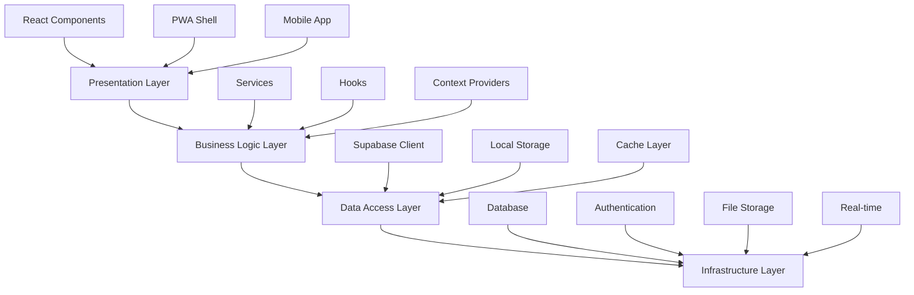
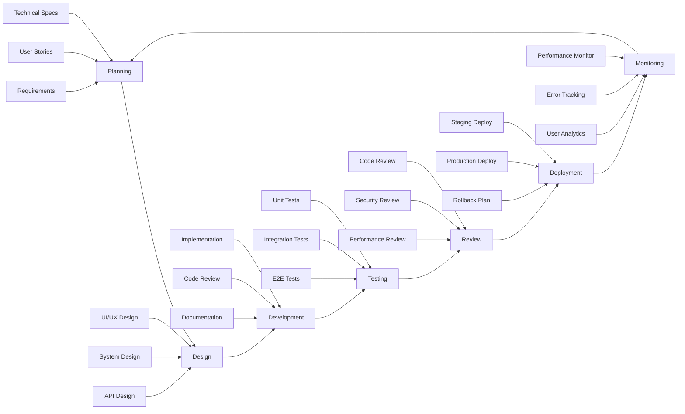

# Sembalun Development Framework
# Framework Pengembangan Aplikasi Meditasi yang Komprehensif

## 🎯 Framework Overview

Sembalun Development Framework adalah sistem pengembangan terintegrasi yang dirancang khusus untuk aplikasi meditasi dan mindfulness dengan fokus pada:

- **Cultural Authenticity**: Preservasi tradisi meditasi Indonesia
- **Technical Excellence**: Modern architecture dengan best practices
- **User-Centric Design**: Experience yang transformatif
- **Scalable Growth**: Architecture yang dapat berkembang
- **Quality Assurance**: Standards yang tinggi di semua aspek

## 🏗️ Architecture Framework

### 1. Layered Architecture Pattern



### 2. Feature-Based Module Structure

```typescript
// Framework Module Pattern
interface FrameworkModule {
  name: string;
  version: string;
  dependencies: string[];
  exports: ModuleExports;
  config: ModuleConfig;
}

// Standard Module Structure
src/
├── features/
│   ├── authentication/
│   │   ├── components/
│   │   │   ├── LoginForm/
│   │   │   │   ├── LoginForm.tsx
│   │   │   │   ├── LoginForm.test.tsx
│   │   │   │   ├── LoginForm.stories.tsx
│   │   │   │   └── index.ts
│   │   │   ├── SignUpForm/
│   │   │   └── AuthModal/
│   │   ├── hooks/
│   │   │   ├── useAuth.ts
│   │   │   ├── useAuth.test.ts
│   │   │   └── index.ts
│   │   ├── services/
│   │   │   ├── authService.ts
│   │   │   ├── authService.test.ts
│   │   │   └── index.ts
│   │   ├── types/
│   │   │   ├── auth.types.ts
│   │   │   └── index.ts
│   │   ├── utils/
│   │   ├── constants/
│   │   └── index.ts
│   ├── meditation/
│   ├── community/
│   └── analytics/
├── shared/
│   ├── components/
│   ├── hooks/
│   ├── utils/
│   ├── types/
│   └── constants/
└── core/
    ├── config/
    ├── providers/
    ├── services/
    └── types/
```

### 3. Component Framework Standards

```typescript
// Standard Component Template
interface ComponentFramework {
  // Props interface dengan clear documentation
  props: ComponentProps;
  // State management pattern
  state: ComponentState;
  // Event handlers convention
  handlers: EventHandlers;
  // Styling approach
  styling: StylingPattern;
  // Testing requirements
  testing: TestingPattern;
}

// Example Implementation
interface ButtonProps {
  /** Button text content */
  children: React.ReactNode;
  /** Button variant style */
  variant?: 'primary' | 'secondary' | 'outline' | 'ghost';
  /** Button size */
  size?: 'sm' | 'md' | 'lg';
  /** Loading state */
  loading?: boolean;
  /** Disabled state */
  disabled?: boolean;
  /** Full width button */
  fullWidth?: boolean;
  /** Click handler */
  onClick?: () => void;
  /** Additional CSS classes */
  className?: string;
  /** Test ID for testing */
  testId?: string;
}

const Button: React.FC<ButtonProps> = ({
  children,
  variant = 'primary',
  size = 'md',
  loading = false,
  disabled = false,
  fullWidth = false,
  onClick,
  className,
  testId
}) => {
  // Implementation with framework standards
  const baseClasses = 'btn-base';
  const variantClasses = `btn-${variant}`;
  const sizeClasses = `btn-${size}`;
  
  return (
    <button
      className={cn(
        baseClasses,
        variantClasses,
        sizeClasses,
        {
          'btn-loading': loading,
          'btn-disabled': disabled,
          'btn-full-width': fullWidth
        },
        className
      )}
      disabled={disabled || loading}
      onClick={onClick}
      data-testid={testId}
    >
      {loading && <LoadingSpinner />}
      {children}
    </button>
  );
};

export default Button;
```

## 🔄 Development Workflow Framework

### 1. Development Lifecycle



### 2. Git Workflow Framework

```bash
# Branch Naming Convention
main                    # Production branch
develop                 # Development integration branch
feature/AUTH-123-login  # Feature branches
bugfix/BUG-456-timer   # Bug fix branches
hotfix/HOT-789-security # Hotfix branches
release/v1.2.0         # Release branches

# Commit Message Framework
# Format: <type>(<scope>): <description>
# 
# Types:
feat: new feature
fix: bug fix
docs: documentation only
style: formatting changes
refactor: code change without feature/bug
test: adding missing tests
chore: maintain, build, dependencies

# Examples:
feat(auth): add Google OAuth integration
fix(timer): resolve meditation timer not stopping
docs(readme): update installation instructions
refactor(components): extract common button logic
test(meditation): add session tracking tests
```

### 3. Code Quality Framework

```typescript
// ESLint Configuration Framework
module.exports = {
  extends: [
    '@typescript-eslint/recommended',
    'plugin:react/recommended',
    'plugin:react-hooks/recommended',
    'plugin:jsx-a11y/recommended',
    'plugin:import/recommended',
  ],
  rules: {
    // Framework-specific rules
    '@typescript-eslint/no-unused-vars': 'error',
    '@typescript-eslint/explicit-function-return-type': 'warn',
    'react/prop-types': 'off', // Using TypeScript
    'react/react-in-jsx-scope': 'off', // React 17+
    'jsx-a11y/anchor-is-valid': 'error',
    'import/order': ['error', {
      groups: ['builtin', 'external', 'internal'],
      alphabetize: { order: 'asc' }
    }],
    // Custom Sembalun rules
    'sembalun/cultural-sensitivity': 'warn',
    'sembalun/meditation-terminology': 'error',
  }
};

// TypeScript Configuration Framework
{
  "compilerOptions": {
    "target": "ES2022",
    "lib": ["DOM", "DOM.Iterable", "ES6"],
    "allowJs": true,
    "skipLibCheck": true,
    "esModuleInterop": true,
    "allowSyntheticDefaultImports": true,
    "strict": true,
    "forceConsistentCasingInFileNames": true,
    "noFallthroughCasesInSwitch": true,
    "module": "esnext",
    "moduleResolution": "node",
    "resolveJsonModule": true,
    "isolatedModules": true,
    "noEmit": true,
    "jsx": "react-jsx"
  },
  "include": ["src"],
  "exclude": ["node_modules"]
}
```

## 🧪 Testing Framework

### 1. Testing Strategy Framework

```typescript
// Testing Pyramid Framework
interface TestingFramework {
  unit: {
    coverage: 85; // Minimum coverage percentage
    tools: ['vitest', 'testing-library'];
    patterns: ['component-testing', 'service-testing', 'utility-testing'];
  };
  integration: {
    coverage: 70;
    tools: ['vitest', 'msw'];
    patterns: ['api-integration', 'feature-integration'];
  };
  e2e: {
    coverage: 'critical-paths';
    tools: ['playwright', 'cypress'];
    patterns: ['user-journey', 'cross-browser'];
  };
  visual: {
    tools: ['storybook', 'chromatic'];
    patterns: ['component-snapshots', 'responsive-testing'];
  };
}

// Test Structure Framework
describe('Feature: Authentication', () => {
  describe('Component: LoginForm', () => {
    describe('Behavior: Form Validation', () => {
      it('should show error for invalid email format', () => {
        // Arrange
        render(<LoginForm />);
        
        // Act
        fireEvent.change(screen.getByLabelText(/email/i), {
          target: { value: 'invalid-email' }
        });
        fireEvent.click(screen.getByRole('button', { name: /sign in/i }));
        
        // Assert
        expect(screen.getByText(/invalid email format/i)).toBeInTheDocument();
      });
    });
  });
});
```

### 2. Test Data Framework

```typescript
// Test Data Factory Framework
class TestDataFactory {
  static createUser(overrides?: Partial<User>): User {
    return {
      id: 'test-user-id',
      email: 'test@sembalun.com',
      displayName: 'Test User',
      createdAt: new Date('2024-01-01'),
      preferences: this.createUserPreferences(),
      progress: this.createUserProgress(),
      ...overrides
    };
  }
  
  static createMeditationSession(overrides?: Partial<MeditationSession>): MeditationSession {
    return {
      id: 'test-session-id',
      userId: 'test-user-id',
      type: 'guided',
      duration: 10,
      completedAt: new Date(),
      moodBefore: 'neutral',
      moodAfter: 'calm',
      ...overrides
    };
  }
  
  static createCulturalContent(tradition: CulturalTradition): CulturalContent {
    return {
      id: 'test-content-id',
      title: `${tradition} Meditation`,
      tradition,
      instructor: 'Guru Sembalun',
      duration: 15,
      culturalContext: this.getCulturalContext(tradition),
      audioUrl: `/${tradition}/meditation-audio.mp3`
    };
  }
}
```

## 🚀 Deployment Framework

### 1. Environment Framework

```typescript
// Environment Configuration Framework
interface EnvironmentConfig {
  name: 'development' | 'staging' | 'production';
  database: DatabaseConfig;
  auth: AuthConfig;
  storage: StorageConfig;
  monitoring: MonitoringConfig;
  features: FeatureFlags;
}

const environments: Record<string, EnvironmentConfig> = {
  development: {
    name: 'development',
    database: {
      url: process.env.VITE_SUPABASE_URL_DEV,
      key: process.env.VITE_SUPABASE_ANON_KEY_DEV
    },
    features: {
      aiPersonalization: true,
      communityFeatures: true,
      advancedAnalytics: false,
      vrMeditation: false
    }
  },
  staging: {
    name: 'staging',
    database: {
      url: process.env.VITE_SUPABASE_URL_STAGING,
      key: process.env.VITE_SUPABASE_ANON_KEY_STAGING
    },
    features: {
      aiPersonalization: true,
      communityFeatures: true,
      advancedAnalytics: true,
      vrMeditation: false
    }
  },
  production: {
    name: 'production',
    database: {
      url: process.env.VITE_SUPABASE_URL,
      key: process.env.VITE_SUPABASE_ANON_KEY
    },
    features: {
      aiPersonalization: true,
      communityFeatures: true,
      advancedAnalytics: true,
      vrMeditation: true
    }
  }
};
```

### 2. CI/CD Pipeline Framework

```yaml
# .github/workflows/framework-pipeline.yml
name: Sembalun Framework Pipeline

on:
  push:
    branches: [main, develop]
  pull_request:
    branches: [main]

jobs:
  # Quality Gate 1: Code Quality
  code-quality:
    runs-on: ubuntu-latest
    steps:
      - uses: actions/checkout@v4
      - name: Setup Node.js
        uses: actions/setup-node@v4
        with:
          node-version: '18'
          cache: 'npm'
      
      - name: Install dependencies
        run: npm ci
      
      - name: Run linting
        run: npm run lint
      
      - name: Run type checking
        run: npm run typecheck
      
      - name: Check cultural sensitivity
        run: npm run check:cultural
      
      - name: Validate meditation terminology
        run: npm run check:terminology

  # Quality Gate 2: Testing
  testing:
    needs: code-quality
    runs-on: ubuntu-latest
    strategy:
      matrix:
        test-type: [unit, integration, e2e]
    steps:
      - uses: actions/checkout@v4
      - name: Setup Node.js
        uses: actions/setup-node@v4
        with:
          node-version: '18'
          cache: 'npm'
      
      - name: Install dependencies
        run: npm ci
      
      - name: Run ${{ matrix.test-type }} tests
        run: npm run test:${{ matrix.test-type }}
      
      - name: Upload test coverage
        uses: codecov/codecov-action@v3
        if: matrix.test-type == 'unit'

  # Quality Gate 3: Security & Performance
  security-performance:
    needs: testing
    runs-on: ubuntu-latest
    steps:
      - uses: actions/checkout@v4
      - name: Run security audit
        run: npm audit --audit-level moderate
      
      - name: Run dependency vulnerability check
        run: npx audit-ci --moderate
      
      - name: Build application
        run: npm run build
      
      - name: Run Lighthouse CI
        uses: treosh/lighthouse-ci-action@v9
        with:
          uploadArtifacts: true
          temporaryPublicStorage: true

  # Quality Gate 4: Deployment
  deploy:
    needs: [code-quality, testing, security-performance]
    runs-on: ubuntu-latest
    if: github.ref == 'refs/heads/main'
    steps:
      - uses: actions/checkout@v4
      - name: Deploy to Vercel
        uses: amondnet/vercel-action@v25
        with:
          vercel-token: ${{ secrets.VERCEL_TOKEN }}
          vercel-org-id: ${{ secrets.ORG_ID }}
          vercel-project-id: ${{ secrets.PROJECT_ID }}
          vercel-args: '--prod'
```

## 📝 Content Framework

### 1. Cultural Content Framework

```typescript
// Cultural Content Standards Framework
interface CulturalContentFramework {
  traditions: MeditationTradition[];
  validation: ContentValidation;
  localization: LocalizationStandards;
  authenticity: AuthenticityChecks;
}

enum MeditationTradition {
  JAVANESE_LELAKU = 'javanese_lelaku',
  BALINESE_DHARANA = 'balinese_dharana',
  SUNDANESE_CONTEMPLATION = 'sundanese_contemplation',
  MINANG_SPIRITUAL_PRACTICE = 'minang_spiritual',
  ISLAMIC_MURAQABA = 'islamic_muraqaba',
  BUDDHIST_VIPASSANA = 'buddhist_vipassana'
}

interface CulturalContent {
  id: string;
  title: string;
  tradition: MeditationTradition;
  culturalContext: {
    origin: string;
    historicalBackground: string;
    spiritualSignificance: string;
    practiceGuidelines: string[];
  };
  authenticity: {
    consultedExperts: string[];
    culturalReview: boolean;
    communityFeedback: number; // 1-5 scale
    accuracyScore: number; // 1-100
  };
  localization: {
    language: 'id' | 'jv' | 'su' | 'min'; // Indonesian regional languages
    dialectSpecific: boolean;
    culturalNuances: string[];
  };
  accessibility: {
    beginnerFriendly: boolean;
    prerequisiteKnowledge: string[];
    difficultyLevel: 1 | 2 | 3 | 4 | 5;
  };
}

// Content Validation Framework
class CulturalValidator {
  static validateContent(content: CulturalContent): ValidationResult {
    const checks = [
      this.checkCulturalAccuracy(content),
      this.checkLanguageAuthenticity(content),
      this.checkSpiritualAppropriate(content),
      this.checkRespectfulPresentation(content)
    ];
    
    return {
      isValid: checks.every(check => check.passed),
      issues: checks.filter(check => !check.passed),
      recommendations: this.generateRecommendations(checks)
    };
  }
  
  private static checkCulturalAccuracy(content: CulturalContent): ValidationCheck {
    // Validate against cultural database
    return {
      name: 'Cultural Accuracy',
      passed: content.authenticity.accuracyScore >= 85,
      details: 'Content accuracy verified by cultural experts'
    };
  }
}
```

### 2. Audio Content Framework

```typescript
// Audio Content Production Framework
interface AudioContentFramework {
  production: ProductionStandards;
  quality: QualityStandards;
  localization: AudioLocalization;
  accessibility: AudioAccessibility;
}

interface ProductionStandards {
  format: 'mp3' | 'aac' | 'wav';
  bitrate: 128 | 192 | 320; // kbps
  sampleRate: 44100 | 48000; // Hz
  channels: 1 | 2; // mono/stereo
  duration: {
    min: 5; // minutes
    max: 60;
    recommended: [10, 15, 20, 30];
  };
  silence: {
    beginning: 3; // seconds
    ending: 5;
    betweenSections: 2;
  };
}

class AudioProcessor {
  static async processGuidedMeditation(
    rawAudio: AudioBuffer,
    metadata: AudioMetadata
  ): Promise<ProcessedAudio> {
    const pipeline = [
      this.normalizeAudio,
      this.addSilencePadding,
      this.applyEQProfile,
      this.addCulturalSoundscape,
      this.generateTranscript,
      this.createAccessibilityVersion
    ];
    
    let processedAudio = rawAudio;
    for (const step of pipeline) {
      processedAudio = await step(processedAudio, metadata);
    }
    
    return {
      audio: processedAudio,
      metadata: this.generateMetadata(metadata),
      accessibility: this.generateAccessibilityFeatures(processedAudio),
      culturalNotes: this.extractCulturalElements(metadata)
    };
  }
}
```

## 🔒 Security Framework

### 1. Security Architecture Framework

```typescript
// Security Framework Standards
interface SecurityFramework {
  authentication: AuthenticationSecurity;
  authorization: AuthorizationSecurity;
  dataProtection: DataProtectionSecurity;
  communication: CommunicationSecurity;
  monitoring: SecurityMonitoring;
}

interface AuthenticationSecurity {
  methods: ('email' | 'oauth' | 'biometric' | 'mfa')[];
  sessionManagement: {
    timeout: number; // minutes
    refreshToken: boolean;
    deviceTrust: boolean;
  };
  passwordPolicy: {
    minLength: 8;
    requireUppercase: true;
    requireNumbers: true;
    requireSymbols: true;
    preventCommon: true;
  };
}

// Security Middleware Framework
class SecurityMiddleware {
  static validateInput(req: Request): ValidationResult {
    const validators = [
      this.sanitizeInput,
      this.validateCSRF,
      this.checkRateLimit,
      this.validateCulturalSensitivity
    ];
    
    for (const validator of validators) {
      const result = validator(req);
      if (!result.isValid) {
        return result;
      }
    }
    
    return { isValid: true };
  }
  
  static validateCulturalSensitivity(req: Request): ValidationResult {
    // Check for culturally inappropriate content
    const content = req.body.content;
    const issues = CulturalValidator.checkSensitivity(content);
    
    return {
      isValid: issues.length === 0,
      issues: issues.map(issue => ({
        type: 'CULTURAL_SENSITIVITY',
        message: issue.description,
        severity: issue.severity
      }))
    };
  }
}
```

### 2. Privacy Framework

```typescript
// Privacy and Compliance Framework
interface PrivacyFramework {
  dataClassification: DataClassification;
  consentManagement: ConsentManagement;
  dataRetention: DataRetention;
  userRights: UserRights;
}

enum DataSensitivity {
  PUBLIC = 'public',
  INTERNAL = 'internal',
  CONFIDENTIAL = 'confidential',
  RESTRICTED = 'restricted'
}

interface DataClassification {
  userProfile: DataSensitivity.CONFIDENTIAL;
  meditationHistory: DataSensitivity.CONFIDENTIAL;
  communityPosts: DataSensitivity.INTERNAL;
  culturalPreferences: DataSensitivity.CONFIDENTIAL;
  biometricData: DataSensitivity.RESTRICTED;
  sessionAnalytics: DataSensitivity.INTERNAL;
}

class PrivacyManager {
  static async handleDataRequest(
    userId: string,
    requestType: 'access' | 'export' | 'delete' | 'portability'
  ): Promise<PrivacyRequestResult> {
    switch (requestType) {
      case 'access':
        return this.generateDataReport(userId);
      case 'export':
        return this.exportUserData(userId);
      case 'delete':
        return this.deleteUserData(userId);
      case 'portability':
        return this.portUserData(userId);
    }
  }
  
  private static async deleteUserData(userId: string): Promise<DeletionResult> {
    // Implement right to be forgotten
    const deletionPlan = [
      this.anonymizeSessionData,
      this.removePersonalIdentifiers,
      this.preserveCulturalContributions,
      this.updateAnalyticsData
    ];
    
    for (const step of deletionPlan) {
      await step(userId);
    }
    
    return {
      success: true,
      deletedAt: new Date(),
      preservedData: ['anonymized_cultural_contributions'],
      retentionReason: 'Cultural preservation and research'
    };
  }
}
```

## 📊 Analytics Framework

### 1. Analytics Architecture Framework

```typescript
// Analytics Framework Structure
interface AnalyticsFramework {
  userBehavior: UserBehaviorAnalytics;
  meditationInsights: MeditationAnalytics;
  culturalEngagement: CulturalAnalytics;
  businessMetrics: BusinessAnalytics;
  wellnessImpact: WellnessAnalytics;
}

interface MeditationAnalytics {
  sessionMetrics: {
    completionRate: number;
    averageDuration: number;
    preferredTimes: TimeSlot[];
    moodImprovement: number;
    consistencyScore: number;
  };
  contentPerformance: {
    mostPopular: ContentItem[];
    culturalPreferences: CulturalPreference[];
    instructorRatings: InstructorRating[];
    dropoffPoints: DropoffAnalysis[];
  };
  progressTracking: {
    streakDistribution: StreakData[];
    skillProgression: SkillLevel[];
    achievementUnlocks: Achievement[];
    goalCompletion: GoalProgress[];
  };
}

// Analytics Event Framework
class AnalyticsTracker {
  static trackMeditationSession(session: MeditationSession): void {
    const event: AnalyticsEvent = {
      type: 'meditation_session_complete',
      userId: session.userId,
      timestamp: new Date(),
      properties: {
        duration: session.duration,
        type: session.type,
        culturalTradition: session.culturalTradition,
        moodBefore: session.moodBefore,
        moodAfter: session.moodAfter,
        completionRate: session.completionRate,
        environment: session.environment, // home, office, nature, etc.
        deviceType: this.getDeviceType()
      },
      culturalContext: {
        tradition: session.culturalTradition,
        language: session.language,
        culturalAccuracy: session.culturalAccuracyRating
      }
    };
    
    this.sendEvent(event);
  }
  
  static trackCulturalEngagement(engagement: CulturalEngagement): void {
    const event: AnalyticsEvent = {
      type: 'cultural_content_interaction',
      userId: engagement.userId,
      timestamp: new Date(),
      properties: {
        contentId: engagement.contentId,
        tradition: engagement.tradition,
        interactionType: engagement.type, // view, like, share, comment
        engagementTime: engagement.duration,
        culturalLearning: engagement.learningOutcome,
        respectfulEngagement: engagement.respectfulnessScore
      }
    };
    
    this.sendEvent(event);
  }
}
```

### 2. Wellness Impact Measurement Framework

```typescript
// Wellness Impact Framework
interface WellnessImpactFramework {
  mentalHealthMetrics: MentalHealthMetrics;
  behaviorChanges: BehaviorChangeMetrics;
  culturalConnection: CulturalConnectionMetrics;
  communityWellbeing: CommunityWellbeingMetrics;
}

interface MentalHealthMetrics {
  stressReduction: {
    beforeMeditation: number; // 1-10 scale
    afterMeditation: number;
    improvement: number;
    consistency: number;
  };
  sleepQuality: {
    duration: number; // hours
    quality: number; // 1-10 scale
    meditationCorrelation: number;
  };
  emotionalRegulation: {
    emotionalRange: EmotionData[];
    stabilityScore: number;
    resilienceIndex: number;
  };
  mindfulnessLevel: {
    presentMomentAwareness: number;
    reactivivity: number;
    acceptanceLevel: number;
    compassionScore: number;
  };
}

class WellnessImpactAnalyzer {
  static calculateWellnessScore(userId: string): WellnessScore {
    const userHistory = this.getUserMeditationHistory(userId);
    const baselineData = this.getUserBaseline(userId);
    
    return {
      overallScore: this.calculateOverallWellness(userHistory, baselineData),
      improvements: this.identifyImprovements(userHistory, baselineData),
      recommendations: this.generateWellnessRecommendations(userId),
      culturalAlignment: this.assessCulturalAlignment(userId),
      socialImpact: this.measureSocialWellbeingContribution(userId)
    };
  }
  
  private static assessCulturalAlignment(userId: string): CulturalAlignment {
    const culturalEngagement = this.getCulturalEngagement(userId);
    const traditionalPractices = this.getTraditionalPracticeAdherence(userId);
    
    return {
      authenticityScore: this.calculateAuthenticity(culturalEngagement),
      respectfulnesssScore: this.calculateRespectfulness(culturalEngagement),
      culturalLearning: this.measureCulturalLearning(userId),
      communityContribution: this.assessCommunityContribution(userId)
    };
  }
}
```

## 🎨 Design System Framework

### 1. Visual Design Framework

```typescript
// Design System Framework
interface DesignSystemFramework {
  colorPalette: ColorPalette;
  typography: TypographyScale;
  spacing: SpacingScale;
  components: ComponentLibrary;
  culturalElements: CulturalDesignElements;
}

interface ColorPalette {
  primary: {
    50: '#f0f9ff';
    100: '#e0f2fe';
    500: '#0ea5e9';
    900: '#0c4a6e';
  };
  cultural: {
    earthBrown: '#8b4513';    // Traditional Indonesian earth tones
    templeGold: '#ffd700';    // Gold from traditional architecture
    lotusWhite: '#fffaf0';    // Pure white for spiritual elements
    bambooGreen: '#9acd32';   // Natural green from bamboo
    spiritualPurple: '#663399'; // Deep purple for meditation
  };
  semantic: {
    success: '#22c55e';
    warning: '#f59e0b';
    error: '#ef4444';
    info: '#3b82f6';
  };
}

interface CulturalDesignElements {
  patterns: {
    batik: string[];          // Traditional batik patterns
    geometry: string[];       // Sacred geometry patterns
    nature: string[];         // Natural elements (lotus, bamboo)
  };
  iconography: {
    spiritual: string[];      // Spiritual symbols
    traditional: string[];    // Traditional Indonesian elements
    modern: string[];         // Modern interpretations
  };
  animations: {
    breathingRhythm: AnimationConfig;
    mandalaRotation: AnimationConfig;
    waterRipple: AnimationConfig;
  };
}

// Component Design Framework
class ComponentDesigner {
  static createCulturalComponent(
    baseComponent: ComponentConfig,
    culturalTheme: CulturalTheme
  ): CulturalComponent {
    return {
      ...baseComponent,
      styling: this.applyCulturalStyling(baseComponent.styling, culturalTheme),
      animations: this.addCulturalAnimations(culturalTheme),
      sounds: this.integrateCulturalSounds(culturalTheme),
      interactions: this.enhanceWithCulturalInteractions(
        baseComponent.interactions,
        culturalTheme
      )
    };
  }
  
  static applyCulturalStyling(
    baseStyling: ComponentStyling,
    theme: CulturalTheme
  ): ComponentStyling {
    return {
      ...baseStyling,
      colors: this.blendWithCulturalColors(baseStyling.colors, theme.colors),
      patterns: theme.patterns,
      typography: this.adaptTypographyForCulture(baseStyling.typography, theme),
      spacing: this.adjustSpacingForCulture(baseStyling.spacing, theme)
    };
  }
}
```

## 🔧 Development Tools Framework

### 1. Development Environment Framework

```typescript
// Development Tools Configuration
interface DevelopmentFramework {
  ide: IDEConfiguration;
  debugging: DebuggingTools;
  testing: TestingTools;
  monitoring: MonitoringTools;
  collaboration: CollaborationTools;
}

// VSCode Configuration for Sembalun Development
interface VSCodeSembalunConfig {
  extensions: [
    // Core Development
    'ms-vscode.vscode-typescript-next',
    'bradlc.vscode-tailwindcss',
    'ms-vscode.vscode-eslint',
    
    // Testing & Quality
    'vitest.explorer',
    'ms-playwright.playwright',
    'streetsidesoftware.code-spell-checker',
    
    // Cultural Development
    'sembalun.cultural-validator',
    'sembalun.meditation-terminology',
    'sembalun.indonesian-language-support',
    
    // Productivity
    'ms-vscode.vscode-github-copilot',
    'ms-vscode.vscode-pull-request-github'
  ];
  
  settings: {
    "typescript.preferences.importModuleSpecifier": "relative";
    "eslint.workingDirectories": ["./"];
    "tailwindCSS.includeLanguages": {
      "typescript": "javascript",
      "typescriptreact": "javascript"
    };
    "culturalValidator.traditions": [
      "javanese", "balinese", "sundanese", "minang"
    ];
    "meditationTerminology.strictMode": true;
  };
  
  tasks: {
    "version": "2.0.0";
    "tasks": [
      {
        "label": "Cultural Content Validation";
        "type": "shell";
        "command": "npm run validate:cultural";
        "group": "build";
      },
      {
        "label": "Meditation Terminology Check";
        "type": "shell";
        "command": "npm run check:terminology";
        "group": "test";
      }
    ];
  };
}
```

### 2. Debugging Framework

```typescript
// Debugging Framework for Meditation App
class SembalunDebugger {
  static enableMeditationDebugging(): void {
    // Debug meditation session lifecycle
    window.addEventListener('meditation-session-start', (event) => {
      console.group('🧘 Meditation Session Debug');
      console.log('Session Config:', event.detail);
      console.log('Cultural Context:', event.detail.culturalContext);
      console.log('User State:', this.getCurrentUserState());
    });
    
    window.addEventListener('meditation-session-progress', (event) => {
      console.log('Progress:', event.detail.progress);
      console.log('Biometric Data:', event.detail.biometrics);
    });
    
    window.addEventListener('meditation-session-complete', (event) => {
      console.log('Session Results:', event.detail);
      console.groupEnd();
    });
  }
  
  static debugCulturalContent(contentId: string): CulturalContentDebugInfo {
    const content = this.getContentById(contentId);
    
    return {
      authenticity: {
        score: content.authenticityScore,
        validatedBy: content.culturalExperts,
        lastReviewed: content.lastCulturalReview
      },
      performance: {
        loadTime: this.measureContentLoadTime(contentId),
        audioQuality: this.analyzeAudioQuality(content.audioUrl),
        userEngagement: this.getUserEngagementMetrics(contentId)
      },
      accessibility: {
        transcriptAvailable: !!content.transcript,
        multiLanguage: content.availableLanguages,
        visualSupport: content.hasVisualSupport
      }
    };
  }
  
  static enablePerformanceDebugging(): void {
    // Monitor meditation-specific performance
    const observer = new PerformanceObserver((entryList) => {
      for (const entry of entryList.getEntries()) {
        if (entry.name.includes('meditation')) {
          console.log(`🎯 ${entry.name}: ${entry.duration}ms`);
        }
      }
    });
    
    observer.observe({ entryTypes: ['measure'] });
  }
}
```

## 📚 Documentation Framework

### 1. Documentation Standards Framework

```typescript
// Documentation Framework Standards
interface DocumentationFramework {
  structure: DocumentationStructure;
  standards: WritingStandards;
  cultural: CulturalDocumentation;
  technical: TechnicalDocumentation;
  user: UserDocumentation;
}

interface CulturalDocumentation {
  traditions: {
    description: string;
    historicalContext: string;
    practiceGuidelines: string[];
    culturalSensitivity: string[];
    expertValidation: string[];
  };
  terminology: {
    indonesian: TerminologyEntry[];
    english: TerminologyEntry[];
    crossReference: TerminologyMapping[];
  };
  respectfulUsage: {
    guidelines: string[];
    examples: UsageExample[];
    commonMistakes: string[];
  };
}

// Auto-Documentation Generator
class DocumentationGenerator {
  static generateComponentDocs(component: React.ComponentType): ComponentDocs {
    return {
      name: component.displayName || component.name,
      description: this.extractDescription(component),
      props: this.extractProps(component),
      examples: this.generateExamples(component),
      culturalContext: this.extractCulturalContext(component),
      accessibility: this.analyzeAccessibility(component),
      testing: this.generateTestingGuidance(component)
    };
  }
  
  static generateAPIDocumentation(service: ServiceClass): APIDocs {
    return {
      service: service.name,
      methods: this.extractMethods(service),
      culturalConsiderations: this.extractCulturalConsiderations(service),
      securityRequirements: this.extractSecurityRequirements(service),
      examples: this.generateAPIExamples(service)
    };
  }
}
```

## 🚀 Quick Start Framework

### 1. Project Setup Framework

```bash
# Sembalun Development Setup Script
#!/bin/bash

echo "🧘 Setting up Sembalun Development Environment"

# 1. Framework Prerequisites Check
echo "📋 Checking prerequisites..."
check_prerequisite() {
  if ! command -v $1 &> /dev/null; then
    echo "❌ $1 is required but not installed."
    exit 1
  else
    echo "✅ $1 found"
  fi
}

check_prerequisite "node"
check_prerequisite "npm"
check_prerequisite "git"

# 2. Clone and Setup
echo "📥 Setting up project..."
npm ci
npm run setup:framework

# 3. Environment Configuration
echo "⚙️ Configuring environment..."
if [ ! -f .env.local ]; then
  cp .env.example .env.local
  echo "🔧 Please update .env.local with your Supabase credentials"
fi

# 4. Cultural Content Setup
echo "🎨 Setting up cultural content..."
npm run setup:cultural-content

# 5. Development Tools
echo "🛠️ Installing development tools..."
npm run setup:dev-tools

# 6. Database Setup
echo "🗄️ Setting up database..."
npm run db:setup

# 7. Validation
echo "✅ Running framework validation..."
npm run validate:framework

echo "🎉 Sembalun development environment is ready!"
echo "🚀 Start development with: npm run dev"
echo "📖 View documentation at: http://localhost:5173/docs"
```

### 2. Framework Usage Guide

```typescript
// Quick Start Examples

// 1. Creating a Cultural Component
import { createCulturalComponent } from '@sembalun/framework';

const JavaneseMeditationTimer = createCulturalComponent({
  baseComponent: 'MeditationTimer',
  culturalTheme: 'javanese',
  tradition: MeditationTradition.JAVANESE_LELAKU,
  respectfulImplementation: true
});

// 2. Implementing Cultural Content
import { CulturalContentValidator, AudioProcessor } from '@sembalun/framework';

const createCulturalMeditation = async (content: RawCulturalContent) => {
  // Validate cultural accuracy
  const validation = await CulturalContentValidator.validate(content);
  if (!validation.isValid) {
    throw new CulturalValidationError(validation.issues);
  }
  
  // Process audio with cultural context
  const processedAudio = await AudioProcessor.processGuidedMeditation(
    content.rawAudio,
    { tradition: content.tradition, language: content.language }
  );
  
  return {
    ...content,
    audio: processedAudio,
    validation: validation.certificate
  };
};

// 3. Setting up Analytics
import { AnalyticsFramework } from '@sembalun/framework';

const analytics = new AnalyticsFramework({
  culturalSensitivity: true,
  respectfulTracking: true,
  wellnessImpact: true
});

// Track meditation session with cultural context
analytics.trackMeditationSession({
  userId: user.id,
  session: meditationSession,
  culturalContext: {
    tradition: session.tradition,
    authenticity: session.authenticityScore,
    respectfulEngagement: true
  }
});
```

## 📋 Framework Checklist

### Implementation Checklist

#### Phase 1: Foundation Setup
- [ ] **Architecture Setup**: Implement layered architecture pattern
- [ ] **Module Structure**: Create feature-based module organization
- [ ] **Component Framework**: Establish component development standards
- [ ] **Testing Framework**: Setup comprehensive testing strategy
- [ ] **Development Workflow**: Implement Git workflow and CI/CD pipeline

#### Phase 2: Cultural Integration
- [ ] **Cultural Validation**: Implement cultural content validation system
- [ ] **Audio Framework**: Setup audio processing pipeline
- [ ] **Design System**: Create culturally-sensitive design system
- [ ] **Terminology System**: Implement meditation terminology checker
- [ ] **Expert Network**: Establish cultural expert validation network

#### Phase 3: Quality & Security
- [ ] **Security Framework**: Implement comprehensive security measures
- [ ] **Privacy Framework**: Setup GDPR-compliant privacy system
- [ ] **Performance Framework**: Establish performance monitoring
- [ ] **Analytics Framework**: Implement respectful analytics system
- [ ] **Documentation Framework**: Create comprehensive documentation system

#### Phase 4: Advanced Features
- [ ] **AI Integration**: Implement AI personalization framework
- [ ] **Wellness Analytics**: Setup wellness impact measurement
- [ ] **Community Framework**: Establish community engagement system
- [ ] **Mobile Framework**: Implement cross-platform mobile support
- [ ] **Innovation Pipeline**: Setup experimental features framework

---

**Sembalun Development Framework menyediakan fondasi yang solid, scalable, dan culturally-sensitive untuk pengembangan aplikasi meditasi yang authentic dan impactful. Framework ini memastikan setiap aspek pengembangan - dari kode hingga konten - mengikuti standar tertinggi dalam hal kualitas teknis, akurasi budaya, dan impact pada wellbeing pengguna.** 🧘‍♀️✨

Framework ini siap diimplementasikan dan dapat diadaptasi sesuai dengan evolusi kebutuhan pengembangan aplikasi Sembalun. Dengan mengikuti framework ini, tim development dapat memastikan konsistensi, kualitas, dan keaslian dalam setiap aspek aplikasi yang dikembangkan.