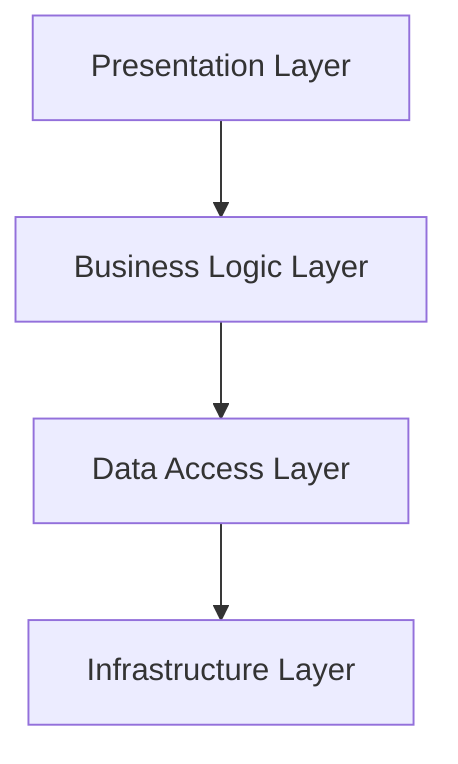

# Sembalun Framework Reference Guide
# Referensi Cepat Framework Pengembangan Sembalun

## 🎯 Framework Summary

Sembalun Development Framework adalah sistem pengembangan terintegrasi yang dirancang khusus untuk aplikasi meditasi dan mindfulness dengan fokus pada **Cultural Authenticity**, **Technical Excellence**, **User-Centric Design**, dan **Scalable Growth**.

### Core Principles
1. **🏛️ Cultural Authenticity** - Preservasi dan representasi yang respectful terhadap tradisi meditasi Indonesia
2. **⚡ Technical Excellence** - Modern architecture dengan best practices dan performance optimization
3. **👤 User-Centric Design** - Experience yang transformatif dan accessible untuk semua pengguna
4. **📈 Scalable Growth** - Architecture yang dapat berkembang dengan kebutuhan bisnis dan teknologi

## 🏗️ Architecture Quick Reference

### Layered Architecture


### Module Structure Template
```
src/features/[feature-name]/
├── components/          # UI components
├── hooks/              # Custom React hooks
├── services/           # Business logic
├── types/              # TypeScript definitions
├── utils/              # Utility functions
├── constants/          # Constants
└── index.ts           # Module exports
```

## 🛠️ Development Workflow Reference

### Git Workflow
```bash
# Branch naming
main                           # Production
develop                        # Development integration  
feature/AUTH-123-description   # Feature branches
bugfix/BUG-456-description     # Bug fixes
hotfix/HOT-789-description     # Critical fixes
release/v1.2.0                 # Release branches

# Commit format
<type>(<scope>): <description>

# Types: feat, fix, docs, style, refactor, test, chore
```

### Command Reference
```bash
# Setup & Development
npm run setup:framework        # Initial framework setup
npm run dev                   # Start development server
npm run build                 # Production build
npm run preview               # Preview build

# Code Quality
npm run lint                  # Run linting
npm run typecheck            # TypeScript check
npm run format               # Format code

# Testing
npm run test                 # Run all tests
npm run test:unit            # Unit tests only
npm run test:integration     # Integration tests
npm run test:e2e             # End-to-end tests
npm run test:coverage        # Coverage report

# Cultural Validation
npm run validate:cultural     # Cultural content validation
npm run check:terminology    # Meditation terminology check
npm run check:sensitivity    # Cultural sensitivity check

# Framework Utilities
npm run validate:framework   # Validate framework setup
npm run generate:component   # Generate component template
npm run generate:service     # Generate service template
```

## 🧩 Component Framework Reference

### Component Template
```typescript
interface ComponentProps {
  // Props dengan clear documentation
}

const Component: React.FC<ComponentProps> = ({
  // Destructured props
}) => {
  // Component logic
  return (
    // JSX with proper accessibility
  );
};

export default Component;
```

### Cultural Component Template
```typescript
import { createCulturalComponent, MeditationTradition } from '@sembalun/framework';

const CulturalComponent = createCulturalComponent({
  name: 'ComponentName',
  tradition: MeditationTradition.JAVANESE_LELAKU,
  component: ComponentImplementation,
  culturalValidation: {
    requiredExperts: ['expert_id'],
    accuracyThreshold: 85,
    respectfulnessCheck: true
  }
});
```

### Service Template
```typescript
import { BaseService } from '@sembalun/framework';

export class FeatureService extends BaseService {
  async methodName(params: ParamType): Promise<ReturnType> {
    try {
      // Validation
      const validation = await this.validateInput(params, schema);
      if (!validation.isValid) throw new ValidationError();
      
      // Business logic
      const result = await this.processRequest(params);
      
      // Analytics tracking
      await this.analytics.trackEvent('event_name', data);
      
      return result;
    } catch (error) {
      throw await this.handleServiceError(error, context);
    }
  }
}
```

## 🧪 Testing Reference

### Testing Structure
```typescript
// Test file naming: ComponentName.test.tsx
describe('Feature: FeatureName', () => {
  describe('Component: ComponentName', () => {
    describe('Behavior: SpecificBehavior', () => {
      it('should do something specific', () => {
        // Arrange - Act - Assert pattern
      });
    });
  });
});
```

### Cultural Testing Utilities
```typescript
import { renderWithCulturalContext, CulturalTestDataFactory } from '@sembalun/framework/test';

// Render dengan cultural context
renderWithCulturalContext(<Component />, {
  tradition: MeditationTradition.JAVANESE_LELAKU,
  culturalValidation: true
});

// Create test data
const testData = CulturalTestDataFactory.createCulturalContent(tradition);
```

### Common Test Patterns
```typescript
// Component behavior testing
it('should handle cultural validation correctly', async () => {
  // Test cultural validation logic
});

// Service integration testing
it('should process cultural content respectfully', async () => {
  // Test service with cultural content
});

// Error handling testing
it('should handle cultural validation errors gracefully', async () => {
  // Test error scenarios
});
```

## 🔒 Security Reference

### Authentication Implementation
```typescript
import { CulturalAuthProvider } from '@sembalun/framework';

// Setup authentication dengan cultural protection
<CulturalAuthProvider
  providers={['email', 'google', 'apple']}
  dataProtection={{
    encryptCulturalData: true,
    respectfulDataHandling: true,
    culturalConsentRequired: true
  }}
  culturalAccess={{
    validateCulturalPermissions: true,
    requireCulturalConsent: true
  }}
>
  {children}
</CulturalAuthProvider>
```

### Data Protection Standards
```typescript
// Cultural data classification
enum DataSensitivity {
  PUBLIC = 'public',
  INTERNAL = 'internal', 
  CONFIDENTIAL = 'confidential',
  RESTRICTED = 'restricted'
}

// Cultural content protection
const protectedContent = await CulturalDataProtection.protect(culturalContent, {
  encryption: 'AES-256-GCM',
  accessControl: 'cultural-permission-based',
  auditTrail: true,
  respectfulUseOnly: true
});
```

## 📊 Analytics Reference

### Respectful Analytics Implementation
```typescript
import { CulturalAnalyticsService } from '@sembalun/framework';

// Track cultural engagement responsibly
await analytics.trackCulturalEngagement({
  tradition: MeditationTradition.JAVANESE_LELAKU,
  contentType: 'guided_meditation',
  duration: 600000,
  respectfulness: {
    culturalSensitivity: 95,
    appropriateUsage: true,
    learningIntent: true
  },
  // NO personal identifiers
  // NO location data  
  // NO device fingerprinting
});
```

### Wellness Impact Measurement
```typescript
// Measure meditation impact
const impact = await WellnessImpactService.measureMeditationImpact(userId, session);

// Generate cultural impact report
const culturalReport = await analytics.generateCulturalImpactReport(
  MeditationTradition.JAVANESE_LELAKU,
  { startDate: '2025-01-01', endDate: '2025-03-31' }
);
```

## 🎨 Design System Reference

### Color Palette
```typescript
const colors = {
  primary: {
    50: '#f0f9ff',
    500: '#0ea5e9',
    900: '#0c4a6e'
  },
  cultural: {
    earthBrown: '#8b4513',     // Traditional Indonesian earth
    templeGold: '#ffd700',     // Gold from architecture
    lotusWhite: '#fffaf0',     // Pure spiritual white
    bambooGreen: '#9acd32',    // Natural bamboo green
    spiritualPurple: '#663399' // Deep meditation purple
  }
};
```

### Typography Scale
```typescript
const typography = {
  // Headings
  h1: 'text-4xl font-bold',
  h2: 'text-3xl font-semibold',
  h3: 'text-2xl font-medium',
  
  // Body text
  body: 'text-base',
  'body-large': 'text-lg',
  'body-small': 'text-sm',
  
  // Cultural text
  'cultural-title': 'text-2xl font-medium text-cultural-earthBrown',
  'spiritual-text': 'text-lg text-cultural-spiritualPurple'
};
```

### Component Variants
```typescript
// Button variants
<Button variant="primary" size="lg">Primary Action</Button>
<Button variant="cultural" tradition="javanese">Cultural Action</Button>

// Card variants
<Card variant="elevated" culturalTheme="balinese">
  Cultural Content
</Card>
```

## 🚀 Performance Reference

### Optimization Strategies
```typescript
// Efficient content loading
const content = await loadCulturalContent(tradition, 'high');

// Session optimization
const optimizedSession = await optimizeMeditationSession(session);

// Analytics optimization
const analytics = setupEfficientAnalytics({
  batchingStrategy: { maxBatchSize: 50, maxWaitTime: 5000 },
  dataMinimization: { collectOnlyEssential: true },
  storageOptimization: { useCompression: true }
});
```

### Performance Targets
```typescript
interface PerformanceTargets {
  loadTime: {
    firstContentfulPaint: '<1.5s';
    largestContentfulPaint: '<2.5s';
    cumulativeLayoutShift: '<0.1';
  };
  lighthouse: {
    performance: '>90';
    accessibility: '>95';
    bestPractices: '>90';
  };
}
```

## 🌍 Cultural Framework Reference

### Supported Meditation Traditions
```typescript
enum MeditationTradition {
  JAVANESE_LELAKU = 'javanese_lelaku',
  BALINESE_DHARANA = 'balinese_dharana', 
  SUNDANESE_CONTEMPLATION = 'sundanese_contemplation',
  MINANG_SPIRITUAL_PRACTICE = 'minang_spiritual',
  ISLAMIC_MURAQABA = 'islamic_muraqaba',
  BUDDHIST_VIPASSANA = 'buddhist_vipassana'
}
```

### Cultural Validation Process
```typescript
// 1. Content creation
const content = createCulturalContent(tradition);

// 2. Expert validation
const validation = await CulturalValidator.validate(content);

// 3. Community review
const communityFeedback = await getCommunityFeedback(content);

// 4. Approval process
if (validation.isValid && communityFeedback.positive) {
  await publishCulturalContent(content);
}
```

### Respectful Implementation Guidelines
```typescript
const guidelines = {
  // Always validate dengan cultural experts
  expertValidation: true,
  
  // Provide cultural context dan education
  culturalEducation: true,
  
  // Ensure respectful representation
  respectfulRepresentation: true,
  
  // Enable community oversight
  communityOversight: true,
  
  // Prevent commercial misuse
  commercialProtection: true,
  
  // Support cultural preservation
  culturalPreservation: true
};
```

## 📋 Quick Setup Checklist

### Initial Setup (15 menit)
- [ ] Clone repository
- [ ] `npm install`
- [ ] Copy `.env.example` to `.env.local`
- [ ] Add Supabase credentials
- [ ] `npm run setup:framework`
- [ ] `npm run validate:framework`

### Development Setup (30 menit)
- [ ] Setup IDE extensions
- [ ] Configure cultural validation tools
- [ ] Setup testing environment
- [ ] Create first cultural component
- [ ] Run development server

### Production Setup (60 menit)
- [ ] Configure CI/CD pipeline
- [ ] Setup monitoring and analytics
- [ ] Configure security measures
- [ ] Setup cultural expert network
- [ ] Deploy to staging environment

## 🆘 Troubleshooting Reference

### Common Issues
```bash
# Framework validation fails
npm run validate:framework --verbose

# Cultural validation errors
npm run check:cultural --fix

# Type errors
npm run typecheck --strict

# Test failures
npm run test --verbose

# Build issues
npm run build --debug
```

### Error Handling Patterns
```typescript
// Service error handling
try {
  const result = await service.method(params);
} catch (error) {
  if (error instanceof CulturalValidationError) {
    // Handle cultural validation errors
  } else if (error instanceof ValidationError) {
    // Handle general validation errors
  } else {
    // Handle unexpected errors
  }
}

// Component error boundaries
<CulturalErrorBoundary tradition={tradition}>
  <CulturalComponent />
</CulturalErrorBoundary>
```

## 📚 Additional Resources

### Documentation Links
- [Framework Overview](./FRAMEWORK.md) - Complete framework documentation
- [Implementation Guide](./FRAMEWORK_IMPLEMENTATION.md) - Step-by-step implementation
- [Development Roadmap](./ROADMAP.md) - Complete development plan
- [Technical Roadmap](./TECHNICAL_ROADMAP.md) - Technical architecture evolution

### Cultural Resources
- Indonesian Meditation Traditions Database
- Cultural Expert Network Directory
- Respectful Implementation Guidelines
- Community Feedback Channels

### Development Resources
- Component Storybook
- API Documentation
- Testing Utilities Reference
- Performance Monitoring Dashboard

---

**Sembalun Framework Reference Guide ini menyediakan akses cepat ke semua aspek penting framework untuk membantu developer dalam implementasi yang efisien, authentic, dan berkualitas tinggi.** 🧘‍♀️✨

Gunakan referensi ini sebagai panduan cepat dalam development sehari-hari dan pastikan setiap implementasi mengikuti prinsip-prinsip cultural authenticity dan technical excellence yang telah ditetapkan.