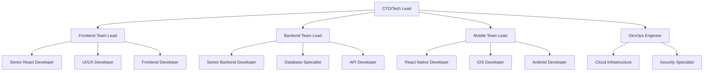

# Roadmap Pengembangan Sembalun 2025-2026
# Rencana Pengembangan Komprehensif Aplikasi Meditasi Sembalun

## 🎯 Visi dan Misi

### Visi 2026
Menjadi platform meditasi dan mindfulness terdepan di Asia Tenggara yang menggabungkan kearifan tradisional Indonesia dengan teknologi modern untuk menciptakan pengalaman spiritual yang transformatif.

### Misi
- Menyediakan akses mudah terhadap praktik meditasi berkualitas tinggi
- Melestarikan dan menyebarkan tradisi meditasi Indonesia
- Membangun komunitas mindfulness yang supportif dan inklusif
- Mengintegrasikan teknologi AI untuk personalisasi pengalaman meditasi
- Mendukung kesehatan mental dan wellbeing masyarakat Indonesia

## 📊 Analisis Kondisi Saat Ini (Q4 2024)

### ✅ Kekuatan (Strengths)
- **Teknologi Modern**: React 19, TypeScript, Supabase stack yang scalable
- **PWA Ready**: Aplikasi dapat diinstall dan berfungsi offline
- **Cultural Integration**: Integrasi budaya Indonesia yang kuat
- **Comprehensive Features**: Fitur lengkap untuk tracking dan personalisasi
- **Security First**: Row Level Security dan authentication multi-provider
- **Documentation**: Dokumentasi lengkap dan maintainable codebase

### 🔧 Area Perbaikan (Weaknesses)
- **Content Library**: Konten audio dan video masih terbatas
- **Community Features**: Fitur social dan community belum optimal
- **AI Implementation**: Sistem AI/ML untuk personalisasi masih basic
- **Mobile Native**: Belum ada aplikasi mobile native
- **Monetization**: Model bisnis dan revenue stream belum jelas
- **Marketing**: Brand awareness dan user acquisition masih rendah

### 🌟 Peluang (Opportunities)
- **Market Growing**: Pasar wellness dan mental health berkembang pesat
- **Digital Adoption**: Adopsi aplikasi kesehatan mental meningkat post-COVID
- **Government Support**: Dukungan pemerintah untuk startup kesehatan mental
- **Cultural Heritage**: Kekayaan tradisi meditasi Indonesia yang belum dieksplor
- **Regional Expansion**: Potensi ekspansi ke negara ASEAN lainnya
- **Corporate Wellness**: Peluang B2B untuk program wellness perusahaan

### ⚠️ Tantangan (Threats)
- **Competition**: Kompetisi dengan Headspace, Calm, dan aplikasi lokal
- **Regulation**: Regulasi kesehatan mental yang ketat
- **Economic Downturn**: Dampak ekonomi yang mempengaruhi spending
- **Technology Changes**: Perubahan teknologi yang cepat
- **Cultural Sensitivity**: Risiko misrepresentasi budaya Indonesia
- **Data Privacy**: Regulasi privasi data yang semakin ketat

## 🗓️ Roadmap Pengembangan 2025

### Q1 2025 (Januari - Maret): Fondasi dan Optimisasi

#### 🎯 Tema: "Stabilitas dan Kualitas"

#### 📱 Frontend Development (6-8 minggu)
**Prioritas Tinggi:**
- **UI/UX Redesign**
  - Redesign interface dengan design system yang konsisten
  - Implementasi dark/light mode yang seamless
  - Responsive design optimization untuk tablet
  - Accessibility improvements (WCAG 2.1 AA compliance)
  
- **Performance Optimization**
  - Bundle size optimization (target: <500KB initial load)
  - Lazy loading implementation untuk semua route
  - Image optimization dan WebP conversion
  - Service Worker enhancement untuk better caching
  
- **Core Features Enhancement**
  - Meditation timer dengan advanced features (interval bells, custom patterns)
  - Breathing guide dengan biometric integration (heart rate)
  - Progress tracking dengan detailed analytics
  - Achievement system dengan gamification elements

**Prioritas Sedang:**
- **Indonesian Localization**
  - Complete Bahasa Indonesia translation
  - Cultural content integration (local wisdom, traditions)
  - Indonesian voice guidance untuk guided meditations
  - Local festival and celebration integration

#### 🔧 Backend Development (4-6 minggu)
**Database Enhancements:**
```sql
-- New tables for Q1
CREATE TABLE public.content_library (
  id UUID DEFAULT uuid_generate_v4() PRIMARY KEY,
  title TEXT NOT NULL,
  description TEXT,
  content_type TEXT CHECK (content_type IN ('audio', 'video', 'text')),
  category TEXT NOT NULL,
  duration_minutes INTEGER,
  instructor_id UUID REFERENCES public.instructors(id),
  audio_url TEXT,
  video_url TEXT,
  transcript TEXT,
  tags TEXT[],
  difficulty_level TEXT CHECK (difficulty_level IN ('beginner', 'intermediate', 'advanced')),
  is_premium BOOLEAN DEFAULT false,
  cultural_origin TEXT, -- Indonesian cultural origin
  created_at TIMESTAMP WITH TIME ZONE DEFAULT NOW(),
  updated_at TIMESTAMP WITH TIME ZONE DEFAULT NOW()
);

CREATE TABLE public.instructors (
  id UUID DEFAULT uuid_generate_v4() PRIMARY KEY,
  name TEXT NOT NULL,
  bio TEXT,
  avatar_url TEXT,
  expertise_areas TEXT[],
  cultural_background TEXT,
  languages TEXT[],
  created_at TIMESTAMP WITH TIME ZONE DEFAULT NOW()
);

CREATE TABLE public.user_preferences_extended (
  id UUID DEFAULT uuid_generate_v4() PRIMARY KEY,
  user_id UUID REFERENCES public.users(id) ON DELETE CASCADE,
  biometric_integration BOOLEAN DEFAULT false,
  heart_rate_tracking BOOLEAN DEFAULT false,
  sleep_tracking BOOLEAN DEFAULT false,
  cultural_preferences JSONB DEFAULT '{}',
  ai_personalization_level TEXT DEFAULT 'moderate',
  created_at TIMESTAMP WITH TIME ZONE DEFAULT NOW()
);
```

**API Enhancements:**
- RESTful API expansion untuk content management
- GraphQL implementation untuk complex queries
- Real-time notifications system
- Advanced analytics API

#### 🎵 Content Development (Ongoing)
**Audio Content Creation:**
- 50 guided meditation sessions dalam Bahasa Indonesia
- 20 breathing exercise audio guides
- 30 nature sounds dari Indonesia (pantai, hutan, gunung)
- Traditional Indonesian meditation music (gamelan, etc.)

**Cultural Content Integration:**
- Javanese meditation traditions (Lelaku, Tirakat)
- Balinese mindfulness practices (Tri Hita Karana)
- Sundanese contemplative practices
- Islamic meditation (Muraqaba) adaptation

#### 🧪 Testing & Quality Assurance (2-3 minggu)
- Automated testing coverage target: 85%
- Performance testing (Lighthouse score >90)
- Security penetration testing
- Accessibility testing dengan screen readers
- Cross-browser compatibility testing
- Mobile device testing (iOS/Android)

#### 📊 Deliverables Q1
- [ ] Redesigned UI dengan consistent design system
- [ ] 100+ pieces of Indonesian meditation content
- [ ] Performance optimization (50% faster loading)
- [ ] Enhanced offline capabilities
- [ ] Advanced analytics dashboard
- [ ] Complete Bahasa Indonesia localization

#### 📈 Success Metrics Q1
- **Technical**: Bundle size <500KB, Lighthouse score >90
- **Content**: 100+ audio content pieces
- **User Experience**: App store rating >4.5
- **Performance**: 50% improvement in loading time

---

### Q2 2025 (April - Juni): Ekspansi Fitur dan Community

#### 🎯 Tema: "Community dan Engagement"

#### 👥 Community Features (6-8 minggu)
**Social Features:**
```typescript
// Community feature interfaces
interface CommunityGroup {
  id: string;
  name: string;
  description: string;
  category: 'beginner' | 'advanced' | 'cultural' | 'corporate';
  memberCount: number;
  isPrivate: boolean;
  culturalFocus?: string; // e.g., 'javanese', 'balinese'
  moderators: string[];
  activities: GroupActivity[];
}

interface GroupChallenge {
  id: string;
  groupId: string;
  title: string;
  description: string;
  type: 'meditation_streak' | 'total_minutes' | 'consistency';
  duration: number; // days
  startDate: Date;
  endDate: Date;
  participants: string[];
  rewards: Achievement[];
}

interface MeditationCircle {
  id: string;
  title: string;
  scheduledTime: Date;
  duration: number;
  maxParticipants: number;
  facilitator: string;
  type: 'guided' | 'silent' | 'discussion';
  culturalTheme?: string;
}
```

**Fitur Community:**
- **Meditation Circles**: Virtual group meditation sessions
- **Community Challenges**: Group meditation challenges dengan leaderboard
- **Discussion Forums**: Forum diskusi berdasarkan topik dan budaya
- **Mentor System**: Sistem mentoring untuk practitioner berpengalaman
- **Cultural Groups**: Grup berdasarkan tradisi meditasi regional
- **Progress Sharing**: Berbagi pencapaian dengan privacy controls

#### 🤖 AI & Personalization Engine (8-10 minggu)
**Advanced AI Features:**
```typescript
interface AIPersonalizationEngine {
  userId: string;
  meditationStyle: 'guided' | 'silent' | 'movement' | 'mixed';
  optimalTimes: TimeSlot[];
  moodPatterns: MoodPattern[];
  progressPredictions: ProgressPrediction[];
  culturalAffinities: CulturalPreference[];
  recommendedContent: ContentRecommendation[];
  adaptiveDifficulty: DifficultyProgression;
}

interface SmartScheduling {
  userId: string;
  calendarIntegration: boolean;
  weatherBasedRecommendations: boolean;
  stressLevelAdaptation: boolean;
  biorhythmSync: boolean;
  contextualReminders: ContextualReminder[];
}
```

**AI Implementation:**
- **Smart Content Recommendation**: ML-based content recommendation
- **Adaptive Meditation Plans**: Personalized meditation programs
- **Mood-based Session Selection**: AI memilih sesi berdasarkan mood
- **Optimal Time Prediction**: Prediksi waktu terbaik untuk meditasi
- **Cultural Preference Learning**: AI belajar preferensi budaya user
- **Voice Sentiment Analysis**: Analisis sentiment dari voice notes

#### 📱 Mobile Native Development (10-12 minggu)
**React Native App Development:**
- Cross-platform mobile app dengan React Native
- Native features integration (haptic feedback, biometric auth)
- Offline-first architecture dengan React Query
- Push notifications dengan FCM
- Deep linking dan universal links
- App store optimization (ASO)

**Platform-Specific Features:**
- **iOS**: HealthKit integration, Siri Shortcuts, Apple Watch companion
- **Android**: Google Fit integration, Wear OS companion, Adaptive icons

#### 📊 Deliverables Q2
- [ ] Community platform dengan social features
- [ ] AI-powered personalization engine
- [ ] React Native mobile applications (iOS & Android)
- [ ] Advanced meditation analytics
- [ ] Cultural content expansion (200+ total pieces)
- [ ] Mentor/mentee matching system

#### 📈 Success Metrics Q2
- **Community**: 1000+ active community members
- **Mobile**: 10,000+ mobile app downloads
- **Engagement**: 40% increase in daily active users
- **AI**: 80% accuracy dalam content recommendation

---

### Q3 2025 (Juli - September): Monetisasi dan Business Development

#### 🎯 Tema: "Sustainable Growth dan Revenue"

#### 💰 Monetization Strategy (4-6 minggu)
**Revenue Streams:**
```typescript
interface SubscriptionPlan {
  id: string;
  name: 'basic' | 'premium' | 'family' | 'corporate';
  price: {
    monthly: number;
    yearly: number;
    currency: 'IDR' | 'USD';
  };
  features: PlanFeature[];
  limits: PlanLimits;
  culturalContent: boolean;
  aiPersonalization: boolean;
  communityAccess: boolean;
}

interface CorporatePackage {
  id: string;
  companySize: 'small' | 'medium' | 'large' | 'enterprise';
  employeeCount: number;
  customBranding: boolean;
  analytics: boolean;
  wellnessPrograms: WellnessProgram[];
  pricing: CorporatePrice;
}
```

**Implementasi Monetisasi:**
- **Freemium Model**: Basic features gratis, premium content berbayar
- **Subscription Tiers**: Multiple pricing tiers dengan feature differentiation
- **Corporate Wellness**: B2B packages untuk perusahaan
- **Cultural Content Premium**: Premium access ke content budaya eksklusif
- **Personal Coaching**: 1-on-1 coaching sessions dengan certified instructors
- **Merchandise**: Meditation accessories dan cultural items

#### 🏢 Corporate Wellness Platform (6-8 minggu)
**Enterprise Features:**
- **Company Dashboard**: Analytics untuk HR dan wellness teams
- **Employee Engagement Tracking**: Anonymized wellness metrics
- **Custom Meditation Programs**: Program khusus per perusahaan
- **Integration dengan HR Systems**: HRIS integration
- **Wellness Challenges**: Company-wide meditation challenges
- **ROI Reporting**: Impact measurement untuk wellness programs

**Corporate Partnerships:**
- Partnership dengan perusahaan multinasional di Indonesia
- Collaboration dengan HR consulting firms
- Integration dengan employee benefits platforms
- Certification program untuk corporate wellness managers

#### 🎓 Education & Certification Program (4-6 minggu)
**Learning Management System:**
```sql
CREATE TABLE public.courses_extended (
  id UUID DEFAULT uuid_generate_v4() PRIMARY KEY,
  title TEXT NOT NULL,
  description TEXT,
  category TEXT,
  difficulty_level TEXT,
  duration_weeks INTEGER,
  modules JSONB, -- Course modules structure
  certification_available BOOLEAN DEFAULT false,
  cultural_tradition TEXT,
  instructor_id UUID REFERENCES public.instructors(id),
  price DECIMAL(10,2),
  currency TEXT DEFAULT 'IDR',
  prerequisites TEXT[],
  learning_outcomes TEXT[],
  created_at TIMESTAMP WITH TIME ZONE DEFAULT NOW()
);

CREATE TABLE public.certifications (
  id UUID DEFAULT uuid_generate_v4() PRIMARY KEY,
  user_id UUID REFERENCES public.users(id),
  course_id UUID REFERENCES public.courses_extended(id),
  completion_date TIMESTAMP WITH TIME ZONE,
  certificate_url TEXT,
  credential_id TEXT UNIQUE,
  cultural_specialization TEXT,
  instructor_signature TEXT,
  created_at TIMESTAMP WITH TIME ZONE DEFAULT NOW()
);
```

**Program Sertifikasi:**
- **Mindfulness Fundamentals Certificate**
- **Indonesian Cultural Meditation Practitioner**
- **Corporate Wellness Facilitator**
- **Community Meditation Leader**
- **Breathwork Specialist Certificate**

#### 📊 Advanced Analytics Platform (3-4 minggu)
**Business Intelligence Dashboard:**
- User behavior analytics dan retention metrics
- Content performance dan engagement tracking
- Revenue analytics dan subscription metrics
- Cultural content popularity analysis
- Community health dan engagement metrics
- Predictive analytics untuk churn prevention

#### 📈 Deliverables Q3
- [ ] Complete monetization platform implementation
- [ ] Corporate wellness dashboard dan B2B features
- [ ] Certification program dengan 5 course tracks
- [ ] Advanced business analytics platform
- [ ] Partnership agreements dengan 10+ corporations
- [ ] Revenue target: $50,000 MRR

#### 📈 Success Metrics Q3
- **Revenue**: $50,000+ Monthly Recurring Revenue
- **Corporate**: 10+ corporate clients
- **Certification**: 500+ certified practitioners
- **Premium Conversion**: 15% freemium to premium conversion

---

### Q4 2025 (Oktober - Desember): Ekspansi Regional dan Innovation

#### 🎯 Tema: "Regional Leadership dan Future Tech"

#### 🌏 Regional Expansion (8-10 minggu)
**ASEAN Market Entry:**
```typescript
interface RegionalLocalization {
  country: 'MY' | 'SG' | 'TH' | 'PH' | 'VN';
  language: string;
  culturalAdaptation: CulturalContent[];
  paymentMethods: PaymentMethod[];
  localPartnerships: Partnership[];
  regulatoryCompliance: Compliance[];
}

interface CulturalContent {
  country: string;
  traditions: MeditationTradition[];
  instructors: LocalInstructor[];
  languages: string[];
  culturalNuances: string[];
}
```

**Market Expansion Strategy:**
- **Malaysia**: Fokus pada multicultural meditation practices
- **Singapore**: Corporate wellness dan premium market
- **Thailand**: Buddhist meditation integration
- **Philippines**: Christian contemplative practices adaptation
- **Vietnam**: Zen Buddhism dan mindfulness traditions

**Localization Requirements:**
- Multi-language support (Malay, Thai, Tagalog, Vietnamese)
- Local payment gateways (GrabPay, TrueMoney, etc.)
- Cultural content adaptation per negara
- Local instructor partnerships
- Regulatory compliance per negara

#### 🚀 Next-Generation Features (6-8 minggu)
**Emerging Technology Integration:**
```typescript
interface VRMeditationExperience {
  id: string;
  environment: 'beach' | 'forest' | 'temple' | 'mountain';
  culturalSetting: 'borobudur' | 'bali_temple' | 'toraja' | 'flores';
  interactivity: 'passive' | 'guided' | 'interactive';
  deviceSupport: 'oculus' | 'cardboard' | 'webxr';
  duration: number;
}

interface AIVoiceGuide {
  personality: 'calm' | 'energetic' | 'wise' | 'nurturing';
  language: string;
  culturalAccent: string;
  adaptiveGuidance: boolean;
  emotionalIntelligence: boolean;
  personalizedScripts: boolean;
}

interface BiometricIntegration {
  heartRateVariability: boolean;
  breathingRate: boolean;
  stressLevels: boolean;
  sleepQuality: boolean;
  brainwavePatterns: boolean; // EEG integration
  deviceCompatibility: WearableDevice[];
}
```

**Innovation Features:**
- **VR/AR Meditation**: Virtual reality meditation experiences di lokasi spiritual Indonesia
- **AI Voice Synthesis**: Personalized AI meditation guides dengan suara natural
- **Biometric Integration**: Advanced health tracking dengan smartwatch dan wearables
- **Blockchain Certificates**: NFT-based meditation certificates dan achievements
- **Voice Interaction**: Voice-controlled meditation sessions
- **Smart Home Integration**: Integrasi dengan Google Home, Alexa untuk ambient control

#### 🎯 Strategic Partnerships (4-6 minggu)
**Partnership Ecosystem:**
- **Healthcare Partners**: Rumah sakit dan klinik untuk mental health programs
- **Education Partners**: Universitas untuk student wellness programs
- **Technology Partners**: Integration dengan health tech companies
- **Cultural Partners**: Museum dan cultural institutions untuk authentic content
- **Media Partners**: Content collaboration dengan wellness influencers
- **Government Partners**: Collaboration dengan ministry of health programs

#### 🔬 Research & Development (Ongoing)
**Research Initiatives:**
- Effectiveness study pada traditional Indonesian meditation
- User behavior research untuk personalization improvement
- Cultural sensitivity research untuk content development
- Mental health impact studies dengan academic institutions
- Technology adoption research di ASEAN region

#### 📊 Deliverables Q4
- [ ] Multi-country launch (Malaysia, Singapore, Thailand)
- [ ] VR meditation experiences untuk 10+ Indonesian spiritual locations
- [ ] AI-powered personalized voice guides
- [ ] Advanced biometric integration
- [ ] Strategic partnerships dengan 20+ organizations
- [ ] Research publication tentang digital meditation effectiveness

#### 📈 Success Metrics Q4
- **Regional**: 50,000+ users across ASEAN
- **Innovation**: 10,000+ VR session completions
- **Partnership**: 20+ strategic partnerships established
- **Research**: 2+ published research papers

---

## 🎯 Rencana 2026: Ekspansi Global dan Platform Leadership

### Vision 2026: "Global Mindfulness Platform"

#### Q1 2026: Global Market Entry
- **United States & Europe**: English market penetration
- **Middle East**: Islamic meditation market
- **East Asia**: Japan, South Korea, China expansion
- **Content Globalization**: 1000+ meditation content dalam 15+ bahasa

#### Q2 2026: Technology Leadership
- **AI Research Lab**: Dedicated R&D untuk meditation AI
- **Open Source Initiative**: Open source meditation tools
- **Developer Platform**: API untuk third-party developers
- **Academic Partnerships**: Research collaboration dengan top universities

#### Q3 2026: Ecosystem Platform
- **Marketplace**: Third-party instructor dan content marketplace
- **Hardware Partnerships**: Branded meditation hardware
- **Clinic Integration**: Medical clinic dan therapist platform
- **Insurance Integration**: Mental health insurance coverage

#### Q4 2026: Cultural Preservation Initiative
- **Digital Archive**: UNESCO partnership untuk cultural preservation
- **Documentary Series**: Cultural meditation documentary production
- **Scholarship Program**: Free access untuk underserved communities
- **Global Conference**: Annual international mindfulness conference

---

## 👥 Tim dan Resource Planning

### Struktur Tim Pengembangan

#### Core Development Team (15-20 orang)


#### Product & Content Team (10-12 orang)
- **Product Manager** (1): Overall product strategy dan roadmap
- **UX Researcher** (1): User research dan testing
- **Content Director** (1): Content strategy dan quality
- **Indonesian Content Creators** (3): Traditional meditation content
- **Audio Engineers** (2): Audio production dan mastering
- **Cultural Consultants** (2): Indonesian meditation traditions
- **Community Managers** (2): Community engagement dan moderation

#### Business & Operations (8-10 orang)
- **COO** (1): Operations dan business development
- **Sales Director** (1): B2B sales dan partnerships
- **Marketing Manager** (2): Digital marketing dan brand
- **Customer Success** (2): Customer support dan success
- **Data Analyst** (1): Business intelligence dan analytics
- **Legal/Compliance** (1): Legal affairs dan regulatory compliance

### Budget Estimasi (12 bulan)

#### Development Costs
```
Personnel (30 orang x 12 bulan):
- Senior Developers (5 @ $8,000/month): $480,000
- Mid-level Developers (10 @ $5,000/month): $600,000
- Junior Developers (5 @ $3,000/month): $180,000
- Product/Content Team (10 @ $4,000/month): $480,000

Total Personnel: $1,740,000/year
```

#### Technology & Infrastructure
```
- Cloud Infrastructure (AWS/Vercel): $60,000/year
- Third-party Services (Supabase, etc.): $36,000/year
- Development Tools & Licenses: $24,000/year
- Security & Compliance Tools: $18,000/year
- AI/ML Services: $48,000/year

Total Technology: $186,000/year
```

#### Content & Production
```
- Audio/Video Production: $120,000/year
- Instructor Fees: $96,000/year
- Translation Services: $36,000/year
- Cultural Research: $24,000/year
- Legal & Licensing: $18,000/year

Total Content: $294,000/year
```

#### Marketing & Business Development
```
- Digital Marketing: $180,000/year
- Conferences & Events: $48,000/year
- Partnership Development: $36,000/year
- PR & Communications: $30,000/year
- Market Research: $18,000/year

Total Marketing: $312,000/year
```

#### **Total Budget Estimation: $2,532,000 (Q1 2025 - Q4 2025)**

---

## 📊 Key Performance Indicators (KPIs)

### User Growth Metrics
```typescript
interface UserGrowthKPIs {
  // Acquisition
  monthlyActiveUsers: number; // Target: 100K by Q4 2025
  newUserAcquisition: number; // Target: 10K/month by Q4
  organicVsPaidRatio: number; // Target: 70% organic
  
  // Engagement
  dailyActiveUsers: number; // Target: 30K by Q4 2025
  sessionDuration: number; // Target: 15+ minutes average
  retentionRate: {
    day1: number; // Target: 80%
    day7: number; // Target: 60%
    day30: number; // Target: 40%
  };
  
  // Quality
  appStoreRating: number; // Target: 4.7+
  npsScore: number; // Target: 70+
  supportTicketResolution: number; // Target: <24 hours
}
```

### Revenue Metrics
```typescript
interface RevenueKPIs {
  monthlyRecurringRevenue: number; // Target: $200K by Q4 2025
  averageRevenuePerUser: number; // Target: $15/month
  customerLifetimeValue: number; // Target: $180
  churnRate: number; // Target: <5% monthly
  conversionRate: {
    freeToTrial: number; // Target: 25%
    trialToPaid: number; // Target: 60%
  };
  corporateRevenue: number; // Target: 40% of total revenue
}
```

### Content & Community Metrics
```typescript
interface ContentCommunityKPIs {
  contentLibrarySize: number; // Target: 500+ pieces by Q4
  contentEngagement: number; // Target: 85% completion rate
  communityMembers: number; // Target: 50K active community members
  userGeneratedContent: number; // Target: 1K posts/month
  culturalContentUtilization: number; // Target: 70% of users engage
  instructorRatings: number; // Target: 4.8+ average
}
```

---

## ⚠️ Risk Analysis dan Mitigasi

### Technical Risks

#### 🔴 High Risk
**Scalability Issues**
- *Risk*: Application tidak dapat handle user growth yang cepat
- *Impact*: Service downtime, poor user experience, churn
- *Mitigation*: Load testing, horizontal scaling, CDN implementation, microservices architecture
- *Contingency*: Cloud auto-scaling, database partitioning, emergency scaling procedures

**Data Security Breaches**
- *Risk*: User data compromise, privacy violations
- *Impact*: Legal liability, trust loss, regulatory penalties
- *Mitigation*: End-to-end encryption, regular security audits, compliance certification
- *Contingency*: Incident response plan, legal coverage, data breach insurance

#### 🟡 Medium Risk
**Third-party Dependencies**
- *Risk*: Supabase or key services discontinuation/issues
- *Impact*: Service disruption, migration costs
- *Mitigation*: Multi-cloud strategy, data portability, service monitoring
- *Contingency*: Alternative service providers, data backup strategy

**AI Model Performance**
- *Risk*: AI recommendations tidak accurate atau biased
- *Impact*: Poor user experience, cultural insensitivity
- *Mitigation*: Diverse training data, bias testing, human oversight
- *Contingency*: Fallback to rule-based recommendations

### Business Risks

#### 🔴 High Risk
**Competitive Pressure**
- *Risk*: Major players (Headspace, Calm) enter Indonesian market aggressively
- *Impact*: Market share loss, pricing pressure, user acquisition costs increase
- *Mitigation*: Strong cultural differentiation, community building, local partnerships
- *Contingency*: Pivot to B2B focus, strategic partnerships, acquisition consideration

**Regulatory Changes**
- *Risk*: Indonesia healthcare/data regulations become restrictive
- *Impact*: Compliance costs, feature limitations, market access
- *Mitigation*: Proactive regulatory engagement, legal compliance, industry association participation
- *Contingency*: Business model adaptation, international expansion acceleration

#### 🟡 Medium Risk
**Cultural Sensitivity Issues**
- *Risk*: Misrepresentation of Indonesian meditation traditions
- *Impact*: Community backlash, cultural appropriation accusations
- *Mitigation*: Cultural advisors, community feedback loops, respectful content development
- *Contingency*: Public apology, content revision, community engagement initiatives

**Monetization Challenges**
- *Risk*: Users resistant to paying for meditation content
- *Impact*: Revenue shortfall, investor confidence loss
- *Mitigation*: Value demonstration, freemium optimization, alternative revenue streams
- *Contingency*: Business model pivot, cost reduction, additional funding rounds

---

## 🎯 Success Factors dan Critical Dependencies

### Key Success Factors

#### 1. Cultural Authenticity
- Authentic Indonesian meditation content yang respectful dan accurate
- Partnership dengan cultural experts dan traditional practitioners
- Community feedback integration dalam content development

#### 2. Technology Excellence
- Scalable, performant, dan reliable platform
- Innovative features yang differentiate dari competitors
- Seamless user experience across all platforms

#### 3. Community Building
- Strong, engaged user community
- Effective community management dan moderation
- User-generated content dan peer support systems

#### 4. Strategic Partnerships
- Corporate partnerships untuk B2B growth
- Healthcare partnerships untuk credibility
- Cultural institution partnerships untuk authenticity

### Critical Dependencies

#### External Dependencies
- **Supabase Platform**: Core backend infrastructure
- **Vercel/AWS**: Hosting dan CDN services
- **Payment Processors**: Subscription billing systems
- **Content Licensing**: Music dan audio licensing rights
- **Regulatory Approval**: Healthcare data handling permissions

#### Internal Dependencies
- **Content Production Pipeline**: Consistent, quality content creation
- **Community Management**: Effective community engagement
- **Customer Support**: Responsive user support systems
- **Quality Assurance**: Comprehensive testing dan quality control

---

## 📋 Implementation Timeline

### Q1 2025 Implementation Plan

#### Week 1-2: Team Setup & Planning
- [ ] Hire key technical leads dan senior developers
- [ ] Setup development infrastructure dan tooling
- [ ] Finalize technical architecture decisions
- [ ] Create detailed sprint plans

#### Week 3-6: Core Development Phase 1
- [ ] UI/UX redesign implementation
- [ ] Database schema updates dan migrations
- [ ] Content management system development
- [ ] Performance optimization initiatives

#### Week 7-10: Content & Feature Development
- [ ] Indonesian content creation (audio recording)
- [ ] Advanced meditation features implementation
- [ ] Community features basic implementation
- [ ] Testing dan quality assurance

#### Week 11-12: Launch Preparation
- [ ] Beta testing dengan selected users
- [ ] Performance testing dan optimization
- [ ] Security audit dan penetration testing
- [ ] Launch planning dan marketing preparation

### Milestone Checkpoints

#### Monthly Reviews
- Technical progress assessment
- Budget tracking dan adjustment
- User feedback integration
- Risk assessment update

#### Quarterly Business Reviews
- KPI performance evaluation
- Strategy adjustment berdasarkan market feedback
- Resource allocation review
- Next quarter planning

---

## 🚀 Conclusion dan Next Steps

Rencana pengembangan komprehensif ini dirancang untuk mentransformasi Sembalun dari aplikasi meditasi yang solid menjadi platform mindfulness terdepan di Asia Tenggara. Dengan fokus pada keaslian budaya Indonesia, teknologi inovatif, dan community building yang kuat, kami yakin dapat mencapai visi 2026.

### Immediate Action Items (Next 30 days)
1. **Team Recruitment**: Mulai proses hiring untuk key positions
2. **Partnership Outreach**: Initiate conversations dengan potential strategic partners
3. **Funding Strategy**: Prepare investor materials untuk Series A funding
4. **Market Validation**: Conduct user interviews untuk validate roadmap priorities
5. **Technical Architecture**: Finalize scalability dan performance requirements

### Long-term Strategic Focus
- **Cultural Preservation**: Menjadi digital custodian tradisi meditasi Indonesia
- **Technology Innovation**: Pioneer dalam meditation AI dan personalization
- **Community Impact**: Measurable positive impact pada mental health di Indonesia
- **Regional Leadership**: Establish Sembalun sebagai go-to meditation platform di ASEAN

Dengan commitment terhadap excellence, cultural sensitivity, dan user-centric development, Sembalun siap untuk menjadi pemimpin dalam digital wellness space sambil melestarikan dan mempromosikan kekayaan tradisi spiritual Indonesia.

**Target Akhir 2025:**
- 🎯 100,000+ Monthly Active Users
- 💰 $200,000+ Monthly Recurring Revenue  
- 🌏 Available di 5 negara ASEAN
- 🎵 500+ pieces of authentic Indonesian meditation content
- 👥 50,000+ active community members
- 🏢 50+ corporate clients

Mari bersama-sama membangun masa depan mindfulness digital yang authentic, inclusive, dan transformative! 🧘‍♀️✨