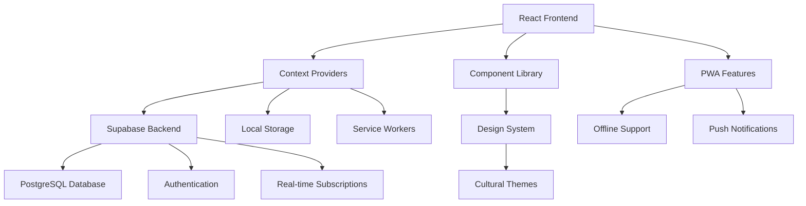

# Sembalun - Technical Documentation

## Overview

**Sembalun** is a comprehensive Indonesian meditation application that combines modern web technologies with cultural sensitivity and personalization. Built with React, TypeScript, and Supabase, it provides a culturally-aware meditation platform specifically designed for Indonesian users.

## Table of Contents

1. [Architecture Overview](#architecture-overview)
2. [Technology Stack](#technology-stack)
3. [Project Structure](#project-structure)
4. [Core Features](#core-features)
5. [Component System](#component-system)
6. [State Management](#state-management)
7. [Database Schema](#database-schema)
8. [API Integration](#api-integration)
9. [Authentication System](#authentication-system)
10. [Cultural Adaptation](#cultural-adaptation)
11. [Progressive Web App Features](#progressive-web-app-features)
12. [Performance Optimizations](#performance-optimizations)
13. [Build Configuration](#build-configuration)
14. [Development Setup](#development-setup)
15. [Deployment Strategy](#deployment-strategy)
16. [Testing Strategy](#testing-strategy)
17. [Developer Onboarding](#developer-onboarding)

## Architecture Overview

### High-Level Architecture



### Core Principles

1. **Cultural Sensitivity**: Indonesian-first design with regional customization
2. **Performance**: Optimized for Indonesian mobile devices and network conditions
3. **Offline-First**: Full functionality without internet connection
4. **Personalization**: AI-powered content and experience customization
5. **Accessibility**: WCAG 2.1 AA compliance with Indonesian language support

## Technology Stack

### Frontend
- **React 19.1.0**: Modern React with concurrent features
- **TypeScript 5.8.3**: Full type safety and developer experience
- **Vite 7.0.4**: Fast build tool and dev server
- **Tailwind CSS 4.1.11**: Utility-first CSS framework
- **Framer Motion 12.23.12**: Animation and gesture library
- **React Router 7.7.1**: Client-side routing

### Backend & Database
- **Supabase**: Backend-as-a-Service (BaaS)
- **PostgreSQL**: Primary database with JSONB support
- **Row Level Security (RLS)**: Data security and multi-tenancy
- **Real-time subscriptions**: Live data updates

### Development & Build
- **ESLint 9.30.1**: Code linting with custom rules
- **Vitest 3.2.4**: Unit testing framework
- **Playwright 1.54.2**: End-to-end testing
- **PostCSS**: CSS processing and optimization

### Design & UI
- **Custom Design System**: Indonesian cultural themes
- **Lucide React**: Icon library
- **Class Variance Authority**: Component variants
- **Polished**: CSS-in-JS utilities

## Project Structure

```
sembalun/
├── public/                     # Static assets
│   ├── icons/                 # App icons and favicons
│   └── manifest.json         # PWA manifest
├── src/
│   ├── components/           # React components
│   │   ├── auth/            # Authentication components
│   │   ├── cultural/        # Indonesian cultural components
│   │   ├── meditation/      # Meditation-specific components
│   │   ├── onboarding/      # User onboarding flow
│   │   ├── personalization/ # AI personalization components
│   │   └── ui/             # Reusable UI components
│   ├── contexts/           # React context providers
│   │   ├── AuthContext.tsx
│   │   ├── OnboardingContext.tsx
│   │   ├── PersonalizationContext.tsx
│   │   └── SupabaseAuthContext.tsx
│   ├── hooks/              # Custom React hooks
│   ├── pages/              # Page components
│   ├── services/           # Business logic and API calls
│   ├── types/              # TypeScript type definitions
│   ├── utils/              # Utility functions
│   ├── design-system/      # Design system tokens and components
│   └── styles/            # Global styles
├── supabase/               # Database schema and migrations
│   ├── migrations/
│   ├── functions/         # Edge functions
│   └── schema.sql
└── docs/                   # Documentation
```

## Core Features

### 1. Authentication System
- **Multi-provider Authentication**: Email/password, Google OAuth, Apple Sign-in
- **Guest Mode**: Full functionality without account creation
- **Data Migration**: Seamless transition from guest to authenticated user
- **Session Management**: Automatic token refresh and secure storage

### 2. Onboarding & Personalization
- **Cultural Personalization**: Regional preferences (Java, Bali, Sunda, Minang)
- **Experience-First Flow**: Users try meditation before account creation
- **AI-Powered Recommendations**: Content suggestions based on usage patterns
- **Progressive Disclosure**: Gradual feature introduction based on user engagement

### 3. Meditation Features
- **Guided Meditations**: Voice-guided sessions with Indonesian narrators
- **Breathing Exercises**: Visual breathing guides with cultural themes
- **Silent Sessions**: Timer-based meditation with ambient sounds
- **Cultural Practices**: Traditional Indonesian meditation techniques

### 4. Progress Tracking
- **Cairn System**: Visual progress representation using stone cairn metaphor
- **Streak Management**: Daily and weekly meditation streaks
- **Mood Tracking**: Before/after session mood logging
- **Analytics Dashboard**: Personal insights and progress reports

### 5. Offline Capabilities
- **Content Caching**: Automatic download of essential content
- **Offline Queue**: Actions sync when connection restored
- **Progressive Sync**: Intelligent data synchronization
- **Performance Optimization**: Reduced bandwidth usage for Indonesian networks

## Component System

### Design System Architecture

The application uses a comprehensive design system with Indonesian cultural themes:

```typescript
// Design system structure
src/design-system/
├── foundations/
│   ├── colors.ts           # Cultural color palettes
│   ├── typography.ts       # Indonesian-optimized fonts
│   ├── spacing.ts         # Consistent spacing scale
│   └── shadows.ts         # Elevation system
├── components/
│   ├── Button/            # Button variants with cultural themes
│   ├── Card/              # Card components with regional styles
│   └── Input/             # Form inputs with Indonesian UX patterns
└── themes/
    ├── javanese.ts        # Javanese cultural theme
    ├── balinese.ts        # Balinese cultural theme
    ├── sundanese.ts       # Sundanese cultural theme
    └── minang.ts          # Minangkabau cultural theme
```

### Key Component Categories

#### 1. Cultural Components
- **IndonesianCard**: Cards with regional visual styles
- **CulturalButton**: Buttons with traditional patterns
- **RegionalQuotes**: Wisdom quotes from Indonesian cultures

#### 2. Meditation Components
- **MeditationTimer**: Advanced timer with visual progress
- **BreathingGuide**: Animated breathing visualization
- **AudioPlayer**: Optimized audio player with caching

#### 3. UI Components
- **DashboardLayout**: Responsive layout with bottom navigation
- **PersonalizedDashboard**: AI-powered content arrangement
- **ProgressVisualization**: Cairn-based progress display

## State Management

### Context Architecture

The application uses React Context API with multiple providers:

```typescript
// Context hierarchy
App
├── ThemeProvider              # Theme and design system
├── ErrorBoundary             # Error handling
├── OfflineProvider           # Offline state management
├── SupabaseAuthProvider      # Authentication
├── PersonalizationProvider   # AI personalization
└── OnboardingProvider        # Onboarding flow state
```

### Key Contexts

#### 1. SupabaseAuthContext
- User authentication state
- Session management
- Profile data synchronization
- Guest user support

#### 2. PersonalizationContext
- User preferences and goals
- AI-powered recommendations
- Cultural customization
- Behavioral analytics

#### 3. OnboardingContext
- Onboarding flow state
- Progressive disclosure logic
- Cultural preference collection

## Database Schema

### Core Tables

#### Users Table
```sql
CREATE TABLE public.users (
  id UUID REFERENCES auth.users(id) PRIMARY KEY,
  email TEXT NOT NULL,
  display_name TEXT,
  avatar_url TEXT,
  preferences JSONB DEFAULT '{...}',
  progress JSONB DEFAULT '{...}',
  is_guest BOOLEAN DEFAULT FALSE,
  created_at TIMESTAMP WITH TIME ZONE DEFAULT NOW(),
  updated_at TIMESTAMP WITH TIME ZONE DEFAULT NOW()
);
```

#### Meditation Sessions
```sql
CREATE TABLE public.meditation_sessions (
  id UUID DEFAULT uuid_generate_v4() PRIMARY KEY,
  user_id UUID REFERENCES users(id) ON DELETE CASCADE,
  type TEXT NOT NULL CHECK (type IN ('breathing', 'guided', 'silent', 'walking')),
  duration_minutes INTEGER NOT NULL,
  completed_at TIMESTAMP WITH TIME ZONE NOT NULL,
  mood_before TEXT,
  mood_after TEXT,
  notes TEXT,
  created_at TIMESTAMP WITH TIME ZONE DEFAULT NOW(),
  updated_at TIMESTAMP WITH TIME ZONE DEFAULT NOW()
);
```

#### Progress Tracking
```sql
CREATE TABLE public.user_progress (
  id UUID DEFAULT uuid_generate_v4() PRIMARY KEY,
  user_id UUID REFERENCES users(id) ON DELETE CASCADE,
  metric_type TEXT NOT NULL,
  metric_value INTEGER NOT NULL,
  recorded_at TIMESTAMP WITH TIME ZONE DEFAULT NOW()
);
```

### Row Level Security (RLS)

All tables implement RLS policies to ensure data privacy:

```sql
-- Users can only access their own data
CREATE POLICY "Users can view own data" ON users
  FOR SELECT USING (auth.uid() = id);

CREATE POLICY "Users can update own data" ON users
  FOR UPDATE USING (auth.uid() = id);
```

## API Integration

### Supabase Services

The application uses multiple Supabase services:

#### 1. Authentication Service
```typescript
// src/services/supabaseAuthService.ts
export class SupabaseAuthService {
  async signInWithEmail(email: string, password: string)
  async signInWithGoogle()
  async signInWithApple()
  async signOut()
  async resetPassword(email: string)
}
```

#### 2. Database Service
```typescript
// src/services/supabaseDatabaseService.ts
export class SupabaseDatabaseService {
  async createMeditationSession(session: MeditationSession)
  async getUserProgress(userId: string)
  async updateUserPreferences(userId: string, preferences: object)
}
```

#### 3. Realtime Service
```typescript
// Real-time subscriptions for live data
const subscription = supabase
  .channel('meditation_sessions')
  .on('postgres_changes', { event: '*', schema: 'public', table: 'meditation_sessions' }, 
      (payload) => handleRealtimeUpdate(payload))
  .subscribe();
```

## Authentication System

### Multi-Provider Authentication

#### 1. Email/Password Authentication
- Custom forms with Indonesian UX patterns
- Password reset with email verification
- Account creation with progressive profiling

#### 2. OAuth Providers
- **Google**: Primary social login for Indonesian users
- **Apple**: Required for iOS App Store compliance

#### 3. Guest Mode
- Full app functionality without account
- Local data storage with migration capability
- Seamless transition to authenticated user

### Security Features

#### 1. Session Management
- Automatic token refresh
- Secure storage using httpOnly cookies
- Cross-tab synchronization

#### 2. Data Protection
- Row Level Security (RLS) on all tables
- Encrypted sensitive data
- GDPR compliance for user data

## Cultural Adaptation

### Indonesian Cultural Integration

#### 1. Regional Themes
- **Javanese**: Earth tones, gamelan-inspired animations
- **Balinese**: Vibrant colors, nature-based visuals
- **Sundanese**: Mountain themes, bamboo aesthetics
- **Minangkabau**: Traditional architecture patterns

#### 2. Language Localization
- Primary language: Bahasa Indonesia
- Regional dialect support
- Cultural proverbs and wisdom quotes

#### 3. Cultural Practices
- Traditional meditation techniques
- Integration with Islamic prayer times
- Hindu-Buddhist mindfulness practices
- Indigenous contemplative methods

### Mobile Optimization for Indonesia

#### 1. Network Optimization
```typescript
// Adaptive quality based on connection
class IndonesianMobileOptimizer {
  determineOptimalQuality(): 'low' | 'medium' | 'high' {
    const connection = navigator.connection;
    if (connection?.effectiveType === '3g') return 'low';
    if (connection?.effectiveType === '4g') return 'medium';
    return 'high';
  }
}
```

#### 2. Data Consciousness
- Aggressive caching strategies
- Offline-first architecture
- Compressed asset delivery
- Progressive image loading

## Progressive Web App Features

### PWA Configuration

#### 1. Manifest Configuration
```json
{
  "name": "Sembalun - Indonesian Meditation App",
  "short_name": "Sembalun",
  "description": "Pengalaman meditasi Indonesia yang tenang",
  "theme_color": "#6A8F6F",
  "background_color": "#E1E8F0",
  "display": "standalone",
  "orientation": "portrait",
  "lang": "id-ID"
}
```

#### 2. Service Worker Features
- **Caching Strategy**: Cache-first for static assets, network-first for dynamic content
- **Background Sync**: Queue actions for offline execution
- **Push Notifications**: Meditation reminders and achievement notifications

#### 3. Installation Experience
- Native install prompts
- iOS Safari installation guidance
- Android Chrome installation optimization

### Offline Capabilities

#### 1. Content Caching
```typescript
// Workbox caching strategies
workbox: {
  runtimeCaching: [
    {
      urlPattern: /\.(?:mp3|wav|ogg)$/,
      handler: 'CacheFirst',
      options: {
        cacheName: 'audio-cache',
        expiration: {
          maxEntries: 100,
          maxAgeSeconds: 30 * 24 * 60 * 60 // 30 days
        }
      }
    }
  ]
}
```

#### 2. Offline Queue Management
```typescript
class OfflineQueue {
  async addToQueue(action: 'create' | 'update', data: any) {
    const queueItem = {
      id: generateId(),
      action,
      data,
      timestamp: Date.now(),
      retries: 0
    };
    localStorage.setItem('offline-queue', JSON.stringify(queueItem));
  }
  
  async processQueue() {
    // Sync queued actions when online
  }
}
```

## Performance Optimizations

### Build Optimizations

#### 1. Bundle Splitting
```typescript
// Advanced manual chunking in vite.config.ts
manualChunks: (id: string) => {
  if (id.includes('react') || id.includes('react-dom')) {
    return 'react-core';
  }
  if (id.includes('src/components/auth')) {
    return 'feature-auth';
  }
  if (id.includes('src/services/audioService')) {
    return 'feature-audio';
  }
  // ... more strategic chunks
}
```

#### 2. Asset Optimization
- **Image Optimization**: WebP format with fallbacks
- **Audio Compression**: Adaptive bitrates based on connection
- **Font Optimization**: Variable fonts with subset loading

### Runtime Optimizations

#### 1. React Performance
```typescript
// Memoized expensive calculations
const PersonalizedRecommendations = memo(() => {
  const recommendations = useMemo(() => 
    calculateRecommendations(userProfile, behaviorData), 
    [userProfile, behaviorData]
  );
  
  return <RecommendationList items={recommendations} />;
});
```

#### 2. Memory Management
- Automatic component unmounting
- Audio player resource cleanup
- Cache size management with LRU eviction

#### 3. Network Optimizations
- Request deduplication
- Intelligent prefetching
- Connection-aware loading strategies

## Build Configuration

### Vite Configuration

#### 1. Development Setup
```typescript
// vite.config.ts
export default defineConfig(({ mode }) => ({
  plugins: [
    react(),
    VitePWA({
      registerType: 'autoUpdate',
      workbox: {
        globPatterns: ['**/*.{js,css,html,ico,png,svg,mp3,wav}'],
        maximumFileSizeToCacheInBytes: 5000000
      }
    })
  ],
  build: {
    target: 'es2020',
    rollupOptions: {
      output: {
        manualChunks: chunkingStrategy
      }
    }
  }
}));
```

#### 2. Environment Configuration
```bash
# .env.example
VITE_SUPABASE_URL=your_supabase_url
VITE_SUPABASE_ANON_KEY=your_supabase_anon_key
VITE_APP_VERSION=1.0.0
VITE_ENVIRONMENT=development
```

### Build Scripts

```json
{
  "scripts": {
    "dev": "vite",
    "build": "vite build",
    "build:analyze": "vite build --mode production && npm run open:stats",
    "test": "vitest",
    "test:e2e": "playwright test",
    "lint": "eslint . --max-warnings 50",
    "typecheck": "tsc --noEmit"
  }
}
```

## Development Setup

### Prerequisites

1. **Node.js**: Version 18.0 or higher
2. **npm**: Version 8.0 or higher
3. **Supabase Account**: For backend services
4. **Git**: For version control

### Installation Steps

```bash
# 1. Clone the repository
git clone https://github.com/your-org/sembalun.git
cd sembalun

# 2. Install dependencies
npm install

# 3. Set up environment variables
cp .env.example .env.local
# Edit .env.local with your Supabase credentials

# 4. Start development server
npm run dev

# 5. Run tests
npm run test

# 6. Build for production
npm run build
```

### Database Setup

```bash
# 1. Install Supabase CLI
npm install -g @supabase/cli

# 2. Link to your project
supabase link --project-ref your-project-ref

# 3. Run migrations
supabase db push

# 4. Seed data (optional)
supabase db seed
```

### Development Workflow

1. **Branch Strategy**: GitFlow with feature branches
2. **Code Style**: ESLint + Prettier configuration
3. **Testing**: Unit tests required for all services
4. **Type Safety**: Strict TypeScript configuration
5. **Performance**: Bundle analyzer for build optimization

## Deployment Strategy

### Production Environments

#### 1. Vercel Deployment (Primary)
```json
// vercel.json
{
  "buildCommand": "npm run build",
  "outputDirectory": "dist",
  "framework": "vite",
  "rewrites": [
    { "source": "/(.*)", "destination": "/index.html" }
  ],
  "headers": [
    {
      "source": "/(.*)",
      "headers": [
        {
          "key": "X-Frame-Options",
          "value": "DENY"
        },
        {
          "key": "X-Content-Type-Options",
          "value": "nosniff"
        }
      ]
    }
  ]
}
```

#### 2. Netlify Deployment (Alternative)
```toml
# netlify.toml
[build]
  publish = "dist"
  command = "npm run build"

[[redirects]]
  from = "/*"
  to = "/index.html"
  status = 200

[[headers]]
  for = "/*"
  [headers.values]
    X-Frame-Options = "DENY"
    X-Content-Type-Options = "nosniff"
```

### CI/CD Pipeline

```yaml
# .github/workflows/deploy.yml
name: Deploy to Production
on:
  push:
    branches: [main]

jobs:
  deploy:
    runs-on: ubuntu-latest
    steps:
      - uses: actions/checkout@v3
      - uses: actions/setup-node@v3
        with:
          node-version: '18'
      - run: npm ci
      - run: npm run typecheck
      - run: npm run lint
      - run: npm run test
      - run: npm run build
      - uses: vercel/action@v1
        with:
          vercel-token: ${{ secrets.VERCEL_TOKEN }}
          vercel-org-id: ${{ secrets.VERCEL_ORG_ID }}
          vercel-project-id: ${{ secrets.VERCEL_PROJECT_ID }}
```

## Testing Strategy

### Unit Testing

#### 1. Component Testing
```typescript
// __tests__/components/Button.test.tsx
import { render, screen } from '@testing-library/react';
import { Button } from '../Button';

describe('Button Component', () => {
  it('renders with correct cultural theme', () => {
    render(<Button variant="javanese">Test Button</Button>);
    expect(screen.getByRole('button')).toHaveClass('javanese-theme');
  });
});
```

#### 2. Service Testing
```typescript
// __tests__/services/audioService.test.ts
import { AudioService } from '../audioService';

describe('AudioService', () => {
  it('caches audio files correctly', async () => {
    const audioService = new AudioService();
    const audioFile = { id: 'test', url: 'test.mp3' };
    
    await audioService.loadAudio(audioFile);
    expect(audioService.getCachedAudio('test')).toBeTruthy();
  });
});
```

### Integration Testing

#### 1. Auth Flow Testing
```typescript
// __tests__/integration/auth.test.ts
import { render, screen, fireEvent } from '@testing-library/react';
import { AuthProvider } from '../AuthProvider';

describe('Authentication Flow', () => {
  it('completes guest to user migration', async () => {
    // Test guest mode to authenticated user flow
  });
});
```

#### 2. Offline Functionality Testing
```typescript
// __tests__/integration/offline.test.ts
describe('Offline Functionality', () => {
  it('queues actions when offline', async () => {
    // Mock offline state
    // Test action queuing
    // Test sync when online
  });
});
```

### End-to-End Testing

```typescript
// tests/e2e/meditation-flow.spec.ts
import { test, expect } from '@playwright/test';

test('complete meditation session flow', async ({ page }) => {
  await page.goto('/');
  await page.click('[data-testid="start-meditation"]');
  await page.selectOption('[data-testid="duration-select"]', '5');
  await page.click('[data-testid="begin-session"]');
  
  // Wait for session to complete
  await expect(page.locator('[data-testid="session-complete"]')).toBeVisible();
});
```

## Developer Onboarding

### Getting Started Checklist

#### Day 1: Environment Setup
- [ ] Clone repository and install dependencies
- [ ] Set up Supabase account and configure environment variables
- [ ] Run development server and verify basic functionality
- [ ] Run test suite and ensure all tests pass
- [ ] Review project structure and main components

#### Day 2-3: Architecture Understanding
- [ ] Read through context providers and understand state management
- [ ] Study the authentication flow and user management
- [ ] Examine the personalization system and AI recommendations
- [ ] Understand the cultural adaptation features
- [ ] Review the offline-first architecture

#### Week 1: Feature Development
- [ ] Complete first bug fix or small feature
- [ ] Write tests for your changes
- [ ] Create pull request following project guidelines
- [ ] Deploy to staging environment
- [ ] Conduct code review with team

### Key Resources

#### 1. Documentation
- [Design System Guide](./docs/DESIGN_SYSTEM.md)
- [API Documentation](./docs/API.md)
- [Cultural Guidelines](./docs/CULTURAL_ADAPTATION.md)
- [Performance Best Practices](./docs/PERFORMANCE.md)

#### 2. Tools and Extensions
- **VS Code Extensions**: ESLint, Prettier, TypeScript, Tailwind CSS IntelliSense
- **Browser Extensions**: React Developer Tools, Redux DevTools
- **Testing Tools**: Playwright Test for VS Code

#### 3. Learning Path
1. **React & TypeScript**: Modern React patterns with TypeScript
2. **Supabase**: Authentication, database, and real-time features
3. **PWA Development**: Service workers, offline functionality
4. **Performance Optimization**: Bundle analysis, lazy loading
5. **Cultural Sensitivity**: Indonesian UX patterns and preferences

### Code Style Guidelines

#### 1. TypeScript
```typescript
// Use strict typing
interface UserPreferences {
  theme: 'light' | 'dark' | 'auto';
  language: 'id' | 'en';
  notifications: boolean;
}

// Prefer type over interface for simple types
type MeditationType = 'breathing' | 'guided' | 'silent';

// Use const assertions for readonly data
const MEDITATION_DURATIONS = [5, 10, 15, 20, 30] as const;
```

#### 2. React Patterns
```typescript
// Use functional components with hooks
const MeditationTimer: React.FC<Props> = ({ duration, onComplete }) => {
  const [timeRemaining, setTimeRemaining] = useState(duration);
  
  // Memoize expensive calculations
  const progress = useMemo(() => 
    ((duration - timeRemaining) / duration) * 100, 
    [duration, timeRemaining]
  );
  
  return <TimerDisplay progress={progress} />;
};

// Use proper error boundaries
const SafeComponent = () => (
  <ErrorBoundary fallback={<ErrorMessage />}>
    <ComplexComponent />
  </ErrorBoundary>
);
```

#### 3. Styling Guidelines
```typescript
// Use Tailwind classes with Indonesian mobile optimizations
className="
  bg-gradient-to-r from-primary-50 to-accent-50
  p-4 rounded-soft shadow-meditation-glow
  touch-target interactive-hover
  dark:from-primary-900 dark:to-accent-900
"

// Cultural theme classes
className="javanese-card balinese-colors sundanese-patterns"
```

### Common Patterns

#### 1. Service Pattern
```typescript
// Singleton service with caching
export class UserService {
  private static instance: UserService;
  private cache = new Map();
  
  static getInstance(): UserService {
    if (!UserService.instance) {
      UserService.instance = new UserService();
    }
    return UserService.instance;
  }
  
  async getUser(id: string): Promise<User> {
    if (this.cache.has(id)) {
      return this.cache.get(id);
    }
    
    const user = await this.fetchUser(id);
    this.cache.set(id, user);
    return user;
  }
}
```

#### 2. Hook Pattern
```typescript
// Custom hook with cleanup
export const useMeditationTimer = (duration: number) => {
  const [timeRemaining, setTimeRemaining] = useState(duration);
  const [isRunning, setIsRunning] = useState(false);
  
  useEffect(() => {
    let interval: NodeJS.Timeout;
    
    if (isRunning && timeRemaining > 0) {
      interval = setInterval(() => {
        setTimeRemaining(prev => prev - 1);
      }, 1000);
    }
    
    return () => clearInterval(interval);
  }, [isRunning, timeRemaining]);
  
  return { timeRemaining, isRunning, setIsRunning };
};
```

#### 3. Context Pattern
```typescript
// Context with reducer for complex state
const PersonalizationContext = createContext<ContextType | null>(null);

export const PersonalizationProvider: React.FC<Props> = ({ children }) => {
  const [state, dispatch] = useReducer(personalizationReducer, initialState);
  
  const updatePreferences = useCallback((preferences: Partial<Preferences>) => {
    dispatch({ type: 'UPDATE_PREFERENCES', payload: preferences });
  }, []);
  
  return (
    <PersonalizationContext.Provider value={{ state, updatePreferences }}>
      {children}
    </PersonalizationContext.Provider>
  );
};
```

This comprehensive technical documentation provides a complete overview of the Sembalun application architecture, implementation details, and development practices. It serves as both a reference for current developers and an onboarding guide for new team members joining the project.