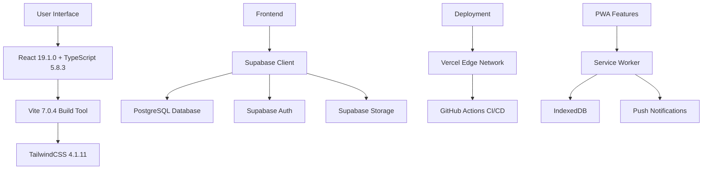
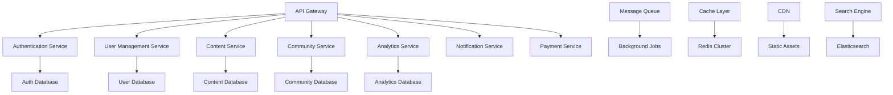

# Technical Roadmap & Architecture Evolution
# Rencana Teknis Pengembangan Sembalun 2025-2026

## 🏗️ Current Architecture Assessment

### Existing Tech Stack (Q4 2024)


### Architecture Strengths
- ✅ **Modern React Stack**: Latest React 19 with concurrent features
- ✅ **Type Safety**: Full TypeScript implementation
- ✅ **Performance**: Vite build system with fast HMR
- ✅ **Scalable Backend**: Supabase with PostgreSQL
- ✅ **Security**: Row Level Security (RLS) implementation
- ✅ **PWA Ready**: Offline capabilities and installable
- ✅ **CI/CD**: Automated testing and deployment

### Architecture Limitations
- ⚠️ **Monolithic Frontend**: Single large React application
- ⚠️ **Limited Offline**: Basic offline functionality
- ⚠️ **No Native Mobile**: PWA only, no native apps
- ⚠️ **Basic AI**: Limited personalization capabilities
- ⚠️ **Single Database**: No distributed data architecture
- ⚠️ **Limited Analytics**: Basic analytics implementation

## 🚀 Technical Evolution Plan

### Q1 2025: Architecture Optimization

#### Frontend Architecture Enhancement
```typescript
// New Architecture Pattern: Feature-Based Modules
src/
├── features/
│   ├── authentication/
│   │   ├── components/
│   │   ├── hooks/
│   │   ├── services/
│   │   ├── types/
│   │   └── index.ts
│   ├── meditation/
│   │   ├── components/
│   │   │   ├── Timer/
│   │   │   ├── SessionBuilder/
│   │   │   └── ProgressTracker/
│   │   ├── hooks/
│   │   │   ├── useTimer.ts
│   │   │   ├── useAudioPlayer.ts
│   │   │   └── useSessionTracking.ts
│   │   ├── services/
│   │   │   ├── sessionService.ts
│   │   │   ├── audioService.ts
│   │   │   └── progressService.ts
│   │   └── types/
│   ├── community/
│   ├── analytics/
│   └── content/
├── shared/
│   ├── components/
│   ├── hooks/
│   ├── utils/
│   └── types/
└── core/
    ├── api/
    ├── auth/
    ├── storage/
    └── config/
```

#### Performance Optimization Strategy
```typescript
// Micro-frontend approach for large features
interface MicroFrontendConfig {
  name: string;
  entry: string;
  routes: string[];
  dependencies: string[];
  lazy: boolean;
}

const microFrontends: MicroFrontendConfig[] = [
  {
    name: 'meditation-core',
    entry: './src/features/meditation/index.ts',
    routes: ['/meditation', '/breathing', '/timer'],
    dependencies: ['@shared/audio', '@shared/storage'],
    lazy: true
  },
  {
    name: 'community-hub',
    entry: './src/features/community/index.ts',
    routes: ['/community', '/groups', '/challenges'],
    dependencies: ['@shared/realtime', '@shared/notifications'],
    lazy: true
  }
];
```

#### State Management Evolution
```typescript
// Zustand with persistence and sync
interface AppStore {
  // User & Auth
  auth: AuthSlice;
  user: UserSlice;
  
  // Core Features
  meditation: MeditationSlice;
  progress: ProgressSlice;
  content: ContentSlice;
  
  // Social Features
  community: CommunitySlice;
  notifications: NotificationSlice;
  
  // System
  offline: OfflineSlice;
  sync: SyncSlice;
  analytics: AnalyticsSlice;
}

// Real-time state synchronization
const useRealtimeSync = () => {
  const supabase = useSupabase();
  const updateStore = useAppStore(state => state.updateFromRealtime);
  
  useEffect(() => {
    const channel = supabase
      .channel('app-state')
      .on('postgres_changes', 
        { event: '*', schema: 'public' },
        payload => updateStore(payload)
      )
      .subscribe();
    
    return () => channel.unsubscribe();
  }, []);
};
```

### Q2 2025: Mobile & AI Integration

#### React Native Architecture
```typescript
// Shared business logic between web and mobile
packages/
├── shared-core/
│   ├── services/
│   ├── types/
│   ├── utils/
│   └── constants/
├── web-app/          // Current React app
├── mobile-app/       // New React Native app
└── desktop-app/      // Future Electron app

// Cross-platform service layer
interface PlatformService {
  storage: StorageService;
  audio: AudioService;
  notifications: NotificationService;
  biometrics: BiometricService;
  sharing: SharingService;
}

// Platform-specific implementations
const createPlatformService = (): PlatformService => {
  if (Platform.OS === 'web') {
    return new WebPlatformService();
  } else if (Platform.OS === 'ios') {
    return new IOSPlatformService();
  } else {
    return new AndroidPlatformService();
  }
};
```

#### AI & Machine Learning Integration
```typescript
// AI Service Architecture
interface AIEngine {
  personalization: PersonalizationAI;
  contentRecommendation: RecommendationAI;
  moodAnalysis: MoodAnalysisAI;
  voiceSynthesis: VoiceSynthesisAI;
  biometricAnalysis: BiometricAI;
}

class PersonalizationAI {
  private model: TensorFlowModel;
  private userProfile: UserProfile;
  
  async recommendSession(): Promise<SessionRecommendation> {
    const features = await this.extractUserFeatures();
    const prediction = await this.model.predict(features);
    return this.formatRecommendation(prediction);
  }
  
  async adaptDifficulty(sessionHistory: Session[]): Promise<DifficultyLevel> {
    // Adaptive learning based on user performance
  }
  
  async optimizeSchedule(userBehavior: UserBehavior): Promise<ScheduleSuggestion> {
    // ML-based optimal timing prediction
  }
}

// Edge AI for offline capabilities
interface EdgeAI {
  offlineRecommendations: boolean;
  localModelInference: boolean;
  privacyPreserving: boolean;
  modelSize: 'small' | 'medium' | 'large';
}
```

### Q3 2025: Microservices & Scalability

#### Backend Architecture Evolution


#### Microservices Implementation
```typescript
// Service Architecture
interface MicroserviceConfig {
  name: string;
  port: number;
  database: DatabaseConfig;
  dependencies: string[];
  scaling: ScalingConfig;
}

const services: MicroserviceConfig[] = [
  {
    name: 'user-service',
    port: 3001,
    database: { type: 'postgresql', schema: 'users' },
    dependencies: ['auth-service'],
    scaling: { min: 2, max: 10, cpu: 70, memory: 80 }
  },
  {
    name: 'content-service',
    port: 3002,
    database: { type: 'postgresql', schema: 'content' },
    dependencies: ['user-service'],
    scaling: { min: 3, max: 15, cpu: 60, memory: 70 }
  },
  {
    name: 'ai-service',
    port: 3003,
    database: { type: 'mongodb', collection: 'ml_models' },
    dependencies: ['user-service', 'content-service'],
    scaling: { min: 2, max: 8, gpu: true }
  }
];

// GraphQL Federation
const federatedSchema = buildFederatedSchema([
  { typeDefs: userTypeDefs, resolvers: userResolvers },
  { typeDefs: contentTypeDefs, resolvers: contentResolvers },
  { typeDefs: communityTypeDefs, resolvers: communityResolvers }
]);
```

### Q4 2025: Advanced Features & Innovation

#### Advanced Technology Integration
```typescript
// VR/AR Integration Architecture
interface VRMeditationEngine {
  environments: VREnvironment[];
  interactions: VRInteraction[];
  biometricSync: boolean;
  spatialAudio: boolean;
  hapticFeedback: boolean;
}

interface VREnvironment {
  id: string;
  name: string;
  culturalContext: 'borobudur' | 'bali_temple' | 'crater_lake';
  assets: {
    skybox: string;
    models: string[];
    audio: string[];
    lighting: LightingConfig;
  };
  interactivity: InteractivityLevel;
}

// Blockchain Integration
interface BlockchainIntegration {
  achievements: NFTAchievement[];
  certificates: VerifiableCertificate[];
  communityGovernance: DAOFeatures;
  tokenIncentives: TokenEconomy;
}

// Voice AI Integration
interface VoiceAI {
  synthesis: VoiceSynthesis;
  recognition: SpeechRecognition;
  naturalLanguage: NLPProcessor;
  emotionalIntelligence: EmotionalAI;
}

class VoiceSynthesis {
  async generateGuidedMeditation(
    script: string,
    voice: VoiceProfile,
    personalization: PersonalizationParams
  ): Promise<AudioBuffer> {
    // AI-generated personalized meditation guidance
  }
  
  async adaptToMood(
    baseAudio: AudioBuffer,
    userMood: MoodState
  ): Promise<AudioBuffer> {
    // Real-time audio adaptation based on mood
  }
}
```

## 🔧 Technology Stack Evolution

### Current → Future Technology Migration

#### Frontend Evolution
```typescript
// Phase 1 (Q1 2025): Current Stack Enhancement
{
  "framework": "React 19.1.0",
  "language": "TypeScript 5.8.3",
  "bundler": "Vite 7.0.4",
  "styling": "TailwindCSS 4.1.11",
  "stateManagement": "React Context + Zustand",
  "testing": "Vitest + Testing Library"
}

// Phase 2 (Q2 2025): Cross-Platform
{
  "web": "React 19 + Next.js 15",
  "mobile": "React Native 0.75",
  "desktop": "Electron 28",
  "shared": "@sembalun/core-logic"
}

// Phase 3 (Q3 2025): Advanced Features
{
  "ai": "TensorFlow.js + MediaPipe",
  "voice": "Web Speech API + Custom AI",
  "vr": "WebXR + Three.js",
  "blockchain": "Web3.js + Ethereum"
}
```

#### Backend Evolution
```typescript
// Current: Supabase BaaS
{
  "database": "PostgreSQL (Supabase)",
  "auth": "Supabase Auth",
  "storage": "Supabase Storage",
  "realtime": "Supabase Realtime",
  "functions": "Supabase Edge Functions"
}

// Future: Hybrid Architecture
{
  "core": "Supabase (maintained)",
  "microservices": "Node.js + Express",
  "ai": "Python + FastAPI + TensorFlow",
  "realtime": "WebSocket + Redis",
  "cache": "Redis Cluster",
  "search": "Elasticsearch",
  "queue": "Bull + Redis"
}
```

### Infrastructure Scaling Plan

#### Q1 2025: Performance Optimization
```yaml
# Vercel Configuration Enhancement
vercel.json:
  functions:
    "api/ai-recommend.js":
      memory: 1024
      maxDuration: 30
  regions: ["sin1", "hnd1"]  # Asia-Pacific optimization
  
# CDN Configuration
cdn:
  provider: "Vercel Edge Network"
  regions: ["singapore", "tokyo", "sydney"]
  caching:
    static: "365d"
    api: "1h"
    dynamic: "0s"
```

#### Q2 2025: Mobile Infrastructure
```typescript
// React Native Deployment
interface MobileDeployment {
  ios: {
    deployment: 'App Store Connect';
    signing: 'Automatic';
    distribution: 'Ad Hoc + App Store';
    testing: 'TestFlight';
  };
  android: {
    deployment: 'Google Play Console';
    signing: 'Upload key signing';
    distribution: 'Internal + Production';
    testing: 'Internal Testing';
  };
  crossPlatform: {
    updates: 'CodePush';
    analytics: 'Firebase Analytics';
    crashReporting: 'Crashlytics';
    performance: 'Firebase Performance';
  };
}
```

#### Q3 2025: Microservices Deployment
```kubernetes
# Kubernetes Configuration
apiVersion: apps/v1
kind: Deployment
metadata:
  name: sembalun-api-gateway
spec:
  replicas: 3
  selector:
    matchLabels:
      app: api-gateway
  template:
    metadata:
      labels:
        app: api-gateway
    spec:
      containers:
      - name: api-gateway
        image: sembalun/api-gateway:latest
        ports:
        - containerPort: 3000
        env:
        - name: DATABASE_URL
          valueFrom:
            secretKeyRef:
              name: db-secret
              key: url
        resources:
          requests:
            memory: "256Mi"
            cpu: "250m"
          limits:
            memory: "512Mi"
            cpu: "500m"
---
apiVersion: v1
kind: Service
metadata:
  name: api-gateway-service
spec:
  selector:
    app: api-gateway
  ports:
  - protocol: TCP
    port: 80
    targetPort: 3000
  type: LoadBalancer
```

## 📊 Performance & Monitoring Strategy

### Performance Targets by Quarter

#### Q1 2025 Targets
```typescript
interface Q1PerformanceTargets {
  loadTime: {
    firstContentfulPaint: '<1.5s';
    largestContentfulPaint: '<2.5s';
    cumulativeLayoutShift: '<0.1';
    firstInputDelay: '<100ms';
  };
  bundleSize: {
    initial: '<500KB';
    total: '<2MB';
    chunks: 'optimized';
  };
  lighthouse: {
    performance: '>90';
    accessibility: '>95';
    bestPractices: '>90';
    seo: '>90';
  };
}
```

#### Advanced Monitoring Implementation
```typescript
// Performance Monitoring Service
class PerformanceMonitor {
  private analytics: AnalyticsService;
  private metrics: MetricsCollector;
  
  trackUserVitals(): void {
    // Core Web Vitals tracking
    new PerformanceObserver((entryList) => {
      for (const entry of entryList.getEntries()) {
        this.recordMetric(entry.name, entry.value);
      }
    }).observe({ entryTypes: ['largest-contentful-paint'] });
  }
  
  trackCustomMetrics(): void {
    // App-specific metrics
    this.trackMeditationSessionMetrics();
    this.trackAudioPlayerPerformance();
    this.trackOfflineSyncPerformance();
  }
  
  trackMeditationSessionMetrics(): void {
    // Meditation-specific performance tracking
    const sessionStart = performance.now();
    
    addEventListener('meditation-session-complete', () => {
      const duration = performance.now() - sessionStart;
      this.recordCustomMetric('session-completion-time', duration);
    });
  }
}

// Real-time Error Tracking
class ErrorTracker {
  private errorBuffer: ErrorReport[] = [];
  
  trackError(error: Error, context: ErrorContext): void {
    const errorReport: ErrorReport = {
      message: error.message,
      stack: error.stack,
      timestamp: new Date().toISOString(),
      userId: context.userId,
      sessionId: context.sessionId,
      platform: navigator.platform,
      userAgent: navigator.userAgent,
      url: window.location.href
    };
    
    this.errorBuffer.push(errorReport);
    this.flushErrors();
  }
  
  private async flushErrors(): Promise<void> {
    if (this.errorBuffer.length > 0) {
      await this.analytics.sendErrorBatch(this.errorBuffer);
      this.errorBuffer = [];
    }
  }
}
```

### Scalability Planning

#### Auto-scaling Configuration
```typescript
// Infrastructure as Code
interface ScalingConfiguration {
  webServers: {
    min: 2;
    max: 20;
    scaleUpThreshold: 70; // CPU %
    scaleDownThreshold: 30;
    cooldown: 300; // seconds
  };
  apiServers: {
    min: 3;
    max: 50;
    scaleUpThreshold: 80;
    scaleDownThreshold: 40;
    cooldown: 180;
  };
  aiServices: {
    min: 1;
    max: 10;
    scaleUpThreshold: 60;
    scaleDownThreshold: 20;
    requiresGPU: true;
  };
  database: {
    readReplicas: 3;
    connectionPooling: true;
    queryOptimization: true;
    partitioning: 'date_based';
  };
}
```

## 🔒 Security & Compliance Enhancement

### Security Roadmap

#### Q1 2025: Security Hardening
```typescript
// Enhanced Security Configuration
interface SecurityConfig {
  authentication: {
    mfa: true;
    biometric: true;
    sessionTimeout: 3600; // seconds
    maxFailedAttempts: 5;
    accountLockout: 1800; // seconds
  };
  dataProtection: {
    encryption: 'AES-256';
    keyRotation: true;
    backupEncryption: true;
    transmissionTLS: '1.3';
  };
  compliance: {
    gdpr: true;
    hipaa: true;
    coppa: false; // Not targeting children
    localRegulations: ['indonesian_data_protection'];
  };
  monitoring: {
    securityLogs: true;
    anomalyDetection: true;
    threatIntelligence: true;
    incidentResponse: true;
  };
}

// Security Audit Implementation
class SecurityAuditor {
  async performSecurityScan(): Promise<SecurityReport> {
    const vulnerabilities = await this.scanForVulnerabilities();
    const compliance = await this.checkCompliance();
    const dataFlow = await this.auditDataFlow();
    
    return {
      timestamp: new Date(),
      vulnerabilities,
      compliance,
      dataFlow,
      recommendations: this.generateRecommendations()
    };
  }
  
  private async scanForVulnerabilities(): Promise<Vulnerability[]> {
    // Automated vulnerability scanning
    return [
      // OWASP Top 10 checks
      // Dependency vulnerability checks
      // Configuration security checks
    ];
  }
}
```

## 🚀 Innovation Lab & Research

### Experimental Features Pipeline

#### AI Research & Development
```typescript
// Experimental AI Features
interface AIExperiments {
  meditationPersonalization: {
    status: 'research';
    description: 'AI that adapts meditation style to user personality';
    timeline: 'Q2 2025';
    resources: ['ML engineer', 'psychology consultant'];
  };
  biometricMeditation: {
    status: 'prototype';
    description: 'Real-time meditation adjustment based on biometrics';
    timeline: 'Q3 2025';
    resources: ['hardware integration', 'AI engineer'];
  };
  culturalAI: {
    status: 'planning';
    description: 'AI trained on Indonesian meditation traditions';
    timeline: 'Q4 2025';
    resources: ['cultural experts', 'NLP engineers'];
  };
}
```

#### Innovation Priorities
1. **Cultural AI**: AI yang memahami konteks budaya Indonesia
2. **Biometric Integration**: Real-time meditation adaptation
3. **Voice Cloning**: Personalized meditation guide voices
4. **VR Environments**: Immersive Indonesian spiritual locations
5. **Blockchain Achievements**: Verifiable meditation credentials

## 📋 Implementation Checklist

### Q1 2025 Technical Milestones
- [ ] **Week 1-2**: Architecture refactoring dan feature modules
- [ ] **Week 3-4**: Performance optimization implementation
- [ ] **Week 5-6**: Enhanced offline capabilities
- [ ] **Week 7-8**: Advanced analytics integration
- [ ] **Week 9-10**: Security hardening dan audit
- [ ] **Week 11-12**: Load testing dan performance validation

### Q2 2025 Technical Milestones
- [ ] **Month 1**: React Native app foundation
- [ ] **Month 2**: AI engine integration
- [ ] **Month 3**: Cross-platform feature parity

### Q3 2025 Technical Milestones
- [ ] **Month 1**: Microservices architecture implementation
- [ ] **Month 2**: Advanced AI features deployment
- [ ] **Month 3**: Scalability testing dan optimization

### Q4 2025 Technical Milestones
- [ ] **Month 1**: VR/AR prototype development
- [ ] **Month 2**: Blockchain integration
- [ ] **Month 3**: Next-generation features beta testing

Dengan roadmap teknis yang komprehensif ini, Sembalun akan berkembang dari aplikasi meditasi yang solid menjadi platform teknologi spiritual yang inovatif dan scalable, sambil tetap mempertahankan keaslian budaya Indonesia dan fokus pada user experience yang exceptional. 🚀