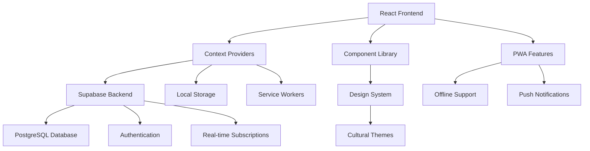

# Sembalun Project Wiki 🧘‍♀️
*Your Complete Guide to the Advanced Indonesian Meditation Platform*

**Current Version**: v1.0 Production Ready | **Last Updated**: January 2025

---

## 📖 Table of Contents

### 🏠 [Getting Started](#getting-started)
- [Project Overview](#project-overview)
- [Current Features](#current-features)
- [Quick Setup](#quick-setup)
- [Architecture Overview](#architecture-overview)

### 🏗️ [Technical Documentation](#technical-documentation)
- [System Architecture](#system-architecture)
- [Technology Stack](#technology-stack)
- [Database Schema](#database-schema)
- [Context Providers](#context-providers)
- [Service Layer](#service-layer)

### 👨‍💻 [Developer Resources](#developer-resources)
- [Developer Onboarding](#developer-onboarding)
- [Component Architecture](#component-architecture)
- [Code Patterns & Conventions](#code-patterns--conventions)
- [Testing Strategy](#testing-strategy)
- [Performance Optimization](#performance-optimization)

### 🎨 [Design & UI](#design--ui)
- [Design System 2025](#design-system-2025)
- [Indonesian Cultural Cards](#indonesian-cultural-cards)
- [Personalized Dashboard](#personalized-dashboard)
- [Responsive Design](#responsive-design)
- [Accessibility](#accessibility)

### 🧠 [Advanced Features](#advanced-features)
- [Personalization Engine](#personalization-engine)
- [Cultural Integration](#cultural-integration)
- [Multi-Agent System](#multi-agent-system)
- [Offline Capabilities](#offline-capabilities)
- [Enterprise Features](#enterprise-features)

### 🚀 [Deployment & Operations](#deployment--operations)
- [Production Build](#production-build)
- [Environment Configuration](#environment-configuration)
- [Performance Monitoring](#performance-monitoring)
- [Troubleshooting Guide](#troubleshooting-guide)

---

## Getting Started

### Project Overview

**Sembalun** is a sophisticated, production-ready Indonesian meditation platform that seamlessly blends cutting-edge web technologies with authentic Indonesian cultural wisdom. Built on React 19+, TypeScript 5+, and Supabase, it delivers a highly personalized, culturally-aware meditation experience.

#### 🎯 Mission
To revolutionize mindfulness practice by delivering deeply personalized meditation experiences rooted in Indonesian cultural authenticity, powered by advanced AI personalization and multi-agent systems.

#### ✨ Core Values
- **🏛️ Cultural Authenticity**: Authentic Indonesian traditions across Javanese, Balinese, Sundanese, and Minangkabau cultures
- **🤖 AI-Powered Personalization**: Advanced behavioral analytics and adaptive content recommendations
- **♿ Universal Accessibility**: WCAG 2.1 AA compliant with comprehensive accessibility features
- **⚡ Enterprise Performance**: Optimized for Indonesian networks with offline-first architecture
- **🧘‍♀️ Holistic Wellness**: Supporting complete mental, spiritual, and emotional wellbeing

### Quick Setup

```bash
# 1. Clone the repository
git clone https://github.com/your-org/sembalun.git
cd sembalun

# 2. Install dependencies
npm install

# 3. Set up environment variables
cp .env.example .env.local
# Edit .env.local with your Supabase credentials

# 4. Start development server
npm run dev

# 5. Open http://localhost:3000
```

### Current Features

#### 🧘 Advanced Meditation Platform
- **Personalized Dashboard**: AI-driven content adaptation based on mood, progress, and cultural preferences
- **Cultural Meditation Cards**: Region-specific meditation techniques (Javanese, Balinese, Sundanese, Minangkabau)
- **Smart Breathing Guide**: Adaptive breathing exercises with cultural visualizations
- **Indonesian Wisdom Integration**: Daily quotes and cultural context from traditional sources
- **Comprehensive Course Library**: Structured learning paths with progress tracking

#### 🤖 AI & Personalization Engine
- **Behavioral Analytics**: Deep learning from user interaction patterns
- **Mood-Based Recommendations**: Content adaptation based on emotional state
- **Smart Scheduling**: AI-optimized meditation timing recommendations
- **Cultural Context Awareness**: Region and tradition-specific customizations
- **Progressive Difficulty**: Adaptive content complexity based on user progress

#### 📱 Technical Excellence
- **Enterprise Performance Monitoring**: Advanced telemetry and optimization
- **Offline-First Architecture**: Complete functionality without internet
- **Multi-Agent Coordination**: Advanced task orchestration system
- **Real-time Synchronization**: Cross-device data consistency
- **Indonesian Mobile Optimization**: Network-aware content delivery

#### 🎨 Design & Cultural Features
- **Indonesian Cultural Cards**: Authentic regional design patterns and colors
- **Adaptive Theming**: User preference-based visual customization
- **Accessibility Excellence**: Screen reader support, high contrast, keyboard navigation
- **Responsive Design**: Optimized for all device sizes and orientations
- **Cultural Ornamental Elements**: Traditional patterns and visual elements

---

## Technical Documentation

### System Architecture

#### High-Level Overview



#### Core Architecture Principles

1. **Offline-First**: Full functionality without internet connection
2. **Cultural Sensitivity**: Indonesian-first design with regional customization
3. **Performance Optimized**: For Indonesian mobile devices and networks
4. **Scalable**: Modular architecture for easy feature addition
5. **Accessible**: WCAG 2.1 AA compliant

### Technology Stack

#### Frontend Architecture
- **React 19.1.0**: Latest React with concurrent rendering and server components
- **TypeScript 5.8.3**: Full type safety with advanced type system features
- **Vite 7.0.4**: Lightning-fast build tool with HMR and optimized production builds
- **Tailwind CSS 4.1.11**: Utility-first framework with custom Indonesian design tokens
- **Framer Motion 12.23.12**: Advanced animations and gesture-based interactions

#### Context & State Management
- **Multi-Context Architecture**: Specialized contexts for auth, personalization, offline, theme
- **Supabase Auth Context**: Advanced authentication with guest mode and profile management
- **Personalization Context**: AI-driven user preference and behavior analytics
- **Offline Context**: Comprehensive offline functionality with intelligent sync

#### Backend & Services
- **Supabase**: Production-grade Backend-as-a-Service with advanced features
- **PostgreSQL**: JSONB-optimized database with cultural data structures
- **Row Level Security**: Granular data access control with user isolation
- **Real-time Subscriptions**: Live data updates with conflict resolution
- **Advanced Storage**: Multi-bucket file management with CDN integration

#### Service Layer Architecture
- **60+ Specialized Services**: Modular service architecture with single responsibilities
- **Multi-Agent Services**: Advanced task orchestration and coordination
- **Analytics Services**: Behavioral tracking and progress analytics
- **Cultural Services**: Indonesian tradition and wisdom integration
- **Offline Services**: IndexedDB-based local storage and sync management

#### Development & Quality
- **ESLint 9.30.1**: Comprehensive linting with custom Indonesian development rules
- **Vitest 3.2.4**: Fast unit testing with cultural context testing
- **Playwright 1.54.2**: End-to-end testing across mobile and desktop
- **Enterprise Monitoring**: Performance tracking and error reporting

### Database Schema

#### Core Tables

**Users Table** - Enhanced with Cultural Preferences
```sql
CREATE TABLE public.users (
  id UUID REFERENCES auth.users(id) PRIMARY KEY,
  email TEXT NOT NULL,
  display_name TEXT,
  avatar_url TEXT,
  created_at TIMESTAMP WITH TIME ZONE DEFAULT TIMEZONE('utc'::text, NOW()) NOT NULL,
  updated_at TIMESTAMP WITH TIME ZONE DEFAULT TIMEZONE('utc'::text, NOW()) NOT NULL,
  preferences JSONB DEFAULT '{
    "theme": "auto",
    "language": "id",
    "notifications": {
      "daily": true,
      "reminders": true,
      "achievements": true,
      "weeklyProgress": true,
      "socialUpdates": false,
      "push": true,
      "email": false,
      "sound": true,
      "vibration": true
    },
    "meditation": {
      "defaultDuration": 10,
      "preferredVoice": "default",
      "backgroundSounds": true,
      "guidanceLevel": "moderate",
      "musicVolume": 70,
      "voiceVolume": 80,
      "autoAdvance": false,
      "showTimer": true,
      "preparationTime": 30,
      "endingBell": true
    }
  }'::jsonb,
  progress JSONB DEFAULT '{
    "total_sessions": 0,
    "total_minutes": 0,
    "current_streak": 0,
    "longest_streak": 0,
    "achievements": [],
    "favorite_categories": [],
    "completed_programs": []
  }'::jsonb,
  is_guest BOOLEAN DEFAULT FALSE
);
```

**Meditation Sessions** - Extended with Cultural Context
```sql
CREATE TABLE public.meditation_sessions (
  id UUID DEFAULT uuid_generate_v4() PRIMARY KEY,
  user_id UUID REFERENCES public.users(id) ON DELETE CASCADE NOT NULL,
  type TEXT NOT NULL CHECK (type IN ('breathing', 'guided', 'silent', 'walking')),
  duration_minutes INTEGER NOT NULL CHECK (duration_minutes > 0),
  completed_at TIMESTAMP WITH TIME ZONE NOT NULL,
  mood_before TEXT,
  mood_after TEXT,
  notes TEXT,
  created_at TIMESTAMP WITH TIME ZONE DEFAULT TIMEZONE('utc'::text, NOW()) NOT NULL,
  updated_at TIMESTAMP WITH TIME ZONE DEFAULT TIMEZONE('utc'::text, NOW()) NOT NULL
);
```

**Courses Table** - Indonesian Cultural Integration
```sql
CREATE TABLE public.courses (
  id UUID DEFAULT uuid_generate_v4() PRIMARY KEY,
  title TEXT NOT NULL,
  description TEXT NOT NULL,
  category TEXT NOT NULL,
  difficulty TEXT NOT NULL CHECK (difficulty IN ('beginner', 'intermediate', 'advanced')),
  duration_minutes INTEGER NOT NULL CHECK (duration_minutes > 0),
  instructor TEXT,
  image_url TEXT,
  audio_url TEXT,
  is_premium BOOLEAN DEFAULT FALSE,
  order_index INTEGER NOT NULL DEFAULT 0,
  created_at TIMESTAMP WITH TIME ZONE DEFAULT TIMEZONE('utc'::text, NOW()) NOT NULL,
  updated_at TIMESTAMP WITH TIME ZONE DEFAULT TIMEZONE('utc'::text, NOW()) NOT NULL
);
```

#### Security Features
- **Row Level Security (RLS)** enabled on all tables
- **User isolation** - Users can only access their own data
- **Secure authentication** with email/password and OAuth
- **Automatic timestamps** with triggers

### Context Providers

#### Multi-Context Architecture
Sembalun uses a sophisticated multi-context architecture for state management:

**1. SupabaseAuthContext** - Authentication & User Management
```typescript
interface SupabaseAuthContextType {
  user: SupabaseUser | null;
  session: Session | null;
  userProfile: UserProfile | null;
  loading: boolean;
  isGuest: boolean;
  
  // Enhanced authentication methods
  signInWithGoogle: () => Promise<{ error: SupabaseAuthError | null }>;
  signInWithApple: () => Promise<{ error: SupabaseAuthError | null }>;
  signInWithEmail: (email: string, password: string) => Promise<{ error: SupabaseAuthError | null }>;
  signUpWithEmail: (email: string, password: string, displayName?: string) => Promise<{ error: SupabaseAuthError | null }>;
  
  // Guest functionality
  continueAsGuest: () => void;
  migrateGuestData: () => Promise<void>;
  
  // Advanced profile management
  updateUserProfile: (updates: Partial<UserProfile>) => Promise<{ error: SupabaseAuthError | null }>;
  deleteAccount: () => Promise<{ error: SupabaseAuthError | null }>;
  exportUserData: () => Promise<string>;
}
```

**2. PersonalizationContext** - AI-Driven Personalization
```typescript
interface PersonalizationContextType {
  personalization: PersonalizationData | null;
  
  // Content Recommendations
  getPersonalizedRecommendations: () => MeditationRecommendation[];
  getSmartSchedule: () => ScheduleRecommendation[];
  getContextualContent: () => ContextualContent;
  
  // Personalized UI/UX
  getPersonalizedQuote: () => PersonalizedQuote;
  getPersonalizedGreeting: () => string;
  getAdaptiveTheme: () => AdaptiveTheme;
  getDashboardLayout: () => DashboardConfig;
  
  // Analytics and Insights
  getBehaviorInsights: () => BehaviorInsights;
  getProgressInsights: () => ProgressInsights;
  getPredictiveInsights: () => PredictiveInsights;
  
  // Session Management
  trackSession: (sessionData: SessionData) => void;
  updateMoodPattern: (mood: MoodType, context?: string) => void;
}
```

**3. OfflineContext** - Comprehensive Offline Support
```typescript
interface OfflineContextType {
  isOnline: boolean;
  isOffline: boolean;
  hasOfflineData: boolean;
  
  // Offline queue management
  queueAction: (action: OfflineAction) => void;
  processQueue: () => Promise<void>;
  clearQueue: () => void;
  
  // Data synchronization
  syncWhenOnline: () => Promise<void>;
  getOfflineCapabilities: () => OfflineCapabilities;
}
```

### Service Layer

#### Service Architecture Overview
Sembalun features 60+ specialized services organized into functional domains:

**Core Meditation Services**
```typescript
// Meditation API Service - Session Management
class MeditationApiService {
  async createSession(data: SessionData): Promise<string>
  async getUserSessions(userId: string, filters?: SessionFilters): Promise<SessionData[]>
  async updateSession(sessionId: string, updates: Partial<SessionData>): Promise<void>
  async deleteSession(sessionId: string): Promise<void>
}

// Progress Service - Analytics & Tracking
class ProgressService {
  async updateProgress(data: ProgressUpdate): Promise<void>
  async getProgressStats(userId: string, period: TimePeriod): Promise<ProgressStats>
  async getSkillProgression(userId: string): Promise<SkillProgression>
  async calculateStreaks(userId: string): Promise<StreakData>
}

// Achievement Service - Gamification
class AchievementService {
  async checkAchievements(userId: string, sessionData: SessionData): Promise<Achievement[]>
  async unlockAchievement(userId: string, achievementId: string): Promise<void>
  async getUserAchievements(userId: string): Promise<Achievement[]>
  async resetAchievements(userId: string): Promise<void>
}
```

**Cultural & Personalization Services**
```typescript
// Indonesian Wisdom Service
class IndonesianWisdomService {
  async getDailyQuote(culturalContext?: CulturalContext): Promise<WisdomQuote>
  async getQuotesByTradition(tradition: IndonesianTradition): Promise<WisdomQuote[]>
  async getContextualWisdom(mood: MoodType, goal: PersonalizationGoal): Promise<WisdomQuote>
}

// Cultural Personalization Service
class CulturalPersonalizationService {
  async adaptContentForCulture(content: Content, culturalData: CulturalData): Promise<Content>
  async getRegionalRecommendations(region: IndonesianRegion): Promise<Recommendation[]>
  async getCulturalInsights(userId: string): Promise<CulturalInsights>
}

// Recommendation Engine
class RecommendationEngine {
  async getPersonalizedRecommendations(userId: string): Promise<MeditationRecommendation[]>
  async getMoodBasedContent(mood: MoodType): Promise<Content[]>
  async getTimeBasedRecommendations(timeOfDay: TimeOfDay): Promise<Recommendation[]>
  async getWeatherBasedContent(weather: WeatherCondition): Promise<Content[]>
}
```

**Advanced System Services**
```typescript
// Multi-Agent Services
class MultiagentTaskService {
  async createTask(taskData: TaskData): Promise<string>
  async assignAgents(taskId: string, agents: Agent[]): Promise<void>
  async monitorProgress(taskId: string): Promise<TaskProgress>
  async coordinateExecution(taskId: string): Promise<TaskResult>
}

// Offline Synchronization Service
class OfflineSyncService {
  async queueOfflineAction(action: OfflineAction): Promise<void>
  async processOfflineQueue(): Promise<SyncResult[]>
  async resolveConflicts(conflicts: DataConflict[]): Promise<void>
  async validateDataIntegrity(): Promise<ValidationResult>
}

// Analytics Services
class BehaviorAnalyticsService {
  async trackUserInteraction(interaction: UserInteraction): Promise<void>
  async analyzeMoodPatterns(userId: string): Promise<MoodAnalysis>
  async generateInsights(userId: string): Promise<BehaviorInsights>
  async predictOptimalTimes(userId: string): Promise<OptimalTimeSlot[]>
}
```

---

## Developer Resources

### Developer Onboarding

#### Prerequisites
- **Node.js**: Version 18.0 or higher
- **npm**: Version 8.0 or higher
- **Supabase Account**: For backend services
- **Git**: For version control

#### Development Environment Setup

1. **Install VS Code Extensions**
   - ES7+ React/Redux/React-Native snippets
   - TypeScript Importer
   - Tailwind CSS IntelliSense
   - ESLint & Prettier

2. **Environment Configuration**
   ```bash
   # Required Supabase Configuration
   VITE_SUPABASE_URL=https://your-project.supabase.co
   VITE_SUPABASE_ANON_KEY=your-anon-key
   
   # Optional Development Settings
   VITE_ENVIRONMENT=development
   VITE_ENABLE_DEBUG_MODE=true
   ```

3. **Database Setup**
   ```bash
   # Install Supabase CLI
   npm install -g @supabase/cli
   
   # Link to your project
   supabase link --project-ref your-project-ref
   
   # Run migrations
   supabase db push
   ```

#### Key Development Patterns

**Creating a New Page**
```typescript
// src/pages/MyNewPage.tsx
import React from 'react';
import { DashboardLayout } from '@/components/ui/DashboardLayout';
import { useSupabaseAuth } from '@/hooks/useSupabaseAuth';

export const MyNewPage: React.FC = () => {
  const { user } = useSupabaseAuth();

  return (
    <DashboardLayout>
      <div className="container mx-auto px-4 py-6">
        <h1 className="text-2xl font-heading text-primary-700">
          Selamat datang, {user?.displayName}!
        </h1>
      </div>
    </DashboardLayout>
  );
};
```

**Creating a Service**
```typescript
// src/services/myService.ts
import { supabase } from '@/config/supabase';

export class MyService {
  private static instance: MyService;

  static getInstance(): MyService {
    if (!MyService.instance) {
      MyService.instance = new MyService();
    }
    return MyService.instance;
  }

  async getData(userId: string): Promise<any[]> {
    const { data, error } = await supabase
      .from('my_table')
      .select('*')
      .eq('user_id', userId);

    if (error) throw error;
    return data || [];
  }
}
```

### Component Architecture

#### Hierarchical Component Organization
Sembalun follows a sophisticated component architecture:

**1. Page Components** (`src/pages/`)
- **Dashboard.tsx** - Main personalized dashboard
- **Meditation.tsx** - Meditation session interface
- **Profile.tsx** - User profile and settings
- **onboarding/** - Complete onboarding flow

**2. UI Components** (`src/components/ui/`)
- **PersonalizedDashboard.tsx** - AI-driven dashboard with mood tracking
- **IndonesianCard.tsx** - Cultural card components with regional variants
- **AdvancedMeditationTimer.tsx** - Feature-rich meditation timer
- **MeditationStatistics.tsx** - Progress visualization
- **EmotionWheel.tsx** - Interactive mood selection

**3. Cultural Components** (`src/components/cultural/`)
- **IndonesianCard.tsx** - Authentic Indonesian design patterns
- **IndonesianWisdomQuotes.tsx** - Traditional wisdom integration
- **CulturalMeditationModal.tsx** - Region-specific meditation guidance
- **IndonesianAchievementSystem.tsx** - Cultural achievement system

**4. Advanced Features** (`src/components/`)
- **analytics/** - Progress tracking and insights
- **onboarding/** - Comprehensive user onboarding
- **personalization/** - AI personalization components
- **multiagent/** - Multi-agent system interface

### Code Patterns & Conventions

#### TypeScript Excellence
```typescript
// Comprehensive type definitions
interface UserProfile {
  uid: string;
  email: string | null;
  displayName: string | null;
  photoURL: string | null;
  createdAt: Date;
  lastLoginAt: Date;
  isGuest: boolean;
  preferences: UserPreferences;
  progress: UserProgress;
  personalInfo?: PersonalInfo;
  meditationExperience?: MeditationExperience;
  goals?: UserGoals;
  schedule?: MeditationSchedule;
  assessments?: UserAssessments;
  privacySettings?: PrivacySettings;
}

// Cultural type system
type IndonesianTradition = 'javanese' | 'balinese' | 'sundanese' | 'minang';
type CulturalRegion = 'java' | 'bali' | 'sunda' | 'sumatra' | 'kalimantan' | 'sulawesi';
type PersonalizationGoal = 'stress' | 'focus' | 'sleep' | 'curious';

// Advanced service patterns
const CULTURAL_MEDITATION_TYPES = {
  javanese: ['kebatinan', 'semedi', 'tapa'],
  balinese: ['dharana', 'dhyana', 'samadhi'],
  sundanese: ['tarekat', 'zikir', 'muraqaba'],
  minang: ['ratib', 'wirid', 'tawajjuh']
} as const;
```

#### React Component Patterns
```typescript
// Advanced component with personalization
const PersonalizedDashboard: React.FC<PersonalizedDashboardProps> = ({ 
  className = "" 
}) => {
  const { 
    personalization, 
    getPersonalizedRecommendations, 
    getPersonalizedQuote,
    getPersonalizedGreeting,
    getAdaptiveTheme,
    getDashboardLayout,
    getBehaviorInsights,
    getProgressInsights,
    getSmartSchedule,
    getContextualContent,
    isPersonalized,
    updateMoodPattern
  } = usePersonalization();

  // Cultural CTA optimization
  const { getOptimalVariant, getOptimalLocalization } = useCulturalCTA(personalization?.culturalData);

  // Dynamic styling based on user preferences
  const adaptiveStyles = useMemo(() => {
    if (!isPersonalized) return {};
    
    const theme = getAdaptiveTheme();
    return {
      '--primary-color': theme.primaryColor,
      '--accent-color': theme.accentColor,
      '--font-size-base': `${theme.fontSize}px`,
      '--animation-speed': `${theme.animationSpeed}s`,
      background: `linear-gradient(135deg, ${theme.backgroundGradient.join(', ')})`
    } as React.CSSProperties;
  }, [theme, isPersonalized]);

  // Component renders personalized content based on user data...
};
```

#### Indonesian Cultural Component Patterns
```typescript
// Cultural card with authentic Indonesian design
const IndonesianCard = forwardRef<HTMLDivElement, IndonesianCardProps>(({ 
  tradition = 'general',
  variant = 'default',
  size = 'md',
  showPattern = true,
  showOrnament = true,
  title,
  culturalContext,
  children
}) => {
  const { colors, typography, shadows } = designTokens;
  const culturalColors = colors.regionalColors[tradition];

  // Cultural pattern background
  const getCulturalPattern = () => {
    const patterns = {
      javanese: 'batik-kawung',
      balinese: 'pura-ornament', 
      sundanese: 'bamboo-pattern',
      minang: 'rumah-gadang'
    };
    return patterns[tradition] || patterns.javanese;
  };

  // Adaptive styling based on tradition
  const getVariantStyles = (): React.CSSProperties => {
    return {
      background: `linear-gradient(135deg, ${culturalColors.lotusWhite} 0%, ${colors.neutral[50]} 100%)`,
      border: `2px solid ${culturalColors.templeGold}`,
      boxShadow: shadows.regional[tradition].temple,
      borderRadius: borders.radius['2xl'],
    };
  };

  return (
    <div style={getVariantStyles()} data-tradition={tradition}>
      {showPattern && <CulturalPattern tradition={tradition} />}
      {showOrnament && <CulturalOrnament tradition={tradition} />}
      {children}
    </div>
  );
});

// Error boundaries with cultural context
const CulturalErrorBoundary: React.FC<{ children: React.ReactNode; tradition?: IndonesianTradition }> = ({ 
  children, 
  tradition = 'javanese' 
}) => (
  <ErrorBoundary 
    fallback={<IndonesianErrorMessage tradition={tradition} />}
    onError={(error) => trackCulturalError(error, tradition)}
  >
    {children}
  </ErrorBoundary>
);
```

### Testing Guidelines

#### Unit Testing
```typescript
// Component testing
import { render, screen } from '@testing-library/react';
import { Button } from '../Button';

describe('Button Component', () => {
  it('renders with correct cultural theme', () => {
    render(<Button variant="javanese">Test Button</Button>);
    expect(screen.getByRole('button')).toHaveClass('javanese-theme');
  });
});
```

#### Integration Testing
```typescript
// Service testing
import { MeditationService } from '../meditationService';

describe('MeditationService', () => {
  it('creates meditation session correctly', async () => {
    const service = new MeditationService();
    const sessionId = await service.createSession({
      type: 'breathing',
      duration: 600
    });
    expect(sessionId).toBeDefined();
  });
});
```

#### Testing Commands
```bash
# Unit tests
npm run test

# Watch mode for development
npm run test:watch

# Coverage report
npm run test:coverage

# End-to-end tests
npm run test:e2e
```

### Performance Best Practices

#### Component Optimization
```typescript
// Use React.memo for expensive components
const ExpensiveMeditationCard = memo(({ session }) => {
  const analysis = useMemo(() => 
    analyzeSessionData(session), 
    [session]
  );
  
  return <MeditationCard analysis={analysis} />;
});

// Lazy load heavy components
const HeavyAnalyticsDashboard = lazy(() => 
  import('@/components/analytics/AnalyticsDashboard')
);
```

#### Bundle Optimization
```typescript
// Strategic code splitting
const chunkingStrategy = (id: string) => {
  if (id.includes('react') || id.includes('react-dom')) {
    return 'react-core';
  }
  if (id.includes('src/components/meditation')) {
    return 'meditation-features';
  }
  if (id.includes('src/components/cultural')) {
    return 'cultural-features';
  }
};
```

---

## Design & UI

### Design System

#### Core Design Principles
1. **🧘‍♀️ Ketenangan (Serenity)** - Calming and non-distracting design
2. **🏛️ Keaslian Budaya (Cultural Authenticity)** - Visual elements that honor Indonesian traditions
3. **♿ Aksesibilitas (Accessibility)** - Inclusive for all users
4. **🌱 Kesederhanaan (Simplicity)** - Minimalist yet meaningful
5. **⚡ Responsivitas (Responsiveness)** - Adaptive across all devices

#### Color System
```scss
// Primary Brand Colors
$colors: (
  'primary': (
    500: #0ea5e9,  // Sembalun Blue
    600: #0284c7,  // Hover state
    700: #0369a1,  // Active state
  ),
  
  // Cultural Indonesian Colors
  'cultural': (
    'earth-brown': #8B4513,      // Tanah Indonesia
    'temple-gold': #FFD700,      // Emas candi
    'lotus-white': #FFFAF0,      // Putih teratai
    'spiritual-purple': #663399,  // Ungu spiritual
  ),
);
```

#### Typography Scale
```typescript
interface TypographyScale {
  heading: {
    'h1': { fontSize: '1.875rem', lineHeight: '1.3', fontWeight: 'semibold' };
    'h2': { fontSize: '1.5rem', lineHeight: '1.35', fontWeight: 'semibold' };
  };
  
  body: {
    'base': { fontSize: '1rem', lineHeight: '1.6', fontWeight: 'normal' };
    'sm': { fontSize: '0.875rem', lineHeight: '1.5', fontWeight: 'normal' };
  };
  
  cultural: {
    'title': { fontSize: '1.5rem', fontFamily: 'Noto Sans Indonesian' };
  };
}
```

### Cultural Themes

#### Regional Theme Implementation
```typescript
interface CulturalTheme {
  id: string;
  name: 'javanese' | 'balinese' | 'sundanese' | 'minang';
  displayName: string;
  colorPalette: {
    primary: string;
    secondary: string;
    accent: string;
    background: string;
  };
  patterns: string[];
  wisdom: WisdomQuote[];
}
```

#### Theme Usage
```scss
// Javanese Theme
.javanese-card {
  @apply bg-gradient-to-r from-amber-50 to-orange-50;
  @apply border-amber-200;
  
  .header {
    @apply text-amber-800 border-b border-amber-200;
    font-family: 'Noto Sans Javanese', system-ui;
  }
}

// Balinese Theme
.balinese-card {
  @apply bg-gradient-to-r from-emerald-50 to-teal-50;
  @apply border-emerald-200;
}
```

### Component Library

#### Core Components

**Button Component**
```typescript
interface ButtonProps {
  variant?: 'primary' | 'secondary' | 'cultural' | 'meditation';
  size?: 'sm' | 'md' | 'lg';
  culturalTheme?: 'javanese' | 'balinese' | 'sundanese' | 'minang';
}

const Button: React.FC<ButtonProps> = ({ 
  variant = 'primary',
  culturalTheme,
  children 
}) => {
  const classes = cn(
    'btn-base',
    `btn-${variant}`,
    culturalTheme && `btn-${culturalTheme}`
  );
  
  return <button className={classes}>{children}</button>;
};
```

**Cultural Card Component**
```typescript
const IndonesianCard: React.FC<{
  variant: 'javanese' | 'balinese' | 'sundanese' | 'minang';
  children: React.ReactNode;
}> = ({ variant, children }) => (
  <motion.div
    initial={{ opacity: 0, y: 20 }}
    animate={{ opacity: 1, y: 0 }}
    className={cn('card-base', `${variant}-theme`)}
  >
    {children}
  </motion.div>
);
```

#### Animation System
```scss
// Meditation-specific animations
@keyframes breathe {
  0%, 100% { transform: scale(1); opacity: 0.7; }
  50% { transform: scale(1.1); opacity: 1; }
}

.meditation-indicator {
  animation: breathe 4s ease-in-out infinite;
}

@keyframes lotus-bloom {
  0% { transform: scale(0.8) rotate(-5deg); opacity: 0.5; }
  100% { transform: scale(1) rotate(0deg); opacity: 1; }
}
```

### Accessibility Guidelines

#### WCAG 2.1 AA Compliance
- **Color Contrast**: 4.5:1 for normal text, 3.0:1 for large text
- **Keyboard Navigation**: Full keyboard accessibility
- **Screen Reader Support**: Proper ARIA labels and semantic HTML
- **Focus Management**: Visible focus indicators

#### Implementation Examples
```scss
// Focus management
.focus-visible {
  outline: 2px solid var(--primary-500);
  outline-offset: 2px;
  border-radius: 4px;
}

// High contrast support
@media (prefers-contrast: high) {
  .button {
    border: 2px solid currentColor;
  }
}

// Reduced motion support
@media (prefers-reduced-motion: reduce) {
  * {
    animation-duration: 0.01ms !important;
    transition-duration: 0.01ms !important;
  }
}
```

---

## Deployment & Operations

### Build & Deployment

#### Production Build
```bash
# Build optimization
npm run build:analyze  # Analyze bundle size
npm run typecheck      # Type checking
npm run lint          # Code linting
npm run test          # Run all tests
npm run build         # Production build
```

#### Vercel Deployment
```json
// vercel.json
{
  "buildCommand": "npm run build",
  "outputDirectory": "dist",
  "framework": "vite",
  "rewrites": [
    { "source": "/(.*)", "destination": "/index.html" }
  ],
  "headers": [
    {
      "source": "/(.*)",
      "headers": [
        { "key": "X-Frame-Options", "value": "DENY" },
        { "key": "X-Content-Type-Options", "value": "nosniff" }
      ]
    }
  ]
}
```

#### Environment Configuration
```bash
# Production Environment Variables
VITE_SUPABASE_URL=https://your-project.supabase.co
VITE_SUPABASE_ANON_KEY=your-production-key
VITE_ENVIRONMENT=production
VITE_APP_VERSION=1.0.0
```

### Monitoring & Analytics

#### Performance Monitoring
```typescript
// Core Web Vitals tracking
import { getCLS, getFID, getFCP, getLCP, getTTFB } from 'web-vitals';

const trackPerformance = () => {
  getCLS(onPerfEntry);
  getFID(onPerfEntry);
  getFCP(onPerfEntry);
  getLCP(onPerfEntry);
  getTTFB(onPerfEntry);
};

// Cultural-specific analytics
const trackCulturalEngagement = (theme: string, action: string) => {
  analytics.track('cultural_engagement', {
    theme,
    action,
    timestamp: Date.now()
  });
};
```

#### Error Tracking
```typescript
// Error boundary implementation
class ErrorBoundary extends React.Component {
  componentDidCatch(error: Error, errorInfo: ErrorInfo) {
    // Log to monitoring service
    console.error('React Error:', error, errorInfo);
    
    // Track cultural context
    if (this.context.culturalTheme) {
      analytics.track('error_with_cultural_context', {
        theme: this.context.culturalTheme,
        error: error.message
      });
    }
  }
}
```

### Troubleshooting

#### Common Issues

**1. Supabase Connection Issues**
```typescript
// Check environment variables
console.log('Supabase URL:', import.meta.env.VITE_SUPABASE_URL);
console.log('Supabase Key:', import.meta.env.VITE_SUPABASE_ANON_KEY?.substring(0, 10) + '...');

// Test connection
const testConnection = async () => {
  try {
    const { data, error } = await supabase.from('users').select('count');
    console.log('Connection test:', { data, error });
  } catch (err) {
    console.error('Connection failed:', err);
  }
};
```

**2. Authentication State Issues**
```typescript
// Debug authentication state
const debugAuth = () => {
  const { user, loading, error } = useSupabaseAuth();
  
  console.log('Auth Debug:', {
    user: user?.id,
    loading,
    error,
    session: supabase.auth.session()
  });
};
```

**3. Cultural Theme Not Loading**
```typescript
// Check theme provider
const debugTheme = () => {
  const theme = getComputedStyle(document.documentElement);
  console.log('CSS Variables:', {
    primary: theme.getPropertyValue('--color-primary'),
    cultural: theme.getPropertyValue('--cultural-earth')
  });
};
```

**4. Offline Functionality Issues**
```typescript
// Check offline queue
const debugOffline = () => {
  const queueItems = JSON.parse(
    localStorage.getItem('sembalun_offline_queue') || '[]'
  );
  console.log('Offline queue:', queueItems);
  
  // Manual sync
  await progressService.processOfflineQueue();
};
```

#### Performance Debugging
```bash
# Bundle analysis
npm run build:analyze
npm run open:stats

# Performance profiling
npm run dev # with performance.mark() calls

# Memory leak detection
# Use React DevTools Profiler
```

---

## Advanced Features

### Personalization Engine

#### AI-Driven Content Adaptation
Sembalun's personalization engine represents a breakthrough in meditation app technology:

**Behavioral Analytics Engine**
```typescript
interface BehaviorAnalytics {
  sessionHistory: SessionData[];
  usagePatterns: {
    activeTimeSlots: { [hour: number]: number };
    preferredDuration: number;
    completionRate: number;
    streakDays: number;
    totalSessions: number;
    totalMinutes: number;
  };
  moodPatterns: {
    moodHistory: { date: string; mood: MoodType; context?: string }[];
    moodTrends: { [mood in MoodType]: number };
    moodCorrelations: { [activity: string]: MoodType };
  };
  progressMetrics: {
    skillProgression: { [skill: string]: number };
    difficultyProgression: number;
    achievementUnlocked: string[];
    personalBests: { [metric: string]: number };
  };
}
```

**Smart Recommendation System**
- **Mood-Based Adaptation**: Content automatically adjusts based on current emotional state
- **Time-Contextual Suggestions**: Optimal meditation recommendations based on time of day
- **Progress-Aware Difficulty**: Dynamic content complexity adjustment
- **Cultural Preferences**: Indonesian tradition-specific content prioritization
- **Environmental Context**: Weather and location-based recommendations

**Adaptive Dashboard Configuration**
```typescript
interface DashboardConfig {
  layout: 'simple' | 'detailed' | 'comprehensive';
  sections: {
    mood: { enabled: boolean; position: number; size: 'small' | 'medium' | 'large' };
    recommendations: { enabled: boolean; position: number; size: 'small' | 'medium' | 'large' };
    progress: { enabled: boolean; position: number; size: 'small' | 'medium' | 'large' };
    schedule: { enabled: boolean; position: number; size: 'small' | 'medium' | 'large' };
    insights: { enabled: boolean; position: number; size: 'small' | 'medium' | 'large' };
    community: { enabled: boolean; position: number; size: 'small' | 'medium' | 'large' };
  };
  quickActions: string[];
  prominentFeatures: string[];
}
```

#### Cultural Elements Implementation
```typescript
// Cultural wisdom quotes
interface WisdomQuote {
  text: string;
  translation: string;
  author: string;
  region: 'javanese' | 'balinese' | 'sundanese' | 'minang';
  context: string;
}

// Cultural practice templates
interface CulturalPractice {
  name: string;
  region: string;
  duration: [number, number]; // min, max minutes
  instructions: string[];
  benefits: string[];
  audioGuidance?: string;
}
```

### Cultural Integration

#### Authentic Indonesian Traditions
Deep integration of Indonesian cultural wisdom across four major traditions:

**Regional Meditation Systems**
```typescript
const CULTURAL_MEDITATION_SYSTEMS = {
  javanese: {
    practices: ['Kebatinan', 'Semedi', 'Tapa Brata'],
    philosophy: 'Manunggaling Kawula Gusti (Unity of servant and master)',
    colors: { primary: '#8B4513', accent: '#DAA520', spiritual: '#4A5D23' },
    patterns: ['batik-kawung', 'batik-parang', 'batik-truntum'],
    wisdom: 'Javanese spiritual traditions focusing on inner harmony'
  },
  
  balinese: {
    practices: ['Dharana', 'Dhyana', 'Samadhi'],
    philosophy: 'Tri Hita Karana (Three causes of well-being)',
    colors: { primary: '#006400', accent: '#FF6347', spiritual: '#8B008B' },
    patterns: ['patra-bali', 'temple-ornament', 'barong-pattern'],
    wisdom: 'Hindu-Balinese meditation emphasizing cosmic harmony'
  },
  
  sundanese: {
    practices: ['Tarikat', 'Zikir', 'Muraqaba'],
    philosophy: 'Silih Asih, Silih Asah, Silih Asuh (Love, learn, care for each other)',
    colors: { primary: '#228B22', accent: '#8FBC8F', spiritual: '#2F4F4F' },
    patterns: ['bamboo-motif', 'mountain-pattern', 'rice-field'],
    wisdom: 'Sundanese Islamic mysticism connected to nature'
  },
  
  minangkabau: {
    practices: ['Ratib', 'Wirid', 'Tawajjuh'],
    philosophy: 'Adat Basandi Syarak, Syarak Basandi Kitabullah',
    colors: { primary: '#B8860B', accent: '#CD853F', spiritual: '#8B4513' },
    patterns: ['rumah-gadang', 'rangkiang-pattern', 'minang-weaving'],
    wisdom: 'Minangkabau Islamic teachings blended with local wisdom'
  }
} as const;
```

**Cultural Wisdom Integration**
- **Daily Indonesian Quotes**: Rotating wisdom from traditional sources
- **Regional Context Awareness**: Automatic cultural adaptation based on user location
- **Traditional Music Integration**: Authentic Indonesian ambient sounds
- **Cultural Calendar Integration**: Meditation suggestions aligned with Indonesian cultural events
- **Local Language Support**: Bahasa Indonesia with regional dialect awareness

### Multi-Agent System

#### Advanced Task Orchestration
Sembalun implements a sophisticated multi-agent system for complex task coordination:

**Agent Architecture**
```typescript
interface MultiAgentSystem {
  // Task Management
  createTask: (taskData: TaskDefinition) => Promise<TaskId>;
  assignAgents: (taskId: TaskId, agentTypes: AgentType[]) => Promise<void>;
  monitorExecution: (taskId: TaskId) => Promise<TaskProgress>;
  coordinateResults: (taskId: TaskId) => Promise<TaskResult>;
  
  // Agent Types
  agents: {
    'meditation-recommender': MeditationRecommendationAgent;
    'cultural-advisor': CulturalAdvisorAgent;
    'progress-analyzer': ProgressAnalysisAgent;
    'mood-interpreter': MoodInterpretationAgent;
    'scheduling-optimizer': SchedulingAgent;
  };
}
```

**Intelligent Agent Coordination**
- **Meditation Recommendation Agent**: Analyzes user patterns for optimal content suggestions
- **Cultural Context Agent**: Provides Indonesian tradition-specific guidance
- **Progress Tracking Agent**: Monitors skill development and achievement progress
- **Mood Analysis Agent**: Interprets emotional patterns for personalized experiences
- **Scheduling Optimization Agent**: Determines optimal meditation times

**Real-time Agent Communication**
```typescript
class AgentCoordinator {
  async orchestratePersonalization(userId: string): Promise<PersonalizationResult> {
    const tasks = await Promise.all([
      this.agents['cultural-advisor'].analyzeCulturalPreferences(userId),
      this.agents['progress-analyzer'].assessCurrentSkillLevel(userId),
      this.agents['mood-interpreter'].analyzeMoodPatterns(userId),
      this.agents['scheduling-optimizer'].findOptimalTimes(userId)
    ]);
    
    return this.synthesizeRecommendations(tasks);
  }
}
```

### Offline Capabilities

#### Comprehensive Offline-First Architecture
Sembalun provides complete functionality even without internet connectivity:

**Offline Storage System**
```typescript
interface OfflineCapabilities {
  // Core meditation functionality
  meditation: {
    basicTimers: boolean;
    guidedSessions: boolean;  // Pre-cached popular sessions
    breathingExercises: boolean;
    progressTracking: boolean;
  };
  
  // User data management
  data: {
    profileData: boolean;
    sessionHistory: boolean;
    achievements: boolean;
    preferences: boolean;
  };
  
  // Cultural content
  cultural: {
    dailyWisdom: boolean;      // Cached quotes for 30 days
    traditionalMusic: boolean;  // Essential Indonesian ambient sounds
    culturalPatterns: boolean;  // SVG patterns for offline rendering
  };
  
  // Synchronization
  sync: {
    queuedActions: OfflineAction[];
    conflictResolution: ConflictResolutionStrategy;
    intelligentSync: boolean;   // Smart sync when connection restored
  };
}
```

**Intelligent Offline Queue Management**
```typescript
class OfflineQueueManager {
  private queue: OfflineAction[] = [];
  
  async queueAction(action: OfflineAction): Promise<void> {
    // Add to IndexedDB for persistence
    await this.persistAction(action);
    
    // Add to memory queue
    this.queue.push(action);
    
    // Attempt immediate sync if online
    if (navigator.onLine) {
      await this.processQueue();
    }
  }
  
  async processQueue(): Promise<SyncResult[]> {
    const results: SyncResult[] = [];
    
    for (const action of this.queue) {
      try {
        const result = await this.executeAction(action);
        results.push({ action, success: true, result });
        this.removeFromQueue(action);
      } catch (error) {
        results.push({ action, success: false, error });
        // Keep failed actions in queue for retry
      }
    }
    
    return results;
  }
}
```

### Enterprise Features

#### Advanced Performance Monitoring
```typescript
class EnterprisePerformanceMonitor {
  private static instance: EnterprisePerformanceMonitor;
  
  // Core Web Vitals tracking
  trackPerformance(): void {
    this.trackCLS();  // Cumulative Layout Shift
    this.trackFID();  // First Input Delay
    this.trackLCP();  // Largest Contentful Paint
    this.trackFCP();  // First Contentful Paint
    this.trackTTFB(); // Time to First Byte
  }
  
  // Indonesian-specific metrics
  trackCulturalEngagement(culture: IndonesianTradition, interaction: string): void {
    this.sendMetric({
      type: 'cultural_engagement',
      culture,
      interaction,
      timestamp: Date.now(),
      userAgent: navigator.userAgent,
      connectionType: (navigator as any).connection?.effectiveType
    });
  }
  
  // Mobile network optimization tracking
  trackNetworkOptimization(): void {
    const connection = (navigator as any).connection;
    if (connection) {
      this.sendMetric({
        type: 'network_optimization',
        effectiveType: connection.effectiveType,
        downloadSpeed: connection.downlink,
        rtt: connection.rtt,
        saveData: connection.saveData
      });
    }
  }
}
```

#### Indonesian Mobile Network Optimization
```typescript
class IndonesianMobileOptimizer {
  private static instance: IndonesianMobileOptimizer;
  
  // Adaptive content delivery for Indonesian networks
  determineOptimalQuality(): 'low' | 'medium' | 'high' {
    const connection = (navigator as any).connection;
    
    if (!connection) return 'medium';
    
    // Indonesian network conditions optimization
    switch (connection.effectiveType) {
      case 'slow-2g':
      case '2g':
        return 'low';     // Text-only, minimal graphics
      case '3g':
        return 'medium';  // Compressed images, basic animations
      case '4g':
        return 'high';    // Full experience
      default:
        return 'medium';
    }
  }
  
  // Indonesian-specific UI optimizations
  getUIPreferences(): IndonesianUIConfig {
    return {
      spacing: {
        base: 16,         // Comfortable for Indonesian users
        touch: 48,        // Optimized for Indonesian hand sizes
        cultural: 24      // Cultural element spacing
      },
      typography: {
        scale: 1.1,       // Slightly larger for readability
        culturalScale: 1.2 // Emphasized for cultural content
      },
      navigation: {
        bottomNav: true,  // Indonesian mobile usage patterns
        tabHeight: 64,    // Comfortable touch targets
        activeColor: '#B8860B' // Indonesian gold
      }
    };
  }
  
  // Cultural content optimization
  getCulturalOptimizations(): CulturalOptimization[] {
    return [
      {
        tradition: 'javanese',
        optimizations: {
          patternComplexity: 'medium',
          colorSaturation: 'warm',
          animationDuration: '0.6s'
        }
      },
      {
        tradition: 'balinese',
        optimizations: {
          patternComplexity: 'high',
          colorSaturation: 'vibrant',
          animationDuration: '0.8s'
        }
      }
    ];
  }
}
```

---

## 🔗 Quick Links & Resources

### Essential Documentation
- 📋 [Project README](./README.md) - Getting started guide
- 🏗️ [System Architecture](./SYSTEM_ARCHITECTURE.md) - Detailed technical architecture
- 📚 [API Documentation](./API_DOCUMENTATION.md) - Complete API reference
- 🎨 [Design System](./DESIGN_SYSTEM.md) - UI components and guidelines
- 👨‍💻 [Developer Onboarding](./DEVELOPER_ONBOARDING.md) - Complete setup guide

### Development Resources
- 🔧 [Vite Configuration](./vite.config.ts) - Build configuration
- 🧪 [Testing Setup](./vitest.config.ts) - Test configuration
- 📝 [TypeScript Config](./tsconfig.json) - Type checking setup
- 🎯 [ESLint Rules](./eslint.config.js) - Code quality rules

### Deployment & Operations
- 🚀 [Vercel Config](./vercel.json) - Production deployment
- 📊 [Performance Config](./monitoring/) - Analytics setup
- 🗄️ [Database Schema](./supabase/schema.sql) - Complete database structure
- 🔐 [Security Policies](./supabase/migrations/) - RLS and security

### Cultural Resources
- 🏛️ [Indonesian Themes](./src/design-system/themes/) - Cultural theme definitions
- 🎵 [Cultural Assets](./public/cultural-assets/) - Traditional music and sounds
- 📖 [Wisdom Quotes](./src/data/wisdom-quotes/) - Traditional Indonesian wisdom
- 🎨 [Visual Assets](./src/assets/cultural/) - Cultural visual elements

---

## 🤝 Contributing

### How to Contribute
1. **Fork the repository**
2. **Create a feature branch**: `git checkout -b feature/amazing-feature`
3. **Make your changes** with proper tests
4. **Follow code conventions** and cultural guidelines
5. **Submit a pull request** with detailed description

### Code Review Process
- All PRs require review from maintainers
- Automated testing must pass
- Code must follow established patterns
- Cultural sensitivity review for Indonesian content
- Performance impact assessment

### Community Guidelines
- Respect Indonesian cultural values
- Inclusive and welcoming environment
- Constructive feedback and collaboration
- Focus on user experience and accessibility

---

## 📞 Support & Contact

### Getting Help
- 🐛 **Issues**: [GitHub Issues](https://github.com/your-org/sembalun/issues)
- 💬 **Discussions**: [GitHub Discussions](https://github.com/your-org/sembalun/discussions)
- 📧 **Email**: support@sembalun.app
- 📖 **Documentation**: This wiki and inline code comments

### Team Contacts
- **Technical Lead**: Architecture and development questions
- **Cultural Advisor**: Indonesian cultural guidance and content
- **UX Designer**: Design and user experience feedback
- **DevOps Engineer**: Deployment and infrastructure support

---

**Built with ❤️ for mindfulness practitioners everywhere, especially our Indonesian community** 🇮🇩 🧘‍♀️

*Last updated: January 2025*