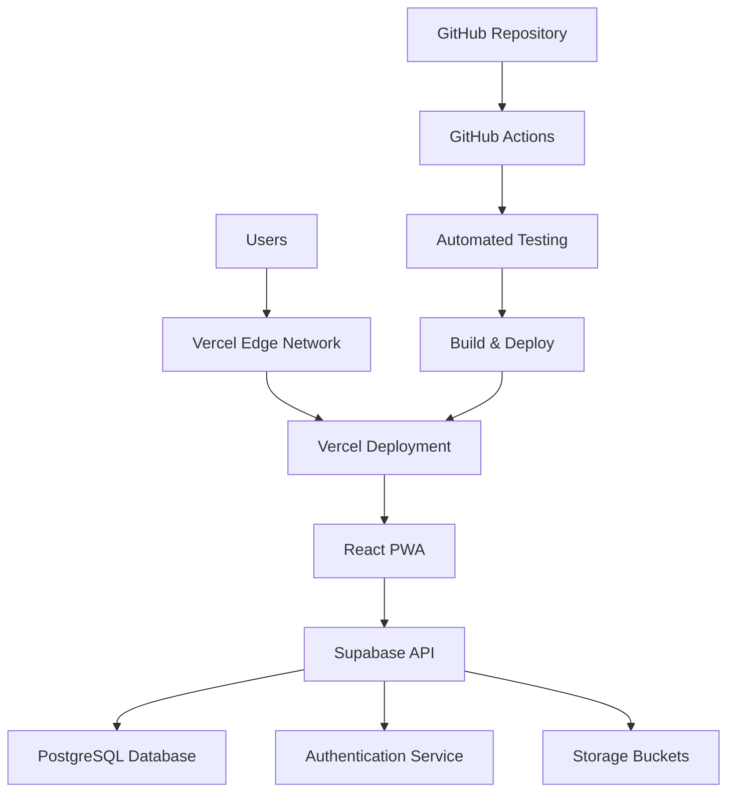

# Deployment & Infrastructure Documentation

This document provides comprehensive documentation for deployment, infrastructure, and DevOps processes in the Sembalun meditation app.

## 🚀 Deployment Overview

The Sembalun application uses a modern, cloud-native deployment strategy with the following components:

- **Frontend**: React PWA deployed on Vercel
- **Backend**: Supabase (BaaS) for database, auth, and storage
- **CDN**: Vercel Edge Network for global content delivery
- **CI/CD**: GitHub Actions with automated testing and deployment

## 🏗️ Infrastructure Architecture



## ⚙️ Build Configurations

### Multiple Build Targets

The application supports multiple build configurations for different deployment scenarios:

#### 1. Development Build (`vite.config.ts`)
```typescript
export default defineConfig({
  plugins: [react()],
  server: {
    port: 5173,
    host: true,
    open: true
  },
  build: {
    sourcemap: true,
    outDir: 'dist'
  }
});
```

#### 2. Production Build (`vite.config.production.ts`)
```typescript
export default defineConfig({
  plugins: [
    react(),
    vitePWA(pwaConfig)
  ],
  build: {
    outDir: 'dist',
    sourcemap: false,
    minify: 'terser',
    rollupOptions: {
      output: {
        manualChunks: {
          vendor: ['react', 'react-dom'],
          supabase: ['@supabase/supabase-js'],
          router: ['react-router-dom'],
          ui: ['lucide-react']
        }
      }
    },
    terserOptions: {
      compress: {
        drop_console: true,
        drop_debugger: true
      }
    }
  }
});
```

#### 3. Deployment Build (`vite.config.deploy.ts`)
```typescript
export default defineConfig({
  plugins: [
    react(),
    vitePWA(pwaConfig),
    visualizer({ filename: 'dist/stats.html' })
  ],
  build: {
    outDir: 'dist',
    sourcemap: false,
    minify: 'terser',
    chunkSizeWarningLimit: 1000,
    rollupOptions: {
      output: {
        manualChunks(id) {
          if (id.includes('node_modules')) {
            if (id.includes('react') || id.includes('react-dom')) {
              return 'react';
            }
            if (id.includes('@supabase')) {
              return 'supabase';
            }
            if (id.includes('lucide-react')) {
              return 'icons';
            }
            return 'vendor';
          }
        }
      }
    }
  }
});
```

#### 4. Minimal Build (`vite.config.minimal.ts`)
For testing and emergency deployments:
```typescript
export default defineConfig({
  plugins: [react()],
  build: {
    outDir: 'dist',
    minify: false,
    sourcemap: true,
    rollupOptions: {
      external: ['@supabase/supabase-js'],
      output: {
        globals: {
          '@supabase/supabase-js': 'Supabase'
        }
      }
    }
  }
});
```

## 📦 Package.json Scripts

### Build Scripts
```json
{
  "scripts": {
    "build": "vite build",
    "build:with-check": "tsc -b && vite build",
    "build:fast": "vite build --config vite.config.production.ts --mode production",
    "build:minimal": "vite build --config vite.config.minimal.ts --mode production",
    "build:prod": "npm run clean && npm run build",
    "build:analyze": "npm run build && open dist/stats.html",
    "build:size": "npm run build && du -sh dist/assets/*.js | sort -hr",
    "build:vercel": "npm run typecheck:loose && npm run build:deploy",
    "build:deploy": "vite build --config vite.config.deploy.ts --mode production"
  }
}
```

### Quality Assurance Scripts
```json
{
  "scripts": {
    "lint": "eslint . --max-warnings 50",
    "lint:fix": "eslint . --fix --max-warnings 50",
    "lint:production": "eslint . --quiet",
    "typecheck": "tsc --noEmit --skipLibCheck",
    "typecheck:loose": "tsc --noEmit --skipLibCheck || echo 'TypeScript warnings ignored for deployment'"
  }
}
```

### Testing Scripts
```json
{
  "scripts": {
    "test": "vitest",
    "test:run": "vitest run",
    "test:ui": "vitest --ui",
    "test:coverage": "vitest run --coverage",
    "test:supabase": "tsx src/scripts/testSupabaseConnection.ts"
  }
}
```

### Deployment Scripts
```json
{
  "scripts": {
    "deploy:netlify": "npm run build:fast && netlify deploy --prod --dir=dist",
    "deploy:vercel": "npm run prepare:production && vercel --prod",
    "prepare:production": "npm run clean && npm run typecheck && npm run build"
  }
}
```

## 🔧 Environment Configuration

### Environment Variables

#### Development (`.env.local`)
```env
# Supabase Configuration
VITE_SUPABASE_URL=https://your-project.supabase.co
VITE_SUPABASE_ANON_KEY=your-anon-key

# Development Settings
VITE_ENV=development
VITE_DEBUG=true
VITE_API_TIMEOUT=10000

# Analytics (Optional)
VITE_GA_TRACKING_ID=G-XXXXXXXXXX
```

#### Production (Vercel Environment Variables)
```env
# Required
VITE_SUPABASE_URL=https://your-project.supabase.co
VITE_SUPABASE_ANON_KEY=your-anon-key

# Production Settings
VITE_ENV=production
VITE_DEBUG=false
VITE_API_TIMEOUT=5000

# Performance
VITE_ENABLE_PWA=true
VITE_CACHE_DURATION=86400

# Analytics
VITE_GA_TRACKING_ID=G-XXXXXXXXXX
```

### Environment Validation

```typescript
// src/config/env.ts
const requiredEnvVars = [
  'VITE_SUPABASE_URL',
  'VITE_SUPABASE_ANON_KEY'
] as const;

export function validateEnvironment() {
  const missing = requiredEnvVars.filter(
    key => !import.meta.env[key]
  );

  if (missing.length > 0) {
    throw new Error(
      `Missing required environment variables: ${missing.join(', ')}`
    );
  }
}
```

## 🌐 Vercel Deployment

### Vercel Configuration (`vercel.json`)

```json
{
  "version": 2,
  "builds": [
    {
      "src": "package.json",
      "use": "@vercel/static-build",
      "config": {
        "distDir": "dist"
      }
    }
  ],
  "routes": [
    {
      "src": "/api/(.*)",
      "dest": "/api/$1"
    },
    {
      "src": "/(.*)",
      "dest": "/index.html"
    }
  ],
  "headers": [
    {
      "source": "/service-worker.js",
      "headers": [
        {
          "key": "Cache-Control",
          "value": "no-cache, no-store, must-revalidate"
        }
      ]
    },
    {
      "source": "/manifest.json",
      "headers": [
        {
          "key": "Cache-Control",
          "value": "public, max-age=86400"
        }
      ]
    },
    {
      "source": "/(.*)\\.(?:js|css|png|jpg|jpeg|svg|ico)",
      "headers": [
        {
          "key": "Cache-Control",
          "value": "public, max-age=31536000, immutable"
        }
      ]
    }
  ],
  "rewrites": [
    {
      "source": "/((?!api/).*)",
      "destination": "/index.html"
    }
  ]
}
```

### Deployment Scripts

#### Automated Deployment (`deploy-to-vercel.sh`)
```bash
#!/bin/bash

# Build and deploy to Vercel
echo "🚀 Starting Vercel deployment..."

# Clean previous builds
npm run clean

# Run type checking
echo "📝 Running type checks..."
npm run typecheck:loose

# Build for production
echo "🏗️ Building for production..."
npm run build:deploy

# Deploy to Vercel
echo "📤 Deploying to Vercel..."
vercel --prod

echo "✅ Deployment complete!"
```

#### Production Deployment (`deploy-production.sh`)
```bash
#!/bin/bash

set -e

echo "🚀 Production Deployment Started"

# Pre-deployment checks
echo "🔍 Running pre-deployment checks..."
npm run lint:production
npm run typecheck
npm run test:run

# Build optimization
echo "🏗️ Building optimized production bundle..."
npm run build:deploy

# Security checks
echo "🔒 Running security checks..."
npm audit --audit-level moderate

# Deploy
echo "📤 Deploying to production..."
vercel --prod

echo "✅ Production deployment complete!"

# Post-deployment verification
echo "🧪 Running post-deployment tests..."
curl -f https://sembalun-app.vercel.app/health || exit 1

echo "🎉 Deployment successful and verified!"
```

## 🔄 CI/CD Pipeline

### GitHub Actions Workflow (`.github/workflows/deploy.yml`)

```yaml
name: Deploy to Production

on:
  push:
    branches: [main]
  pull_request:
    branches: [main]

jobs:
  test:
    runs-on: ubuntu-latest
    
    steps:
    - uses: actions/checkout@v4
    
    - name: Setup Node.js
      uses: actions/setup-node@v4
      with:
        node-version: '18'
        cache: 'npm'
    
    - name: Install dependencies
      run: npm ci
    
    - name: Run linting
      run: npm run lint:production
    
    - name: Run type checking
      run: npm run typecheck
    
    - name: Run tests
      run: npm run test:run
    
    - name: Build application
      run: npm run build:deploy
      env:
        VITE_SUPABASE_URL: ${{ secrets.VITE_SUPABASE_URL }}
        VITE_SUPABASE_ANON_KEY: ${{ secrets.VITE_SUPABASE_ANON_KEY }}

  deploy:
    needs: test
    runs-on: ubuntu-latest
    if: github.ref == 'refs/heads/main'
    
    steps:
    - uses: actions/checkout@v4
    
    - name: Deploy to Vercel
      uses: amondnet/vercel-action@v25
      with:
        vercel-token: ${{ secrets.VERCEL_TOKEN }}
        vercel-org-id: ${{ secrets.ORG_ID }}
        vercel-project-id: ${{ secrets.PROJECT_ID }}
        vercel-args: '--prod'
```

### Quality Gates

#### Pre-deployment Checks
1. **Linting**: ESLint with production-level strictness
2. **Type Checking**: TypeScript compilation without warnings
3. **Testing**: All unit and integration tests pass
4. **Security**: npm audit for known vulnerabilities
5. **Build**: Successful production build

#### Post-deployment Verification
1. **Health Check**: Application loads successfully
2. **API Connection**: Supabase connectivity test
3. **Core Features**: Basic functionality verification
4. **Performance**: Lighthouse score validation

## 🏗️ Supabase Infrastructure

### Database Configuration

#### Production Database Settings
```sql
-- Connection pooling
ALTER SYSTEM SET max_connections = 100;
ALTER SYSTEM SET shared_preload_libraries = 'pg_stat_statements';

-- Performance optimization
ALTER SYSTEM SET effective_cache_size = '1GB';
ALTER SYSTEM SET shared_buffers = '256MB';
ALTER SYSTEM SET random_page_cost = 1.1;

-- Backup configuration
ALTER SYSTEM SET archive_mode = on;
ALTER SYSTEM SET archive_command = 'cp %p /backup/%f';
```

#### Row Level Security (RLS) Policies
All production tables have RLS enabled with proper user isolation.

### Authentication Configuration

#### OAuth Providers
- **Google OAuth**: Configured with proper redirect URLs
- **Apple Sign-In**: iOS/macOS integration
- **Email/Password**: With email verification

#### Security Settings
```typescript
// Supabase Auth configuration
const authConfig = {
  autoRefreshToken: true,
  persistSession: true,
  detectSessionInUrl: true,
  flowType: 'pkce'
};
```

### Storage Configuration

#### Bucket Policies
```sql
-- Avatar storage
CREATE POLICY "Users can upload avatars" ON storage.objects
  FOR INSERT WITH CHECK (
    bucket_id = 'avatars' AND 
    auth.uid()::text = (storage.foldername(name))[1]
  );

-- Audio content (admin only)
CREATE POLICY "Admin can manage audio" ON storage.objects
  FOR ALL USING (
    bucket_id = 'audio' AND 
    auth.jwt() ->> 'role' = 'admin'
  );
```

## 📊 Monitoring & Analytics

### Application Monitoring

#### Performance Metrics
- **Core Web Vitals**: LCP, FID, CLS tracking
- **Bundle Size**: Asset size monitoring
- **API Response Times**: Supabase query performance
- **Error Rates**: Client-side error tracking

#### Monitoring Tools
```typescript
// Performance monitoring
export const trackPageLoad = (pageName: string) => {
  const navigation = performance.getEntriesByType('navigation')[0] as PerformanceNavigationTiming;
  const loadTime = navigation.loadEventEnd - navigation.fetchStart;
  
  console.log(`Page ${pageName} loaded in ${loadTime}ms`);
  
  // Send to analytics
  gtag('event', 'page_load_time', {
    page_name: pageName,
    load_time: loadTime
  });
};
```

### Error Tracking

#### Error Boundary Implementation
```typescript
class ErrorBoundary extends Component {
  componentDidCatch(error: Error, errorInfo: ErrorInfo) {
    // Log to monitoring service
    console.error('Application error:', error, errorInfo);
    
    // Send to error tracking
    this.reportError(error, errorInfo);
  }
  
  private reportError(error: Error, errorInfo: ErrorInfo) {
    // Send to monitoring service (Sentry, LogRocket, etc.)
    if (import.meta.env.PROD) {
      // Production error reporting
    }
  }
}
```

### Health Checks

#### Application Health Endpoint
```typescript
// Health check endpoint
export const checkApplicationHealth = async (): Promise<HealthStatus> => {
  const checks = await Promise.allSettled([
    checkSupabaseConnection(),
    checkAuthService(),
    checkStorageService()
  ]);
  
  return {
    status: checks.every(check => check.status === 'fulfilled') ? 'healthy' : 'unhealthy',
    timestamp: new Date().toISOString(),
    services: {
      database: checks[0].status === 'fulfilled',
      auth: checks[1].status === 'fulfilled',
      storage: checks[2].status === 'fulfilled'
    }
  };
};
```

## 🔒 Security Considerations

### Content Security Policy (CSP)

```html
<!-- meta tags in index.html -->
<meta http-equiv="Content-Security-Policy" content="
  default-src 'self' *.supabase.co;
  script-src 'self' 'unsafe-inline' *.googletagmanager.com;
  style-src 'self' 'unsafe-inline';
  img-src 'self' data: blob: *.supabase.co;
  font-src 'self';
  connect-src 'self' *.supabase.co *.google-analytics.com;
  media-src 'self' *.supabase.co;
">
```

### Environment Security

#### Secrets Management
- **Environment Variables**: Secure storage in Vercel
- **API Keys**: Rotation strategy for Supabase keys
- **Certificates**: SSL/TLS certificate management
- **Access Control**: Team access permissions

## 🚨 Disaster Recovery

### Backup Strategy

#### Database Backups
- **Automated Daily Backups**: Supabase automatic backups
- **Point-in-Time Recovery**: Available for 7 days
- **Manual Exports**: Weekly manual data exports
- **Cross-Region Replication**: Multi-region backup storage

#### Application Backups
- **Source Code**: Git repository with multiple remotes
- **Build Artifacts**: Vercel deployment history
- **Configuration**: Infrastructure as Code (IaC)
- **Dependencies**: Package lock files for reproducible builds

### Recovery Procedures

#### Service Outage Response
1. **Immediate**: Switch to backup deployment
2. **Short-term**: Implement service degradation
3. **Long-term**: Full service restoration
4. **Post-incident**: Root cause analysis and prevention

## 🎯 Performance Optimization

### Bundle Optimization

#### Code Splitting Strategy
```typescript
// Route-based code splitting
const Dashboard = lazy(() => import('./pages/Dashboard'));
const Meditation = lazy(() => import('./pages/Meditation'));
const Profile = lazy(() => import('./pages/Profile'));

// Component-based splitting for heavy components
const HeavyAnalytics = lazy(() => import('./components/analytics/HeavyAnalytics'));
```

#### Asset Optimization
- **Image Compression**: Automatic WebP conversion
- **Font Optimization**: WOFF2 format with font-display: swap
- **Icon Optimization**: SVG sprite generation
- **CSS Optimization**: PostCSS with cssnano

### Caching Strategy

#### Browser Caching
```javascript
// Service worker caching strategy
const CACHE_NAME = 'sembalun-v1';
const STATIC_ASSETS = [
  '/',
  '/static/js/bundle.js',
  '/static/css/main.css',
  '/manifest.json'
];

// Cache-first strategy for static assets
// Network-first strategy for API calls
```

#### CDN Configuration
- **Static Assets**: Long-term caching (1 year)
- **HTML Files**: Short-term caching (1 hour)
- **API Responses**: Context-dependent caching
- **Service Worker**: No caching

This comprehensive deployment documentation covers all aspects of infrastructure, deployment, and operational procedures for the Sembalun meditation application.